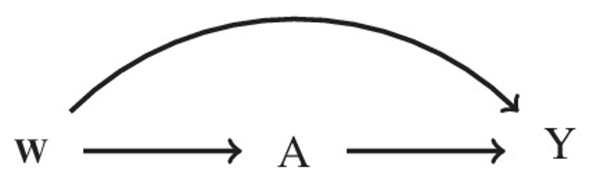

# Introduction {#sec-intro}

The first chapter provides a brief introduction to causal inference and its links to public health, economics, and society.

## Causal inference

Causal inference is the process of determining whether a variable causes a change in another variable. It involves identifying causal relationships between variables based on data and statistical analysis. Causal inference is important because it allows us to understand how the world works and make informed decisions based on that understanding. For example, in medicine, we use causal inference to determine whether a particular treatment is effective and to identify potential side effects. In public policy, we use causal inference to assess the impact of interventions on social outcomes, such as crime rates, educational attainment, and economic growth.

However, determining causality is not always straightforward. Correlation between two variables does not necessarily imply causation, and there may be other factors, known as confounding variables, that are responsible for the observed relationship. Causal inference methods attempt to control for confounding variables and identify the true causal relationship between variables.

To make causal inferences, we need to go beyond mere associations between variables and determine whether a change in one variable actually causes a change in the other variable. This involves controlling for confounding factors and using methods such as randomized controlled trials (RCT), natural experiments, and observational studies to isolate the causal effect. For example, suppose we are interested in determining whether a new drug is effective in reducing blood pressure. A randomized controlled trial might be conducted, where a group of patients are randomly assigned to receive either the new drug or a placebo. By controlling for other factors that could affect blood pressure, such as diet and exercise, and randomly assigning patients to groups, we can attribute any differences in blood pressure between the two groups to the drug and infer a causal relationship. In an RCT, participants are randomly assigned to either a treatment group (where they receive the intervention being studied) or a control group (where they do not receive the intervention). This random assignment helps to balance out potential confounding factors between the two groups, making it more likely that any observed differences between the groups are due to the treatment.

In observational studies, this randomisation process is often not possible because it might be unethical or unfeasible to allocate individuals to certain treatments (or exposures, policies, etc.) i.e., smoking. Since, in observational studies, individuals cannot be randomly assigned to a treatment group, statistical methods are required to control for confounding and to infer causal effects.

Causal inference is important for applied researchers because it allows them to make informed decisions and draw meaningful conclusions about the world. By understanding the true causal relationships between variables, applied researchers can develop effective interventions, evaluate the impact of policies and treatments, and gain a deeper understanding of how different factors interact to produce outcomes. For example, consider a public health researcher who is interested in understanding the relationship between air pollution and respiratory illness. Without causal inference, the researcher might observe a correlation between higher levels of air pollution and higher rates of respiratory illness, but would not be able to determine whether air pollution actually causes respiratory illness. By using causal inference methods the researcher can attempt to control for confounding factors and isolate the causal effect of air pollution on respiratory illness. This information can be used to develop targeted interventions to reduce air pollution and improve public health outcomes.

Causal inference is also important for evaluating the effectiveness of medicine, policies, economics, societal changes, and other contexts. By understanding the true causal relationships between variables, researchers can determine whether a particular policy is effective, and identify factors that may be limiting its effectiveness. This information can be used to make more informed decisions about resource allocation and program design.

Overall, causal inference is an essential tool for applied researchers in a wide range of fields, from public health to economics to education. By understanding the true causal relationships between variables, researchers can make more informed decisions and develop more effective interventions, leading to improved outcomes for individuals and communities.

## Causal inference roadmap

Constructing a causal analysis in a structured manner is necessary to obtain unbiased effect estimates and robust conclusions for real-world evidence. The *Causal Roadmap* (@fig-CIroadmap) offers a framework that can be adapted to the vast majority of studies to generate real-world evidence. The Causal Roadmap begins with defining the causal question of interest, stating whether the data and assumptions can be used to answer the question of interest, performing suitable statistical analyses, and assessing whether alternative conclusions could be obtained under alternate assumptions. The rest of this section describes each step in more detail.

![Causal Inference Roadmap as detailed in [@Dang2023].](figures/CI Roadmap.pdf){#fig-CIroadmap fig-align="center"}

**Step 1: Causal question, model, and estimand**

First, a causal question is defined. The question encapsulates the population of interest (eligibility criteria), the treatment (or exposure), the follow-up period (time from starting-point to end-point), the outcome of interest, and the causal estimand. The causal estimand is a description of the statistical estimate that answers the question (e.g., causal risk difference, causal relative risk, causal odds ratio).

The causal model is a graphical tool that helps to identify the causal pathways between the exposure and the outcome. The causal model is commonly shown using a directed acyclic graph (DAG): detailed explanation of causal models is in @sec-causalDAGs. Briefly, a diagram for the causal model shows what we know and, importantly, what we do not know about how the data is generated in the real world. The diagram is created using background knowledge, advice from experts, and assumptions about other possible variables.

It is important at this stage to go back to the causal question, we must critique whether the causal model is able to answer the causal question. The causal model could have identified a variable that has been overlooked and, if so, the causal question needs to be adapted: we call this process "redefining the causal question".

**Step 2: Consider the observed data**

The causal model from Step 1 illustrates our knowledge of how the exposure causes the outcome and provides the necessary information that we need to answer the causal question. The observed data, on the other hand, can differ from the causal model. The difference can occur in the way the observed data was measured. For example, research has shown that obesity is strongly associated with cardiovascular disease. One way to measure obesity is by using body mass index (i.e., $weight(kg)/height (m^{2})$). However, body mass index (BMI) cannot distinguish between body fat and muscle mass, thus the BMI will be overestimated amongst people with lots of muscle mass and will be underestimated amongst people with very little muscle mass. Alternatively, obesity might be a variable that confounds the association between treatment and risk of mortality, but if obesity is not measured (thus not recorded in the data), we are unable to adjust for obesity. In such cases, we must go back to Step 1 to redefine the question of interest.

**Step 3: Identifiability assumptions**

If the observed data is sufficient to answer the causal question, we must first make certain assumptions. The main assumptions. also known as (AKA) as identifiability assumptions, are conditional exchangeability, consistency, no interference, and positivity. Identifiability in causal inference refers to the fact that the main assumptions are necessary before one can infer a causal effect, they are discussed in more detail in @sec-identifiabilityassumptions. The identifiability assumptions provide a way of writing the causal question (a hypothetical two-world causal contrast in terms of potential outcomes [see @sec-POframework]) in terms of a model for the observed data.

**Step 4: Define the statistical estimand**

If the identifiability assumptions are deemed plausible, we can move on to defining the statistical estimand. The statistical estimand is an algebraic definition of the causal question but in terms of the observed data. For example, the average treatment effect (ATE) measured by the risk difference is given by

$$ ATE \quad = \quad E_{w} (P[Y=1 \mid A=1, \textbf{W}] - P[Y=1 \mid A=0, \textbf{W}]) $$

and is the expected difference (causal risk difference) in the outcome (Y) between two exposure groups (A) conditioned on the set of variables that confound the exposure-outcome relationship (**W**). More details on estimands and measures of association are given in @sec-estimands.

**Step 5: Statistical model and estimator**

The statistical model defines the set of possible data distributions between the outcome, exposure, and covariates. We must consider the functional form of the variables and their relationships to one another (e.g., non-linear terms, time-varying effects, interactions [effect modification], etc.). With the rise in quality and availability of machine-learning methods, the statistical model is at less risk of misspecification: a common source of bias.

Once the statistical model has been defined, the next step is to choose the estimator. In large part, this book focuses on the various statistical estimators that can be used, along with the suitability to certain data. The choice of the statistical estimator is determined by the performance of the estimator in terms of bias, 95% confidence interval (CI) coverage, type I error rate, and precision.

**Step 6: Sensitivity analysis**

Once the statistical estimator provides a quantitative value for our causal question, we must go back to the identifiability assumptions and ask how our result would change if the assumptions were violated. For example, if we were not able to measure a potentially important variable, then our result is potentially biased. We would need to assess whether the unmeasured variable is a strong confounder of the relationship between the treatment and the outcome. This topic of sensitivity analysis is revisited in @sec-sensitivity.

**Step 7: Alternative study designs**

We might often find that multiple study designs are feasible to answer the causal question. The researcher will then need to consider which study design is feasible, and ethical, whether results will be obtained in time for a policy-related decision, and other statistical properties (e.g., power, correct type I and II error rates, bias, coverage, precision, etc.). We do not go into alternative study designs in this book, we refer the interested reader to [@Dang2023] for more details.

## Causal diagrams {#sec-causalDAGs}

Introduce causal diagrams, which are graphical representations of causal relationships. Explain how they can be used to identify confounding variables and to determine which variables should be controlled for in an analysis.

### Directed Acyclic Graphs

The distribution of the observed data can be shown as a graphical representation (@fig-DAG): these diagrams are known as direct acyclic graphs (DAG). When constructing DAGs, subject-matter knowledge must be used to ensure the conditional exchangeability assumption holds.

{#fig-DAG fig-align="center"}

This causal diagram makes several assumptions: all variables that confound the exposure-outcome relationship are included in **W**, there are no intermediate variables, and there is no residual confounding. Therefore, the set of covariates included in **W** suffices to assume the conditional mean independence to estimate the ATE. To more formally illustrate DAGs, we first define some terminology along with examples using the DAG in @fig-DAG1.

```{=latex}
\begin{figure}[ht!]
\centering
\begin{tikzpicture}[scale=1.5]\label{DAG1}
\node (A) at (1,0) {A};
\node (Y) at (4,0) {Y};
\node (W1) at (1,2) {$W_{1}$};
\node (W2) at (-2,2) {$W_{2}$};
\node (W3) at (-4,0) {$W_{3}$};
\node (W4) at (-2,-2) {$W_{4}$};
\node (W5) at (1,-2) {$W_{5}$};

\draw[draw=red] [->](A) -- (Y);
\draw [->](W1) -- (A);
\draw [->](W1) edge[bend left=10] (Y);
\draw [->](W2) -- (A);
\draw [->](W2) edge[bend left=10] (Y);
\draw [->](W2) -- (W1);
\draw [->](W2) -- (W4);
\draw [->](W3) -- (A);
\draw [->](W3) -- (W4);
\draw [->](W3) edge[bend left=20] (Y);
\draw [->](W4) -- (A);
\draw [->](W4) -- (W1);
\draw [->](W5) -- (A);
\end{tikzpicture}
\caption{Causal diagram}
\label{fig:DAG1}
\end{figure}
```

1. **Path**: A path is any series of nodes from $W_{k}$ to $W_{l}$ connected by an edge in any direction (i.e., the edge can be "$\rightarrow$" or "$\leftarrow$"). For example, $W_{3} \rightarrow W_{4} \leftarrow W_{2} \rightarrow A \leftarrow W_{5}$ is one of the paths from $W_{3}$ to $W_{5}$.
2. **Direct path**: A direct path is a path between nodes that involves only forward edges. For example, $W_{3} \rightarrow W_{4} \rightarrow W_{1} \rightarrow A \rightarrow Y$, is a direct path between $W_{3}$ and $Y$ since it contains only forwards edges (i.e., "$\rightarrow$").
3. **Parent** and **child**: $W_{k}$ is a *parent* of $W_{l}$, and $W_{l}$ is a *child* of $W_{k}$, if $W_{k} \rightarrow W_{l}$. In @fig-DAG1, $W_{3}$ is a parent of $W_{4}$, and $W_{4}$ is a child of $W_{3}$.
4. **Ancestor** and **Descendant**: $W_{k}$ is an *ancestor* of $W_{l}$, and $W_{l}$ is a *descendant* of $W_{k}$, if there is a direct path from $W_{k}$ to $W_{l}$. In @fig-DAG1, $W_{3}$ is an ancestor of $W_{1}$, thus $W_{1}$ is a descendant of $W_{3}$.
5. **Collider**: A node $W_{k}$ is a collider between $W_{k-1}$ and $W_{l}$ if it receives both edges (i.e., $W_{k-1} \rightarrow W_{k} \leftarrow W_{l}$). For example, $W_{4}$ is a collider along the path $W_{3} \rightarrow W_{4} \leftarrow W_{2}$.
6. **Instrumental variable**: A node is an instrumental variable if it satisfies these assumptions:
    1. The node is correlated with $A$,
    2. the node is not correlated with $Y$, and
    3. the node is not correlated with a confounder that affects $Y$.
    In @fig-DAG1, $W_{5}$ is an instrumental variable since it satisfies all three assumptions.
7. **Conditional instrumental variable**: A node is a conditional instrumental variable if it satisfies 6(a) and 6(b), conditioning on nodes that are confounders of $A \rightarrow Y$. In @fig-DAG1, $W_{4}$ is an instrumental variable conditional on $W_{1}$, $W_{2}$ and $W_{3}$.

In @fig-DAG1, one would need to condition on $W_{1}$, $W_{2}$, and $W_{3}$ to sufficiently control for confounding. Without conditioning on these variables, the crude association between $A \rightarrow Y$ is biased (i.e., different from the true causal effect).

A collider for a certain pair of variables (e.g., outcome and exposure) is a third variable that is caused by both of them. In DAG terminology, a collider is the variable in the middle of an inverted fork (i.e. variable C in A → C ← Y).[@pearl95seq; @pearl09causality] Using regression to control for a collider, or stratifying the analysis concerning a collider, can introduce a spurious association between its causes, which can potentially introduce non-causal associations between the exposure and the outcome. This has been used to explain why the medical literature contains many paradoxical findings, where established risk factors appear protective for the outcome.[@LuqueParadox2016; @Hernandez-Diaz_2006; @Banack2013; @Witccomb2009] For instance, numerous studies have reported a paradoxical protective effect of maternal cigarette smoking during pregnancy on pre-eclampsia, which has been named the pre-eclampsia smoking paradox. This paradox is due to gestational age at delivery, which is a collider between smoking (exposure) and pre-eclampsia (outcome).[@LuqueParadox2016] However, the magnitude of the resulting bias will depend on the associations between the collider and the two parent variables.

**A note on backdoor paths**

To ensure conditional exchangeability holds, variables along the *path* from $A$ to $Y$ must be conditioned on. This is known as Pearl's backdoor criterion.[@Pearl94probab] In @fig-DAG1, conditioning on only $W_{1}$, $W_{2}$, and $W_{3}$ was sufficient to control for confounding. There are no other *paths* through $W_{4}$ (or $W_{5}$) that does not already control for $W_{1}$, $W_{2}$, or $W_{3}$. In other words, if one wanted to navigate from $W_{4}$ to $Y$, one would have to go through either $W_{1}$, $W_{2}$, or $W_{3}$, which are already controlled for.

### Impact of colliders

To illustrate the induced association of conditioning on a collider, three variables are defined A (unrelated to B), B (unrelated to A), and C (collider, a child of A and B). The association between these variables are shown in @fig-DAG4. We now simulate some data for A, B and C and tabulate the data in Tables @tbl-ColliderAB, @tbl-ColliderAC, and @tbl-ColliderBC.

```{=latex}
\begin{figure}[ht!]
\centering
\begin{tikzpicture}[scale=1.5]
\node (A) at (0,0) {A};
\node (B) at (2,0) {B};
\node (C) at (1,1) {C};

\draw [->](A) -- (C);
\draw [->](B) -- (C);
\end{tikzpicture}
\caption{Causal diagram to illustrate conditioning on a collider}
\label{fig:DAG4}
\end{figure}
```

In @tbl-ColliderAB, there is an equal number of those with A=1 amongst levels of B. In the DAG above, A does not cause B, so the estimate of the causal effect (i.e., odds ratio) should be 1.00.

: {#tbl-ColliderAB}

|       | B=1 | B=0 | **Total** |
|-------|-----|-----|-----------|
| **A=1**   | 20  | 20  | 40        |
| **A=0**   | 80  | 80  | 160       |
| **Total** | 100 | 100 | 200        |

In @tbl-ColliderAC, those with C=1 are less likely to have A=1 (n=15) compared to those with C=0 (n=25). In the DAG above, A is associated with C, so the estimate of the causal effect (i.e., odds ratio) from @tbl-ColliderAC is 1.47.

: {#tbl-ColliderAC}

|       | C=1 | C=0 | **Total** |
|-------|-----|-----|-----------|
| **A=1**   | 15  | 25  | 40        |
| **A=0**   | 75  | 85  | 160       |
| **Total** | 90  | 110 | 200        |

In @tbl-ColliderBC, those with C=1 are much less likely to have B=1 (n=30) compared to those with C=0 (n=70). In the DAG above, B is associated with C, so the estimate of the causal effect (i.e., odds ratio) from @tbl-ColliderBC is 3.50.

: {#tbl-ColliderBC}

|       | C=1 | C=0 | **Total** |
|-------|-----|-----|-----------|
| **B=1**   | 30  | 70  | 100       |
| **B=0**   | 60  | 40  | 100       |
| **Total** | 90  | 110 | 200        |

A marginal association between A and B has an odds ratio of 1.00 @tbl-ColliderAB. This is a marginal association because we do not condition on the collider. The marginal associations between A and C, and B and C, are also explored to assess whether conditioning on the collider could potentially bias the association between A and B. From the above, it is clear that the associations (odds ratios) between A and C (and B and C) are very different from 1.00. Suggesting that conditioning on the collider (C) will induce a bias. To illustrate this, we now condition on the collider. If the collider did not induce bias, we should expect an odds ratio of the association between A and B to be 1.00 for both values of C (i.e., where C is 0 or 1).

**Conditional associations**

Table @tbl-ColliderABC shows the tabulation of the association between A and B within levels of C. The association between A and B, conditional on C = 1, has an odds ratio (OR) of:

$$ \text{OR}_{C=1} = \frac{(21/9)}{(54/6)} = 0.26 $$

The association between A and B, conditional on C = 0, has an odds ratio of:

$$ \text{OR}_{C=0} = \frac{(59/11)}{(26/14)} = 2.89 $$

: {#tbl-ColliderABC}

|       | C=1: B=1 | C=1: B=0 | C=0: B=1 | C=0: B=0 | Total |
|-------|----------|----------|----------|----------|-------|
| **A=1**   | 9        | 6        | 11       | 14       | 40    |
| **A=0**   | 21       | 54       | 59       | 26       | 160   |
| **Total** | 30       | 60       | 70       | 40       | 200   |

Thus, since each of the odds ratios for the association between A and B within levels of C do not equate to 1.00, conditioning on the collider will induce bias in the association between A and B. Conditioning on a descendent (or child) of a collider induces the same problem as conditioning on the collider itself. However, conditioning on an ancestor (or parent) of a collider does not induce bias. This is because the information about the collider that is contained in the ancestor is independent of A and B.

## Counterfactual (potential outcomes) framework {#sec-POframework}

We first introduce the language of the *Potential Outcomes Framework* also known as (a.k.a) Neyman-Rubin Potential Outcomes framework.[@Rubin2007] To illustrate the framework we use an empirical example based on intensive care medicine.[@Connors1996] The study, set in intensive care units of five United States teaching hospitals between 1989 and 1994, evaluated the effectiveness of right heart catheterisation (RHC) on short-term mortality (30 days) of 5,735 critically ill adult patients (2,184 received a RHC and 3,551 did not received it) receiving care for 1 of 9 prespecified disease categories. In this illustration, let Y, the outcome, denote the vital status of the patient in an intensive care unit (ICU) at 30 days after admission. Let A denote the exposure variable for whether or not the patient received RHC during their stay at the ICU. Let (***W***) include the set of confounders, with C denoting a binary confounder.

In this RHC study, each patient has two potentially observed outcomes (i.e., $Y^{a}$), where the first is $Y(1)$ if they received RHC, and the second is $Y(0)$ if they did not receive RHC [@Rubin1974]. We say "potentially observed" because only one of these two outcomes can ever be observed since each patient only receives one of the treatments. As an example from @tbl-POtable, Patient 1 has two potential outcomes: firstly, $Y(0) = 1$ says that if this patient did not receive RHC then they would have died within 30 days, and secondly, $Y(1) = 0$ says that if they had received RHC then they would not have died within 30 days. l,

: Potential outcomes framework: C = Binary confounder, A = Binary treatment, Y = Binary outcome, Y(0) = Potential outcome for A=0, Y(1) = Potential outcome for A=1 {#tbl-POtable}

| Patient | Y | A | C | $Y(0)$ | $Y(1)$ |
|---------|---|---|---|--------|--------|
| 1       | 1 | 0 | 0 | 1      | 0      |
| 2       | 1 | 1 | 1 | 1      | 1      |
| 3       | 1 | 1 | 1 | 0      | 1      |
| 4       | 0 | 1 | 0 | 0      | 0      |
| 5       | 1 | 0 | 1 | 1      | 1      |
| 6       | 0 | 1 | 1 | 0      | 0      |
| 7       | 1 | 0 | 0 | 1      | 1      |
| 8       | 0 | 1 | 1 | 0      | 0      |
| 9       | 1 | 1 | 0 | 1      | 1      |

A common estimand in causal inference is the average treatment effect (ATE). The ATE is a function of the underlying distribution of the counterfactual outcomes, which can be estimated non-parametrically or parametrically.[@Robins1986] The ATE is defined by an average of the difference of two random variables (i.e., the potential outcomes $Y^{1}$ and $Y^{0}$). [@Rubin2007; @Gutman2015] The ATE in the example above can be estimated as the contrast between the *potential outcomes* under different treatment levels (i.e., the difference between $E[Y^{1}] - E[Y^{0}]$).[@Rubin2011]

Potential outcomes are so named because they are outcomes that could potentially be observed had the patient been assigned $A=a$. However, in observational studies, only one outcome is observed for each individual. To estimate causal effects, we must make certain assumptions to identify potential outcomes from the observed data, then estimate the estimand.[@Robins1986] The necessary assumptions are outlined in the next section.

## Identifiability assumptions {#sec-identifiabilityassumptions}

**Conditional exchangeability and identification**

The first assumption is *conditional exchangeability*. In randomised studies, conditional (and marginal) exchangeability holds because the treated individuals, had they not been treated, would have had the same average potential outcomes as the untreated, and vice versa. This cannot be guaranteed in observational studies, but it can be assumed to hold if the unmeasured risk factors of the outcome are equally distributed between the treated and the untreated groups, conditional on the measured confounders. Thus, using the language of the potential outcomes, the conditional exchangeability assumption (a.k.a conditional independence, unconfoundedness or ignorability) is:

$$
Y^{a} \amalg A\mid \textbf{W} \; \forall \; a \in \{0, 1\},
$$

This states that, conditional on the set of observed confounders **W**, the actual exposure level $A$ is independent of each of the potential outcomes. Thus, the conditional mean independence is given $E[Y^{a} \mid A=1, \textbf{W}=w] = E[Y^{a} \mid A=0, \textbf{W}=w] = E[Y^{a} \mid \textbf{W}=w] \; \forall \, a \in{0,1}.$

**Positivity**

Positivity holds if the conditional probability of being treated or exposed (and similarly for being untreated) is greater than zero. Therefore, if P(**W**=w) > 0, then

$$
P(A=a\mid \textbf{W}=w) > 0 \; \forall \; \textbf{W} \in \textbf{w}, a \in \{0, 1\}.
$$

When this assumption is violated, it is typically because the target population is poorly defined (i.e, attempting to estimate the effect of a treatment on people who would never receive it).

**Counterfactual consistency**

Counterfactual consistency holds if the observed outcome for all treated individuals equals their outcome had they been treated, and likewise for untreated individuals. For example, in @tbl-POtable, Patient 1's observed outcome equals their potential outcome had they not been treated ($Y = Y^{a} = 1$), Patient 2's observed outcome equals their potential outcome had they been treated ($Y = Y^{1} = 1$). The consistency assumption means that the definition of the treatment, and outcome, is consistent for each patient. Analytically, consistency is represented by:

$$
Y = A Y^{1} + (1-A)Y^{0},
$$

**Non-interference**

Aside from exchangeability, positivity, and consistency, there are other notable assumptions. It is further assumed that there is *no interference*. This is commonly called *Stable Unit Treatment Value Assumption* (SUTVA). This assumption is closely related to the consistency assumption, in that non-interference (or SUTVA) states that there is only one version of the exposure and that a patient's potential outcome is not influenced by the treatment of another patient.[@Schomaker2020RegressionCausality]

## Estimands {#sec-estimands}

Commonly, an observational study aims to answer a scientific question that characterises the effect of an exposure or treatment on an outcome. This question is translated to an *estimand* for which an *estimate* will provide a relevant answer to the exposure-outcome relationship. Statistical methods are the tools used to obtain an estimate from the data. Within the causal framework, these statistical methods are called *estimators*. They are mathematical functions that use the observed values of the observations in the sample (i.e., a function of the random variables) and generate the quantitative value for the estimand. The estimators are represented by algebraic equations that explicitly describe a function of the realised observations.

An estimand is a quantity of interest in a causal analysis that represents the specific causal effect that a researcher aims to estimate. The average treatment effect (ATE) is an example of an estimand. The ATE is defined as the average difference in the outcome variable between a group of individuals who received a treatment and a group of individuals who did not receive the treatment. It represents the average causal effect of the treatment on an outcome of interest in a population.

The ATE is algebraically defined as

$$
\text{ATE} \, = \, E[Y = 1 \mid A=1] - E[Y = 1 \mid A=0].
$$

This is currently in terms of unobserved potential outcomes. For example, we can only observe what happens when an individual is treated or untreated, but not both. To estimate the ATE from our data, we can apply the identifiability assumptions (@sec-identifiabilityassumptions) and derive the ATE in terms of observable data. Note that $Y^{a}$ is the potential outcome of an individual, with measured confounders $\textbf{W}$, had they received treatment $A=a$

First, by the law of total probability

$$P[Y^{a}=1] \, = \, \sum_{w} P[Y^{a}=1 \,|\, \textbf{W}=w]\,P(\textbf{W}=w)$$

By conditional exchangeability

$$P[Y^{a}=1] \, = \, \sum_{w} P[Y^{a}=1 \,|\,A=a,\textbf{W}=w]\,P(\textbf{W}=w)$$

This is possible since we are assuming that within levels of $\textbf{W}$, the predictors of the outcome are equally distributed between the treated and non-treated groups. That is, we have achieved what would happen if patients were randomised to each treatment group. If we also assume consistency

$$P[Y^{a}=1] \, = \, \sum_{w} P[Y=1 \,|\,A=a,\textbf{W}=w]\,P(W=w)$$

Thus, under these assumptions, the statistical estimand for the ATE is defined as

$$
\sum_{w} P[Y=1 \,|\,A=1,\textbf{W}=w]\,Pr(W=w) \,-\, \sum_{w} P[Y=1 \,|\,A=0,\textbf{W}=w]\,P(\textbf{W}=w).
$$

Many estimands could be estimated. One common alternative to the ATE is the average treatment effect among the treated (ATT):

$$
\text{ATT}\,=\,E[Y^{1} \mid A=1] - E[Y^{0} \mid A=1]
$$

Applying the assumptions above, the statistical estimand for the ATT is

$$
\sum_{w} P[Y=1 \,|\,A=1,\textbf{W}=w]\,P(\textbf{W}=w \mid A=1) \,-\, \sum_{w} P[Y=1 \,|\,A=0,\textbf{W}=w]\,P(\textbf{W}=w \mid A=1).
$$

In the above, for both the ATE and ATT, we have transitioned from a setting where we have unobserved potential outcomes to a setting where we can estimate our causal estimand using the distribution of the observed data [@Robins1999]. Conditional exchangeability requires all confounders to be measured and accounted for in the analysis.

There are many different types of estimands that can be used in causal inference, and the choice of estimand depends on the research question and study design. There are many other estimands used for causal analysis. The conditional average treatment effect (CATE) represents the causal effect of a treatment on the outcome for specific subgroups of individuals, rather than the average effect over the entire population. Average causal effect of the untreated (ACEU) represents the average causal effect of not receiving the treatment on the outcome.

### Choice of causal estimand

How does one choose a suitable causal estimand? In randomised controlled trials (RCT) there is no choice. The ATE, ATT, and ATU are all equivalent in RCTs because, due to randomisation, the distribution of baseline characteristics will be similar between the treatment groups. However, in quasi-experimental and observational studies these estimands will differ because the distribution of baseline characteristics are likely to differ between treatment groups.

A good starting point when choosing the estimand is to ask "for whom should the treatment effect be estimated?". A causal estimand asks what would happen if the treatment were to be given to, or withheld from, a particular population. [@Greifer2023] provide an in-depth discussion of the choice of estimands, which we paraphrase here.

**Average Treatment Effect (ATE)**

The ATE asks how the outcome would differ between a setting where the treatment was given to all patients and a setting where the treatment was withheld from all patients. The ATE is useful when two differing treatments could be given to the population but it is unclear which of the two would be more beneficial. The ATE could also be used for assessing whether a policy could be unilaterally implemented, that is applied to some of the population but not all.

**Average Treatment Effect in the Treated (ATT)**

The ATT asks how the outcome of treated patients would change if they had not received the treatment. The ATT is the effect of withholding the treatment from those who would have received it. This estimand is useful when a decision needs to be made on an intervention that occurs in a particular population. For example, a decision needs to be made on whether to continue a treatment amongst those who are currently being treated, or a decision on whether preventing a harmful exposure would improve health outcomes amongst those who are currently exposed.

**Average Treatment Effect in the Untreated (ATU)**

The ATU is asks how would the outcome of untreated patients change if they had received the treatment? The ATU is the effect of expanding the treatment to those who do not receive it. This estimand is useful when a decision needs to be made on whether a treatment that is not given to a group of patients should continue to not be given to these patients. For example, consider a treatment that reduces the risk of cancer amongst those who are at high risk, but it is not known whether the treatment reduces the risk of cancer amongst those with low risk (and do not currently receive the treatment). The question is whether one should continue withholding the treatment or whether the low-risk patients would benefit from receiving the treatment.

### Choice of statistical estimand

The causal estimand is written in terms of potential outcome notation. It relies on being able to observe two hypothetical potential outcomes and we are not able to observed both of them in the real world. The statistical estimand, however, can be written in terms of the observed data if the identifiability assumptions are plausible.

There are numerous statistical estimands to choose from; some of the more common statistical estimands are:

**Causal risk difference**

$$
\operatorname{P}\{Y^{1}=1\}-\operatorname{P}\{Y^{0}=1\}
$$

**Causal risk ratio**

$$
\frac{\operatorname{P}\{Y^{1}=1\}}{\operatorname{P}\{Y^{0}=1\}}
$$

**Causal log-odds ratio**

$$
\log \left[\frac{\operatorname{P}\{Y^{1}=1\}}{1-\operatorname{P}\{Y^{1}=1\}}\right] - \log \left[\frac{\operatorname{P}\{Y^{0}=1\}}{1-\operatorname{P}\{Y^{0}=1\}}\right]
$$

The choice for the measure of association depends on the form of the exposure and the outcome, but also on what might be easier to interpret in the context of the study.

#### A note on estimands, estimators, and estimates

Estimands represent the target of estimation in causal analysis and should not be confused with estimators, which are statistical methods (or algorithms) that are used to estimate the value of an estimand. Estimators are used to compute a numerical estimate of the causal effect of interest based on the available data.

An easy way to distinguish between these is to think of estimands as the name of a cake you would like to bake, think of estimators as the method (or recipe) you will use to make that cake, and the estimate is the cake that comes out of the oven.

There are many different types of estimators used in causal inference, including regression-based methods, propensity score methods, instrumental variables, and machine learning algorithms. The choice of estimator depends on the selected estimand and the study design, and can impact the results of a causal analysis.

## Conclusion

Often, medical research is interested in estimating cause and effect relationships. These relationships are first considered through hypothetical research questions, such as "what would happen if our patients were given a different treatment?", "how effective is this health policy?", or "what would have happened if the patients were not exposed to some harmful substance?". These questions are hypothetical scenarios because we only ever observe what happens when individuals are exposed or unexposed, but not both.

In randomised studies, causal effects can be estimated because individuals are randomly allocated to a treatment. A suitable randomisation process minimises the possibility of confounding. In epidemiological studies, this randomisation process is often unethical or infeasible. For example, if we were to investigate the effect of long-term tobacco smoking on the chances of developing lung cancer, it would be unethical to assign individuals to smoke tobacco. Instead, we can use statistical methods within a causal framework, whilst making certain assumptions, to estimate the cause-and-effect relationship.

The statistical methods used within the causal framework differ from other statistical methods with respect to their formality. The causal inference roadmap specifies the required criteria to estimate causal effects.[@Petersen_2014]

In this book we show how a range of causal inference methods can be applied to estimate a cause-and-effect relationship. We emphasise that these methods should only be used after the necessary steps have been satisfied in the causal inference roadmap (i.e., research question, assumptions, data generating distributions, etc.).

As practical epidemiologists and biostatisticians, we focus on the use of applied statistics. Thus, we aim to disseminate computational knowledge for executing and utilizing the various causal inference methods discussed in this book. This text offers practical code examples in R, Stata, and Python for users who wish to explore further.

## Glossary

**ATE**
:   Average Treatment Effect

**ATT**
:   Average Treatment Effect among the treated

**ATU**
:   Average Treatment Effect among the non treated

**DAG**
:   Directed Acyclic Graph

**RCT**
:   Randomized Controlled Trial

**TMLE**
:   Targeted Maximum Likelihood Estimation
