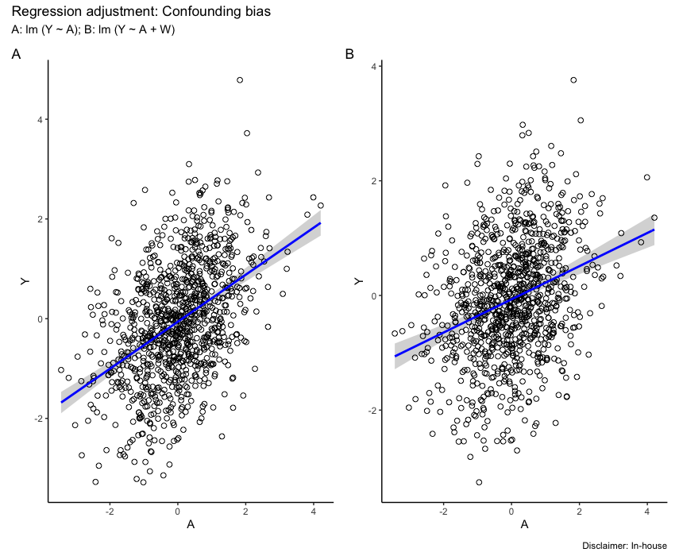
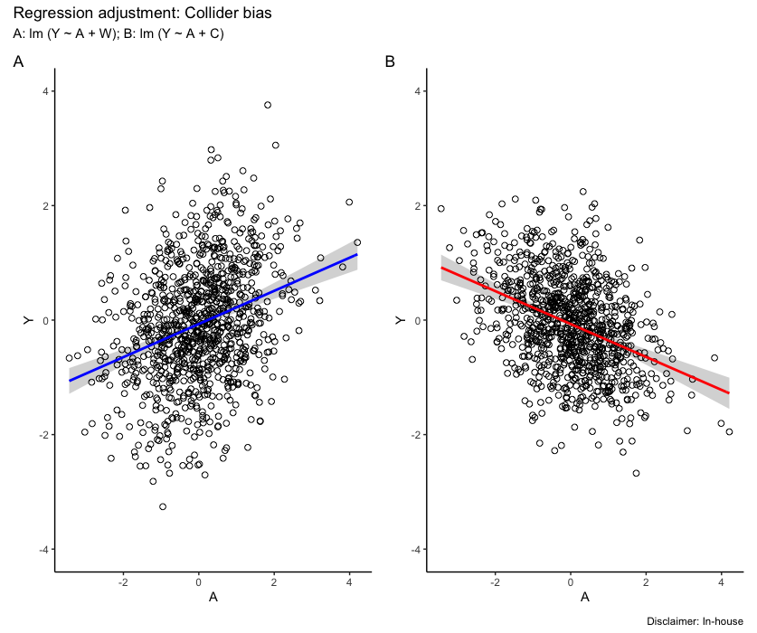

# Regression adjustment {#sec-regression}

Regression adjustment is a powerful statistical tool that allows one to control for confounding in complex settings where other methods, such as matching or stratification, do not work. This chapter will introduce the concept of confounding and the regression adjustment method to control for it.

Note: This chapter contains a lot of content from [this paper](https://academic.oup.com/ije/article/48/2/640/5248195?login=false).[@doi:10.2105/AJPH.2018.304916_f08f]

## Regression methods

Confounding bias in epidemiological studies occurs when there are shared causes for both treatment or exposure, henceforth (A) and outcome, henceforth (Y) that can fully or partially explain the observed association between A and Y. To control for confounding randomization is classically used in experimental settings before the study design. However, when these tools fail or in observational studies it is critical to address confounding during the analysis stage. Classically, stratification serves as a well-recognized analytical technique to manage confounding. This approach involves evaluating the association of interest within separate groups that display similar characteristics with respect to the confounders. The principle of stratification is simple: It removes the variability of confounding elements within each group, ensuring these do not impact the treatment outcome relationship.

However, despite being highly effective, stratification's application becomes limited when faced with numerous confounding variables, as it results in overly small groupings that hinder practical comparisons due to insufficient data for precise estimation (i.e., sparsity due to increasing dimensionality on the data).

Regression methods for adjusting confounding variables incorporate details about interventions and prognostic factors into a regression formula within a modeling context:
$$
y_{ij} = \beta_{0j} + \beta_{1j}x_{i1} + \beta_{2j}x_{i2} + \cdots + \beta_{pj}x_{ip} + \epsilon_{ij},
$$
where:

- $y_{ij}$: represents the i-the observation of the j-th dependent variable.
- $\beta_{0j}$: is the intercept for the j-th dependent variable.
- $\beta_{kj}$: is the regression coefficient for the k-th predictor variable (xk) on the j-th dependent variable.
- $x_{ik}$: represents the i-th observation of the k-th predictor variable.
- p: This is the total number of predictor variables.
- $\epsilon_{ij}$: represents the error term for the i-th observation of the j-th dependent variable.

Regression models are often fit within the generalized linear modeling framework. In a generalized linear model (GLM), the **link** function describes the relationship between Y, and A, adjusted for the set of confounders. It converts probabilities of Y into a continuous measure, enabling the modeling of relationships within a linear regression framework, offering all the advantages of including the outcome predictors in the model as quantitative variables without categorization, and the ability to assess trends with ordinal-scale confounders.

Common link functions include: i) the Identity link for linear regression models with continuous, normally distributed responses; ii) the Logit link for binary outcomes, like disease presence; iii) the Probit link, transforming binary responses to a standard normal distribution; iv) the Log link for positively skewed responses, such as counts or proportions; and v) the Inverse link for continuous, positively skewed responses. For binary outcomes, to assess the model coefficient for the adjusted A effect, the odds ratio [OR] is used as a useful estimand. Other estimands that regression models can also calculate are the risk ratio [RR] and the absolute risk or risk difference [RD].

The interpretation of the regression coefficients is straightforward. A regression coefficient indicates how the outcome changes with a change in the treatment or exposure of interest, holding the other model predictors constant. This is a conditional estimate effect. It is important to highlight that in simple linear models, this is equivalent to the marginal effect, i.e., the overall treatment effect. However, when interaction terms are added between A and some confounders, models become more complex. In such cases, the coefficient for A might only represent its effect within a reference group, i.e., a conditional effect and not the overall effect. When moving away from linear models, the connection between conditional effects and overall marginal effects can deteriorate considerably. It might seem natural to assume that dividing a population into various subgroups and then estimating the effect within each subgroup would produce an overall marginal effect that is simply a weighted combination of these subgroup-specific effects. However, this relationship holds only for certain causal measures—specifically those that are collapsible, such as RD and RR. In contrast, ORs exhibit non-collapsibility (see Chapter 3 for more details on collapsibility), which means that the marginal odds ratio might be either larger or smaller than any of the conditional ORs derived from subgroups in the regression model.[@Withcomb2021]

## Confounding and collider biases

A confounder can fully or partially explain the observed association between exposure (A) and outcome (Y). This bias i.e., "confounding bias", makes for example the effect measure from a binary treatment (A) on the binary outcome (Y) i.e., the raw OR, to diverge from its true causal effect, i.e., the true marginal causal OR. The expression "association is not causation" illustrates clearly the importance of accounting for confounding bias.

Regression models can be a viable approach for confounding adjustment; however, it requires assuming no effect modification. Alternatively, the generalization of standardization, via the **G-Formula**[@robins86new], could be used to improve adjustment, minimize residual confounding, and allow for causal interpretation without randomization (see Chapter four). Moreover, in certain cases, the introduction of a specific type of confounder known as a "collider" into a regression model can result in bias in the regression coefficient estimates for the treatment effect (A), even though it could potentially enhance the model's overall goodness of fit.

Direct Acyclic Graphs (DAGs), which are informed by expertise in the subject area, play a crucial role in identifying such colliders. Identifying whether a confounder is a collider requires careful consideration of the true unobserved data-generating process and the interrelationships among variables within a given context.[@Pearce2014]

In general, incorporating a collider into a regression model is discouraged if the goal is to estimate causal effects, as it can introduce bias. However, if the model is aimed at prediction, including colliders might be beneficial if it decreases prediction error.

To illustrate both concepts, we use a linear regression modeling framework to adjust for confounding in a set of boxes containing R software commented code. We introduce three scenarios to illustrate the differences in adjusting for confounders or colliders @fig-DAG2 In @fig-DAG2 (panel A), the causal effect of $A$on$Y$is confounded by$W$. In @fig-DAG2 (panel B), the causal effect of $A$on$Y$is not confounded but adjusting for the collider$C$induces a bias. Lastly, in @fig-DAG2 (panel C), there are no confounders but conditioning on the collider$C$opens a back-door path through$W1$and$W2$.

```{mermaid}
graph LR
  subgraph PanelA["Panel A"]
    W((W)) --> A[A]
    W --> Y[Y]
    A --> Y
  end
  subgraph PanelB["Panel B"]
    A2[A] --> C((C))
    Y2[Y] --> C
    A2 --> Y2
  end
  subgraph PanelC["Panel C"]
    W1((W1)) --> A3[A]
    W1 --> C3((C))
    W2((W2)) --> C3
    W2 --> Y3[Y]
    A3 --> Y3
  end
```

Data consistent with the directed acyclic graph (DAG) depicted in @fig-DAG2 was generated (Box 2.1), following a process akin to that described by [@Luque-Fernandez2018]: The confounder, represented by **$W$** in @fig-DAG2, was simulated as a standard normal random variable, characterized by a mean of 0 ($\mu=0$) and a variance of 1 ($\sigma^{2}=1$). The generation of the exposure, $A$, was contingent upon the value of $W$, incorporating an error term with a standard normal distribution. Subsequently, the outcome, $Y$, was generated as a function of both $A$and$W$, with an additional error term also drawn from a standard normal distribution. These assumptions establish linear relationships between the variables and a simulated causal effect of $A$on$Y$with a coefficient of 0.3. Linear regression models, both unadjusted (fit1) and adjusted for$W$(fit2), were then employed to estimate associations between$A$and$Y$.

**Box 2.1**: Generate data consistent with @fig-DAG2 (panel A)

**Box 2.1 (R):** Generate data consistent with @fig-DAG2 (panel A)

```r
library(visreg) # load package to visualize regression output
library(ggplot2)# load package to visualize regression output
library(patchwork) # https://patchwork.data-imaginist.com/

N <- 1000 # sample size
set.seed(777)
W <- rnorm(N) # confounder
A <- 0.5 * W + rnorm(N) # exposure
Y <- 0.3 * A + 0.4 * W + rnorm(N) # outcome
fit1 <- lm(Y ~ A) # crude model
fit2 <- lm(Y ~ A + W) # adjusted model

# visualize crude and adjusted models
a = visreg (fit1 , "A" , gg = TRUE , line = list ( col = "blue") ,
    points = list ( size = 2 , pch = 1 , col = "black") ) + theme_classic ()
b = visreg (fit2 , "A" , gg = TRUE , line = list ( col = "blue") ,
    points = list (size = 2 , pch = 1 , col = "black") ) + theme_classic ()
patchwork <- a + b + plot_layout (guides = "collect")
patchwork + plot_annotation(
    tag_levels = 'A',
    title = 'Regression adjustment: Confounding bias',
    subtitle = 'A: lm (Y ~ A); B: lm (Y ~ A + W)',
    caption = 'Disclaimer: In-house'
)
```

**Box 2.1 (Stata):** Stata code for data generation and confounding adjustment

```stata
* Stata code: Generate data consistent with DAG panel A
clear all
set seed 777
set obs 1000

* Generate confounder, exposure, and outcome
generate W = rnormal()
generate A = 0.5 * W + rnormal()
generate Y = 0.3 * A + 0.4 * W + rnormal()

* Crude model (unadjusted for confounder)
regress Y A

* Adjusted model (controlling for confounder W)
regress Y A W

* Visualize using marginal predictions
quietly regress Y A
margins, at(A = (-3(0.5)3))
marginsplot, name(crude, replace) title("Crude: Y ~ A") ///
    ytitle("Linear prediction") xtitle("A")

quietly regress Y A W
margins, at(A = (-3(0.5)3))
marginsplot, name(adjusted, replace) title("Adjusted: Y ~ A + W") ///
    ytitle("Linear prediction") xtitle("A")

* Combine graphs
graph combine crude adjusted, name(combined, replace) ///
    title("Regression adjustment: Confounding bias")
```

The first regression analysis, without conditioning on W, illustrates this bias. The estimated coefficient for $A$(0.472) exhibits an upward bias compared to the true causal effect (0.3) specified in the simulation. In contrast, the second regression adds$W$ as a covariate, effectively closing the open back-door path. This approach yields a more accurate estimate of the causal effect (0.289), closer to the true value. The remaining residual difference of 0.011 can be attributed to sampling variability.

@fig-DAG2 shows the confounding bias based on the slope from the linear adjustment contrasting A without adjustment for W versus B with adjustment for W.

{#fig-DAG2 fig-align="center"}

@fig-DAG2 highlights the key role of $W$as a confounder in this causal structure. Its unique position without parent nodes indicates that it is not influenced by any other variable in the DAG. Consequently,$W$is generated independently within the model. However, both$A$and$Y$share a common parent in$W$, creating an open back-door path between them. This path explains the potential for confounding bias.

In contrast to @fig-DAG2 (panel A), where the causal arrows originate from node $W$, @fig-DAG2 (panel B) presents a different causal structure with arrows directed toward node $C$from both$A$and$Y$. Conditioning on $C$in this scenario, through methods such as regression or stratification, introduces collider bias. This arises because node$C$acts as a collider on the path$A \rightarrow C \leftarrow Y$, where two causal pathways converge.

To illustrate this concept, consider a scenario where the wetness of the ground ($C$) is solely influenced by rain ($A$) and an automatic sprinkler ($Y$) set on a timer. In this case, knowing that the ground is wet (conditioning on $C$) while simultaneously observing that it did not rain (negating path $A \rightarrow C$) implies that the sprinkler must be on (positive effect on $C$via path$Y \rightarrow C$). Failing to account for the collider $C$ in the analysis might lead to the erroneous conclusion that rain negatively influences sprinkler usage, despite pre-existing knowledge of their independence.[@pearl09causality]

Violation of the ignorability assumption due to collider conditioning: conditioning on a collider variable, such as $C$ in @fig-DAG2 (panel B), can induce a spurious association between the exposure ($A$) and the potential outcomes ($Y(a)$). This undermines the conditional ignorability assumption ($Y(a)\perp A \mid W, C$), which requires the exposure to be independent of the potential outcomes given the conditioning set (see Chapter One).

@fig-DAG2 (panel B) illustrates this concept. Conditioning on $C$ opens the back-door path ($A \rightarrow C \leftarrow Y$) previously blocked by the collider itself. This opens a channel for the effect of $A$on$Y$to indirectly influence the observed association between$A$and$Y(a)$. As a result, the observed association becomes a mixture of both the causal effect of $A$on$Y$and the spurious association induced by the back-door path. This confounds the interpretation of the association, as it is no longer solely attributable to the direct causal effect of$A$on$Y$. Therefore, conditioning on a collider can lead to spurious associations, hindering the identification of true causal relationships from observational data.

@fig-DAG2 (panel C) gives another, more complex collider structure usually known as M-bias, in which the collider ($C$) is the effect of a common cause ($W1$) of the exposure ($A$) and a common cause ($W2$) of the outcome ($Y$). There is only one back-door path, and it is already blocked by the collider ($C$); thus we do not need to control for anything. This is the difference between confounders and colliders: a path will be open if one does not adjust for confounders but blocked if adjustment is made. For colliders, it is the other way around. However, some could consider $C$to be a classical confounder as it is associated with both$A$, via ($A \leftarrow W1 \rightarrow C$), and with $Y$, via a path that does not go through $A$ ($C \leftarrow W2 \rightarrow Y$), and it is not in the causal pathway between $A$and$Y$. However, controlling for $C$ will introduce a collider bias. If one were to use the traditional characteristics used to identify confounders (i.e., a third variable [$W$] associated with both the exposure [$A$] and the outcome [$Y$] that is not on the causal pathway between $A$and$Y$), then one could confuse a collider with a confounder.

@fig-DAG2 (panel C) presents a more intricate collider structure exhibiting M-bias, where the collider, $C$, is influenced by both $W$1, a common cause with exposure $A$, and $W$2, a common cause with outcome $Y$. Notably, a single back-door path exists, but collider $C$already blocks it, eliminating the need for adjustment. This highlights a fundamental distinction between confounders and colliders: while adjusting for confounders reveals potential causal effects by unblocking paths, adjusting for colliders like$C$ inadvertently introduces bias by opening blocked paths, leading to the M-bias phenomenon.

However, some may misinterpret $C$as a traditional confounder. It is indeed associated with both$A$(via$W$1) and $Y$(via$W$2), and it lies outside the direct causal pathway between $A$and$Y$. Despite these characteristics, controlling for $C$would induce collider bias, highlighting the critical distinction between association and causation. Therefore, relying solely on the conventional properties of confounders (association with both exposure and outcome, off-pathway location) can lead to misidentification and spurious inferences when dealing with colliders like$C$. This underscores the importance of carefully considering the underlying causal structure and potential collider bias before implementing adjustment strategies.

Building upon the simulated scenario depicted in @fig-DAG2 (panel B), we replicate the data generation process through a simplified linear mechanism outlined in Box 2.2 Initially, we draw variable $A$from a standard normal distribution conditioned on the confounder$W$. Subsequently, we generate outcome $Y$as the sum of the effect of$A$, the confounder $W$, and an error term. Similarly, variable $C$is generated as a function of both$A$and$Y$, incorporating additional error. This revised configuration, as illustrated in @fig-DAG2 (panel B), establishes both $A$(exposure) and$Y$(outcome) as parents of$C$(collider), creating a common effect situation. We then proceed to analyze the data by fitting two models: an adjusted model for$W$excluding the collider (fit3) and a model that incorporates the collider (fit4), also referred to as the collider model). Notably, the true causal coefficient of exposure$A$is established as 0.3, with the collider$C$demonstrating coefficients of 1.0 for both its association with exposure$A$and outcome$Y$.

Box 2.2: To generate data consistent with @fig-DAG2 (panel B)

**Box 2.2 (R):** Generate data consistent with @fig-DAG2 (panel B)

```r
N <- 1000 # sample size
set.seed (777)
W <- rnorm(N) # confounder
A <- 0.5 * W + rnorm(N) # exposure
Y <-  0.3 * A + + 0.4 * W + rnorm(N) # outcome
C <-  1 * A + 1 * Y + rnorm(N) # collider
fit3 <- lm (Y ~ A + W) # adjusted model for confounder
fit4 <- lm (Y ~ A + C) # adjusted model for collider

# visualize adjusted models
g1 <- visreg (fit3 , "A" , gg = TRUE , line = list ( col = "blue") ,
            points = list (size = 2 , pch = 1 , col = "black") ) + theme_classic () +
    coord_cartesian (ylim = c ( -4 , 4))
g2 <- visreg (fit4 , "A" , gg = TRUE , line = list ( col = "red") ,
            points = list (size = 2 , pch = 1 , col = "black") ) + theme_classic () +
    coord_cartesian (ylim = c ( -4 , 4))
patchwork <- g1 + g2 + plot_layout (guides = "collect")
patchwork + plot_annotation(
    tag_levels = 'A',
    title = 'Regression adjustment: Collider bias',
    subtitle = 'A: lm (Y ~ A + W); B: lm (Y ~ A + C)',
    caption = 'Disclaimer: In-house')
```

**Box 2.2 (Stata):** Stata code for data generation and collider bias illustration

```stata
* Stata code: Generate data consistent with DAG panel B (collider)
clear all
set seed 777
set obs 1000

generate W = rnormal()
generate A = 0.5 * W + rnormal()
generate Y = 0.3 * A + 0.4 * W + rnormal()
generate C = 1 * A + 1 * Y + rnormal()   /* C is a collider */

* Model adjusted for confounder W (correct estimate)
regress Y A W

* Model adjusted for collider C (biased estimate)
regress Y A C

* Visualize adjusted predictions
quietly regress Y A W
margins, at(A = (-3(0.5)3))
marginsplot, name(g1, replace) title("Adjusted for W: Y ~ A + W") ///
    ytitle("Linear prediction") xtitle("A") ylabel(-4(2)4)

quietly regress Y A C
margins, at(A = (-3(0.5)3))
marginsplot, name(g2, replace) title("Adjusted for C (collider): Y ~ A + C") ///
    ytitle("Linear prediction") xtitle("A") ylabel(-4(2)4)

* Combine graphs
graph combine g1 g2, name(combined, replace) ///
    title("Regression adjustment: Collider bias")
```

In contrast to the previous section, ignoring the collider variable $C$in the regression model resulted in an estimate of the true coefficient for$A$(0.3) that was remarkably close, at 0.298. However, adjusting for$C$introduced a substantial bias, leading to an estimate of -0.3 as depicted in @fig-DAG3 While the model incorporating the collider (fit4) performs competitively from a predictive standpoint, as evidenced by its lower Akaike Information Criterion (AIC), it paradoxically alters the direction of the association between$A$and$Y$. This phenomenon, where conditioning on the collider introduces bias while ignoring it does not, arises when both $A$and$Y$ are positively correlated with the collider. Thus, in this specific case, including the collider in the regression model introduces a bias while excluding it does not.

{#fig-DAG3 fig-align="center"}

## Motivating example

To illustrate the impact of conditioning on a collider variable, we simulated a dataset with 1,000 observations focusing on the relationship between dietary sodium intake, age, and systolic blood pressure (SBP). The example is fully available and reproducible at the GitHub repository: <https://github.com/migariane/ColliderApp>, and there is also an online available ShinyApp at: <https://watzile.shinyapps.io/EpiCollider/>

Hypertension affects nearly one-third of the American population, with over half exhibiting uncontrolled hypertension. Extensive evidence confirms a positive association between cumulative daily sodium intake (grams) exceeding recommended levels and elevated SBP (mmHg). Moreover, advancing age brings about anatomical and physiological changes in the kidneys, compromising their ability to regulate extracellular fluid volume and composition. Notably, these changes include diminished glomerular filtration rate and an impaired capacity to maintain water and sodium homeostasis in response to external factors. Additionally, age-related structural modifications in the arteries contribute to the observed association between age and SBP.

The strong association between age and both high SBP and impaired sodium homeostasis poses a challenge for assessing the true relationship between sodium intake (SOD) and SBP. Age acts as a potential confounder in this scenario, residing on the causal pathway between SOD and SBP as illustrated in @fig-DAG3 This implies that controlling for age solely based on its association with both the exposure (SOD) and the outcome (SBP) could introduce bias into the estimated effect of SOD on SBP.

Further complicating the analysis is the role of proteinuria (PRO). High levels of 24-hour urinary protein excretion are observed in response to both sustained high SBP and increased dietary sodium intake, as shown in @fig-DAG3 This places proteinuria in the position of a potential collider variable. Controlling for proteinuria in the presence of unmeasured common causes with both SOD and SBP (represented by the arrow converging on PRO in @fig-DAG3) could introduce collider bias, potentially underestimating or overestimating the true effect of SOD on SBP. Therefore, researchers conducting such analyses should carefully consider the potential for both confounding and collider bias. Controlling for age remains crucial when its influence on SBP pathways is understood and adequately represented in the model. However, if the underlying physiological mechanisms are incompletely understood, or if proteinuria is mistakenly conceptualized as a confounder, controlling for it could lead to biased estimates.

```{mermaid}
graph TD
  AGE((AGE)) --> SOD((SOD))
  AGE --> SBP((SBP))
  SOD --> SBP
  SOD --> PRO((PRO))
  SBP --> PRO
```

This section focuses on simulating data to illustrate the paradoxical effect of 24-hour dietary sodium intake (grams) on systolic blood pressure (SBP) after conditioning on a potential collider, urinary proteinuria. The simulated data will be based on the structural relationships depicted in the DAG presented in @fig-DAG3 (see Box 2.3 for details).

Box 2.3 provides a function to simulate data for this example. The true causal effect of sodium intake on systolic blood pressure (SBP) is represented by a beta coefficient of 1.05, as shown in the formula for SBP: systolic blood pressure $=\beta_{1} \cdot sodium + \beta_{2} \cdot age + \epsilon$, where $\beta_{1} = 1.05$, $\beta_{2} = 2.0$, and $\epsilon$denotes a standard normally distributed error term. Additionally, the coefficients for the association of proteinuria (PRO) with SBP and sodium intake are 2.0 and 2.8, respectively, as specified in the formula for PRO: PRO$= \beta_{1} \cdot SBP + \beta_{2} \cdot Sodium + \epsilon$, where $\beta_{1} = 2.0$, $\beta_{2} = 2.8$, and $\epsilon$ represents a standard normally distributed error term.

Box 2.3: Data generation consistent with @fig-DAG3

**Box 2.3 (R):** Data generation consistent with @fig-DAG3

```r
generateData <- function(n, seed){
    set.seed(seed)
    Age_years <- rnorm(n, 65, 5)
    Sodium_gr <- Age_years / 18 + rnorm(n)
    sbp_in_mmHg <- 1.05 * Sodium_gr + 2.00 * Age_years + rnorm(n)
    hypertension <- ifelse(sbp_in_mmHg > 140, 1, 0)
    Proteinuria_in_mg <- 2.00*sbp_in_mmHg + 2.80*Sodium_gr + rnorm(n)
    data.frame(sbp_in_mmHg, hypertension, Sodium_gr, Age_years, Proteinuria_in_mg)
}

ObsData <- generateData(n = 1000, seed = 777)
```

**Box 2.3 (Stata):** Stata code for data generation of the sodium/SBP example

```stata
* Stata code: Data generation consistent with DAG for sodium/SBP example
clear all
set seed 777
set obs 1000

* Generate variables based on the DAG structure
generate Age_years = rnormal(65, 5)
generate Sodium_gr = Age_years / 18 + rnormal()
generate sbp_in_mmHg = 1.05 * Sodium_gr + 2.00 * Age_years + rnormal()
generate hypertension = (sbp_in_mmHg > 140)
generate Proteinuria_in_mg = 2.00 * sbp_in_mmHg + 2.80 * Sodium_gr + rnormal()

* Label variables for clarity
label variable Age_years "Age in years"
label variable Sodium_gr "Sodium intake (grams)"
label variable sbp_in_mmHg "Systolic blood pressure (mmHg)"
label variable hypertension "Hypertension indicator (SBP>140)"
label variable Proteinuria_in_mg "Proteinuria (mg)"
```

Three linear regression models were employed (Box 2.4) to explore the association between sodium intake and systolic blood pressure (SBP):

1. Unadjusted model: This basic model examined the crude relationship between sodium intake and SBP.
2. Model adjusted for age: Recognizing age as a potential confounder, this model controlled for its influence on the association.
3. Model adjusted for age and proteinuria: Expanding upon the previous model, proteinuria was included as a potential collider variable due to its possible influence on both sodium intake and SBP.

The algebraic specifications of these models are presented below. Additionally, Box 2.4 provides R code for model fitting and visualization.

Model 1:
$$
\text{SBP} \quad = \quad \beta0 + \beta1 \cdot Sodium + \epsilon
$$
Model 2:
$$
\text{SBP} \quad = \quad \beta0 + \beta1 \cdot Sodium + \beta2 \cdot Age + \epsilon
$$
Model 3:
$$
\text{SBP} \quad = \quad \beta0 + \beta1 \cdot Sodium + \beta2 \cdot Age + \beta3 \cdot Proteinuria + \epsilon
$$
Box 2.4: Linear regression models in R

**Box 2.4 (R):** Linear regression models in R

```r
library(broom) # load packages to visualize regression model's output
library(visreg)

## Models Fit
fit1 <- lm(sbp_in_mmHg ~ Sodium_gr, data = ObsData); tidy(fit0)
fit2 <- lm(sbp_in_mmHg ~ Sodium_gr + Age_years, data = ObsData); tidy(fit2)
fit3 <- lm(sbp_in_mmHg ~ Sodium_gr + Age_years + Proteinuria, data = ObsData); tidy(fit3)

## Models visualization
par(mfrow = c(1, 3))
visreg(fit1, ylab = 'SBP in mmHg', line = list(col = 'blue'),
    points = list(cex = 1.5, pch = 1), jitter = 10, bty = 'n')

visreg(fit2, ylab = 'SBP in mmHg', line = list(col = 'blue'),
    points = list(cex = 1.5, pch = 1), jitter = 10, bty = 'n')

visreg(fit3, ylab = 'SBP in mmHg', line = list(col = 'red'),
    points = list(cex = 1.5, pch = 1), jitter = 10, bty = 'n')
```

**Box 2.4 (Stata):** Stata code for linear regression models

```stata
* Stata code: Linear regression models for sodium/SBP example

* Model 1: Unadjusted (crude association)
regress sbp_in_mmHg Sodium_gr

* Model 2: Adjusted for age (confounder)
regress sbp_in_mmHg Sodium_gr Age_years

* Model 3: Adjusted for age and proteinuria (collider)
regress sbp_in_mmHg Sodium_gr Age_years Proteinuria_in_mg

* Visualize using marginal predictions with confidence intervals
* Model 1
quietly regress sbp_in_mmHg Sodium_gr
margins, at(Sodium_gr = (3(1)8))
marginsplot, name(fit1_stata, replace) title("Model 1: Unadjusted") ///
    ytitle("SBP in mmHg") xtitle("Sodium (grams)")

* Model 2
quietly regress sbp_in_mmHg Sodium_gr Age_years
margins, at(Sodium_gr = (3(1)8))
marginsplot, name(fit2_stata, replace) title("Model 2: Adjusted for Age") ///
    ytitle("SBP in mmHg") xtitle("Sodium (grams)")

* Model 3
quietly regress sbp_in_mmHg Sodium_gr Age_years Proteinuria_in_mg
margins, at(Sodium_gr = (3(1)8))
marginsplot, name(fit3_stata, replace) title("Model 3: + Proteinuria") ///
    ytitle("SBP in mmHg") xtitle("Sodium (grams)")

* Combine plots
graph combine fit1_stata fit2_stata fit3_stata, rows(1) name(combined, replace) ///
    title("Linear regression: Sodium and SBP")
```

To further investigate the association between sodium intake and hypertension, defined as a binary outcome (systolic blood pressure $\geq$140 mmHg = 1,$<$ 140 mmHg = 0), we employed three logistic regression models. The first model served as a baseline, excluding any adjustments. The second model incorporated age as a potential confounder, while the third additionally adjusted for proteinuria, identified as a collider variable due to its potential influence on both sodium intake and hypertension. Notably, these models mirrored the specifications previously described, with the exception of the binary outcome variable (hypertension). Box 2.5 demonstrates the R code for fitting and visualizing these models as a forest plot.

Box 2.5: Multiplicative scale visualization using a forest plot function

**Box 2.5 (R):** Logistic regression models for hypertension outcome

```r
## Models fit on multiplicative scale
	library(dplyr)
	library(forestplot)
	fit3 <- glm(hypertension ~ Sodium_gr, family=binomial(link='logit'), data=ObsData)
	or <- round(exp(fit3$coef)[2], 3) # conditional odds ratio from logistic model
	ci95 <- exp(confint(fit3))[-1,] # 95% CI of odds ratio
	fit4 <- glm(hypertension ~ Sodium_gr + Age_years, family = binomial(link = 'logit'), data = ObsData)
	or <- round(exp(fit4$coef)[2], 3)
	ci95 <- exp(confint(fit4))[2,]
	fit5 <- glm(hypertension ~ Sodium_gr + Age_years + Proteinuria_in_mg, family = binomial(link = 'logit'), data = ObsData)
	or <- round(exp(fit5$coef)[2], 3)
	ci95 <- exp(confint(fit5))[2,]

## Forest plot (see supplementary material for accessing the complete code)
	fp <- rbind(result1, result2, result3); fp %>% or_graph()
```

**Box 2.5 (Stata):** Stata code for logistic regression models

```stata
* Stata code: Logistic regression models for hypertension (multiplicative scale)

* Model 1: Unadjusted
logistic hypertension Sodium_gr
* Display odds ratio with 95% CI
* Alternatively, use logit for coefficients:
* logit hypertension Sodium_gr

* Model 2: Adjusted for age (confounder)
logistic hypertension Sodium_gr Age_years

* Model 3: Adjusted for age and proteinuria (collider)
logistic hypertension Sodium_gr Age_years Proteinuria_in_mg

* To store odds ratios for a forest plot, use estimates store
* Model 1
logistic hypertension Sodium_gr
estimates store m1

* Model 2
logistic hypertension Sodium_gr Age_years
estimates store m2

* Model 3
logistic hypertension Sodium_gr Age_years Proteinuria_in_mg
estimates store m3

* Forest plot using coefplot (user-written; install with: ssc install coefplot)
* coefplot (m1, drop(_cons) label("Unadjusted")) ///
*         (m2, drop(_cons) label("+ Age")) ///
*         (m3, drop(_cons) label("+ Proteinuria")), ///
*         xline(1) eform title("Forest plot: Sodium and Hypertension") ///
*         xtitle("Odds Ratio (95% CI)")
```

**Effect of conditioning on a collider**

@fig-figure5 depicts the estimated effect of sodium intake on systolic blood pressure (SBP) after conditioning on a collider variable, along with corresponding 95% confidence intervals. The adjusted regression line represents the predicted SBP conditional on the median value of age (@fig-figure5 panel B) or both age and proteinuria (@fig-figure5 panel C). Notably, unlike the unadjusted and bivariate models in @fig-figure5 (panels A and B, respectively), the collider-adjusted model in @fig-figure5 (panel C) reveals a negative association between sodium intake and SBP. Here, a one-unit increase in sodium intake is associated with a predicted decrease of 0.9 mmHg in SBP.

{#fig-figure5 fig-align="center"}

## Monte-Carlo simulation

The code employed for conducting Monte-Carlo simulations on the additive scale, utilizing the same parameters as outlined in Box 2.3, is presented in Box 2.6 Within the linear model, the simulated causal effect of 24-hour sodium intake on SBP was 1.05 mmHg. The coefficients corresponding to the associations between proteinuria (PRO) and SBP, as well as PRO and sodium intake, were 2.0 and 2.8, respectively. Upon completion of 1000 simulation iterations, the estimated additive effect of 24-hour sodium intake on SBP was determined to be -0.91 mmHg. This indicates a decrease of -0.91 units in SBP for every unit increase in sodium intake. Notably, conditioning on proteinuria, a collider variable, introduced a relative bias of 13.3%.

Box 2.6: Monte Carlo simulations

**Box 2.6 (R):** Monte Carlo simulations

```r
# Monte Carlo Simulations
	R<-1000
	true <- rep(NA, R)
	collider <- rep(NA, R)
	se <- rep(NA, R)
	set.seed(050472)

	for(r in 1: R) {
	if (r%%10 == 0) cat(paste('This is simulation run number', r, '\n'))

# Function to generate data
	generateData <- function(n){
	Age_years <- rnorm(n, 65, 5)
	Sodium_gr <- Age_years / 18 + rnorm(n)
	sbp_in_mmHg <- 1.05 * Sodium_gr + 2.00 * Age_years + rnorm(n)
	Proteinuria_in_mg <- 2.00 * sbp_in_mmHg + 2.80 * Sodium_gr + rnorm(n)
	data.frame(sbp_in_mmHg, Sodium_gr, Age_years, Proteinuria_in_mg)
	}

	ObsData <- generateData(n=10000)

# True effect
	true[r] <- summary(lm(sbp_in_mmHg ~ Sodium_gr + Age_years, data = ObsData))$coef[2,1]

# Collider effect
	collider[r] <- summary(lm(sbp_in_mmHg ~ Sodium_gr + Age_years + Proteinuria_in_mg, data = ObsData))$coef[2,1]
	se[r] <- summary(lm(sbp_in_mmHg ~ Sodium_gr + Age_years + Proteinuria_in_mg, data = ObsData))$coef[2,2]
	}

# Estimate of sodium true effect
	mean(true)

# Estimate of sodium biased effect in the model including the collider
	mean(collider)

# simulated standard error/confidence interval of outcome regression
	lci <- (mean(collider) - 1.96*mean(se)); mean(lci)
	uci <- (mean(collider) + 1.96*mean(se)); mean(uci)

# Bias
	Bias <- (true - abs(collider)); mean(Bias)

# % Bias
	relBias <- ((true - abs(collider)) / true); mean(relBias) * 100

# Plot bias
	plot(relBias)
```

**Box 2.6 (Stata):** Stata code for Monte Carlo simulations

```stata
* Stata code: Monte Carlo simulations of collider bias
clear all
set seed 050472

* Define a program to generate one simulated dataset and compute estimates
capture program drop sim_collider_sbp
program define sim_collider_sbp, rclass
    syntax [, n(integer 10000)]
    drop _all
    set obs `n'
    
    * Generate data consistent with DAG
    generate Age_years = rnormal(65, 5)
    generate Sodium_gr = Age_years / 18 + rnormal()
    generate sbp_in_mmHg = 1.05 * Sodium_gr + 2.00 * Age_years + rnormal()
    generate Proteinuria_in_mg = 2.00 * sbp_in_mmHg + 2.80 * Sodium_gr + rnormal()
    
    * True effect (adjusted for confounder, excluding collider)
    regress sbp_in_mmHg Sodium_gr Age_years
    return scalar true_eff = _b[Sodium_gr]
    
    * Collider effect (adjusted for confounder AND collider)
    regress sbp_in_mmHg Sodium_gr Age_years Proteinuria_in_mg
    return scalar collider_eff = _b[Sodium_gr]
    return scalar se = _se[Sodium_gr]
end

* Run 1000 simulations using simulate prefix
simulate true_eff = r(true_eff) collider_eff = r(collider_eff) ///
         se = r(se), reps(1000) seed(050472) saving(sim_results, replace): sim_collider_sbp

* Load simulation results and compute summaries
use sim_results, clear

* Mean estimates
summarize true_eff
local mean_true = r(mean)
summarize collider_eff
local mean_coll = r(mean)
summarize se
local mean_se = r(mean)

display "True effect (mean): `mean_true'"
display "Collider-biased effect (mean): `mean_coll'"
display "Mean standard error: `mean_se'"

* Confidence interval for collider effect
local lci = `mean_coll' - 1.96 * `mean_se'
local uci = `mean_coll' + 1.96 * `mean_se'
display "95% CI for collider effect: (`lci', `uci')"

* Bias and relative bias
generate bias = true_eff - abs(collider_eff)
generate relBias = 100 * (true_eff - abs(collider_eff)) / true_eff
summarize bias relBias

* Histogram of relative bias
histogram relBias, name(bias_hist, replace) ///
    title("Distribution of relative bias (%)") ///
    xtitle("Relative bias (%)") ytitle("Frequency")
```

Within the framework of this data-generating structure, the presence of a collider variable introduces regression dilution bias (also known as regression attenuation), reducing the observed association between sodium intake and SBP compared to the true causal effect. To induce a paradoxically negative association (i.e., sodium intake protective against SBP), the strength of the collider-exposure association ($\alpha_{1}$) and collider-outcome association ($\alpha_{2}$) must increase relative to the magnitude of the true causal effect. While equating $\alpha_{1}$and$\alpha_{2}$ may not be entirely realistic, it serves as a useful simplification for illustrating how bias magnitude changes as these associations vary.

Beyond the classic scenario of conditioning on a collider in the analysis, two further situations warrant attention:

1. Collider Effect and Sample Selection: When sample selection is guided by either a measured or unmeasured common effect of the exposure and outcome, collider bias can emerge. Recent studies highlight the potential for even subtle influences on sample selection to induce misleading estimates. Unfortunately, addressing this bias can be challenging, as information on selection mechanisms may be lacking.

2. M-Bias: Balancing Collider and Confounder Control: M-bias arises when the collider also functions as a confounder. In this setting, understanding the trade-off between collider and confounder control becomes crucial. M-bias, while potentially comparable in magnitude to classical confounding, is often negligible unless associations between the collider and confounders are very strong (e.g., relative risk $>$ 8). Therefore, prioritizing confounder control is generally recommended in M-bias situations.

**Collider Inclusion in Regressions:**

These investigations explored situations where adding a collider variable to a linear regression model improved model fit but introduced bias in coefficient estimates. It is important to note that

- Collider Identification: DAGs, informed by subject-matter knowledge, play a vital role in identifying colliders. This involves critically examining the unobserved data-generation process and variable relationships within the specific research context.
- Prediction vs. Explanation: The decision to include or exclude a collider depends on the study's objective. In studies seeking causal understanding in epidemiology, colliders should generally be excluded to avoid biased effect estimates and confounding through back-door paths. Conversely, for purely predictive purposes, including colliders may be beneficial if it improves model accuracy.

**Implications for Epidemiological Research:**

Given that most epidemiological research aims to explain causal relationships, awareness of collider variables is crucial to avoid paradoxical associations. By carefully considering collider effects and potential biases, epidemiologists can ensure the robustness and interpretability of their causal estimates.

## Conclusion

Regression adjustment is the most widely used method for controlling confounding in observational studies. Its simplicity and familiarity make it an essential tool, but its validity depends critically on correct model specification. When the outcome model is correctly specified and there is no effect modification by confounders, regression provides unbiased estimates of the average treatment effect. However, when effect modification is present, the regression coefficient does not, in general, equal the marginal ATE — a subtle but important point that motivates the g-formula and other standardization-based methods presented in subsequent chapters.

Key takeaways from this chapter:
- Confounding can be addressed by conditioning on measured confounders in a regression model.
- The regression coefficient for treatment equals the ATE only under effect homogeneity (no interaction between treatment and confounders).
- Model diagnostics — including residual analysis, influence measures, and specification tests — are essential for credible inference.
- When the goal is marginal causal effects in the presence of effect modification, more flexible methods such as the g-formula are needed.

## Glossary

**AIC**
:   Akaike Information Criterion — a measure of model fit penalized by the number of parameters.

**DAG**
:   Directed Acyclic Graph — a graphical representation of causal relationships among variables.

**GLM**
:   Generalized Linear Model — a flexible generalization of ordinary linear regression.

**OR**
:   Odds Ratio — the ratio of the odds of an outcome in the treated group to the odds in the control group.

**RD**
:   Risk Difference — the absolute difference in risk between treated and control groups.

**RR**
:   Risk Ratio — the ratio of the risk in the treated group to the risk in the control group.