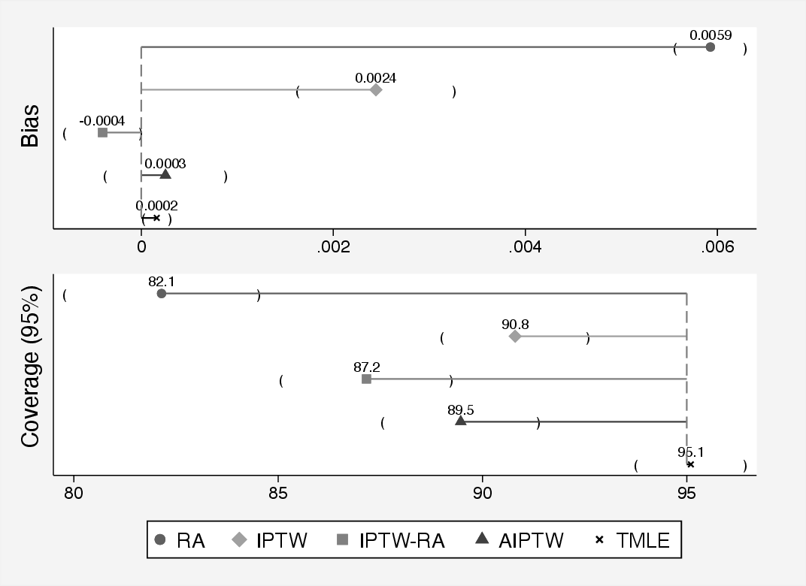

# Double-robust estimators {#sec-doublerobust}

## Introduction to Double Robustness

### Motivation: Why Double Robustness Matters

In earlier chapters, we explored several foundational methods for estimating causal effects in observational studies, including regression adjustment, propensity score methods, inverse probability of treatment weighting (IPTW), and the g-formula. Each of these methods relies on correctly specifying a model -- whether that be a model for the outcome, the treatment assignment, or the joint distribution of covariates, treatment, and outcome.

However, in real-world applications, it is often difficult to know whether the chosen model is correct. Model misspecification is a pervasive concern that can lead to biased estimates and invalid inference. This motivates the need for methods that offer greater protection against such misspecification.

Double-robust estimators are designed with this challenge in mind. They combine models for both the treatment assignment (e.g., the propensity score) and the outcome. Remarkably, they are consistent and asymptotically unbiased if *either* the treatment model *or* the outcome model is correctly specified---not necessarily both. This property makes double-robust methods particularly appealing in applied settings, offering a safeguard when uncertainty about model specification is high.

In the sections that follow, we will build on the concepts introduced in previous chapters to develop and understand double-robust estimators, starting with the intuition behind them and proceeding to concrete implementations.

### Definitions: What Makes an Estimator "Double Robust"?

An estimator is said to be *double robust* if it yields a consistent estimate of the causal effect as long as either:

1. The model for the outcome given treatment and covariates, $\mathbb{E}[Y \mid A, X]$, is correctly specified, or
2. The model for the treatment assignment mechanism, i.e., the propensity score $e(X) = \mathbb{P}(A = 1 \mid X)$, is correctly specified.

In contrast to singly robust estimators---such as ordinary regression or IPW---double-robust methods incorporate information from both models, and the estimator remains valid if at least one is correctly specified.

More formally, suppose we are interested in estimating the average treatment effect (ATE):
$$
\text{ATE} = \mathbb{E}[Y^1 - Y^0]
$$
where $Y^a$ denotes the potential outcome under treatment level $a \in \{0, 1\}$. A double-robust estimator of the ATE typically takes the form:
$$
\hat{\theta}_{\text{DR}} = \frac{1}{n} \sum_{i=1}^{n} \left\{ \frac{A_i(Y_i - \hat{m}_1(X_i))}{\hat{e}(X_i)} - \frac{(1 - A_i)(Y_i - \hat{m}_0(X_i))}{1 - \hat{e}(X_i)} + \hat{m}_1(X_i) - \hat{m}_0(X_i) \right\}
$$
where $\hat{e}(X_i)$ is the estimated propensity score, and $\hat{m}_a(X_i)$ is the predicted outcome under treatment $a$, i.e., $\hat{m}_a(X_i) = \mathbb{E}[Y \mid A = a, X = X_i]$.

If either the propensity score model $\hat{e}(X)$ or the outcome regression $\hat{m}_a(X)$ is correctly specified, the estimator $\hat{\theta}_{\text{DR}}$ is consistent for the true ATE.

### When and Why to Use Double-Robust Estimators

Double-robust estimators are particularly useful when neither the outcome model nor the treatment model can be confidently specified. In applied settings, both models are often estimated using flexible techniques such as machine learning, which are prone to bias if overfit or miscalibrated. By combining two potentially misspecified models, double-robust estimators reduce the reliance on any single model being perfectly correct.

Moreover, these estimators naturally accommodate semiparametric modeling strategies. For example, one can use logistic regression for the propensity score and nonparametric regression for the outcome model, or vice versa. The result is a flexible and robust framework for estimating causal effects even under model uncertainty.

Another key benefit is the built-in structure for diagnostic checking. If both models are suspect, the double-robust estimator may still be biased, but it can help highlight when one model strongly dominates or conflicts with the other.

### Connection to Consistency and Efficiency

Double-robust estimators are part of the broader class of semiparametric efficient estimators. If both the propensity score model and the outcome regression model are correctly specified, then double-robust estimators achieve the semiparametric efficiency bound. This means they have the lowest possible asymptotic variance among all regular and asymptotically linear estimators of the causal effect under the nonparametric model.

This efficiency property sets double-robust estimators apart from singly robust methods. For example, inverse probability weighting tends to have high variance, particularly when propensity scores are close to 0 or 1. Regression-based estimators may have low variance but can be severely biased if the regression model is incorrect. Double-robust methods strike a balance: they are consistent under weaker assumptions and can be more efficient when both models are well specified.

In summary, double-robust estimators are appealing in practice because they offer:

- Consistency under either a correctly specified treatment or outcome model,
- The potential for efficiency when both models are correct,
- Robustness to model misspecification, and
- Flexibility to incorporate machine learning.

We give a formal introduction to double robust estimation from an chronological perspective and explain the value of double robustness when using flexible data-adaptive methods for inverse probability weighting or regression adjustment introducing to one of the most novel double robust methods for causal inference i.e., Targeted Maximum Likelihood Estimation. Finally, we provide a comparison of all classical and more recent methods via a Monte Carlo simulation and discuss pro and cons of the new approaches and interesting ways to continue developing and improving causal inference.

## Inverse Probability of Treatment Weighting with Regression Adjustment

### Description of the Method

Combining inverse probability weighting (IPW) with outcome regression adjustment provides a straightforward way to construct a double-robust estimator. The idea is to use both models---the propensity score model and the outcome regression model---simultaneously to mitigate the risk of misspecification in either.

This approach is often used in practice because it is easy to implement using standard regression software, and it provides some protection against model misspecification while avoiding the more complex steps involved in targeted learning (see TMLE). In particular, it can be viewed as a preliminary or intermediate method that builds intuition for more advanced estimators like AIPW and TMLE.

The IPW + regression estimator also offers an intuitive decomposition: it reweights the residuals from the regression model using inverse probability weights and adds the difference in predicted means across treatment groups. This structure can be helpful for interpreting how and why the estimator works, and for understanding sources of bias and variability.

A common form of the estimator for the average treatment effect (ATE) is:
$$
\hat{\theta}_{\text{DR}} = \frac{1}{n} \sum_{i=1}^n \left\{ \frac{A_i(Y_i - \hat{m}_1(X_i))}{\hat{e}(X_i)} - \frac{(1 - A_i)(Y_i - \hat{m}_0(X_i))}{1 - \hat{e}(X_i)} + \hat{m}_1(X_i) - \hat{m}_0(X_i) \right\}
$$
where $\hat{m}_a(X_i)$ is the predicted outcome under treatment level $a$, and $\hat{e}(X_i)$ is the estimated propensity score. The first two terms reweight residuals using the inverse probability weights, while the final term combines the predicted differences in outcomes.

### Statistical Properties: Bias, Variance, and Efficiency

The estimator is consistent if either the propensity score model or the outcome regression model is correctly specified. When both models are correct, the estimator is semiparametrically efficient, achieving the lowest possible asymptotic variance under the nonparametric model defined by unconfoundedness.

However, when both models are misspecified, the estimator may be biased. In practice, even small violations of model assumptions can introduce bias, especially in finite samples. This reinforces the importance of using flexible models, performing diagnostics, and conducting sensitivity analyses.

Another important consideration is **variance inflation**. If the estimated propensity scores are close to 0 or 1, the corresponding weights become large, leading to instability in the estimator. This issue---known as near-violation of the positivity assumption---can be addressed through weight truncation, stabilized weights, or the use of more robust estimators like TMLE.

### Implementation in R and Stata

Here is a basic implementation of the regression + IPW estimator:

**Box 5.1:** IPTW with regression adjustment (IPTW-RA)

::: {.panel-tabset}
### R
```r
# Simulate data
set.seed(123)
n <- 1000
X <- rnorm(n)
A <- rbinom(n, 1, plogis(0.5 * X))
Y <- 2 * A + X + rnorm(n)
data <- data.frame(A, X, Y)

# Step 1: Estimate propensity scores
e.model <- glm(A ~ X, family = binomial, data = data)
data$ehat <- predict(e.model, type = "response")

# Step 2: Estimate outcome models
m1.model <- lm(Y ~ X, data = subset(data, A == 1))
m0.model <- lm(Y ~ X, data = subset(data, A == 0))
data$m1hat <- predict(m1.model, newdata = data)
data$m0hat <- predict(m0.model, newdata = data)

# Step 3: Compute double-robust estimator
with(data, mean(
  A * (Y - m1hat) / ehat -
  (1 - A) * (Y - m0hat) / (1 - ehat) +
  m1hat - m0hat
))
```

### Stata
```stata
clear all
set seed 123
set obs 1000
generate X = rnormal()
generate A = rbinomial(1, invlogit(0.5 * X))
generate Y = 2 * A + X + rnormal()

* Step 1: Estimate propensity scores
logit A X
predict double ehat, pr

* Step 2: Estimate outcome models
regress Y X if A == 1
predict double m1hat, xb
regress Y X if A == 0
predict double m0hat, xb

* Step 3: Compute double-robust estimator
generate double dr = A * (Y - m1hat) / ehat - ///
                     (1 - A) * (Y - m0hat) / (1 - ehat) + ///
                     m1hat - m0hat
summarize dr
```
:::

### When It Is Used in Practice

The regression + IPW estimator is widely used in epidemiology, economics, and health services research, especially when researchers want to guard against model misspecification. It is particularly attractive when using parametric models for one nuisance parameter (e.g., the propensity score) and nonparametric or flexible models (e.g., machine learning) for the other. In such cases, double-robustness offers a practical compromise between robustness and interpretability.

This approach is also used in high-dimensional settings, such as genomic studies or electronic health records, where traditional model diagnostics are less reliable and model misspecification is more likely. In such contexts, ensemble learners (e.g., Super Learner) can be used to estimate nuisance functions, and the double-robust estimator remains valid as long as at least one learner captures the truth.

Additionally, the regression + IPW estimator forms the foundation for more advanced estimators such as AIPW and TMLE. Understanding its structure provides essential insight into the efficient influence function framework and semiparametric causal inference more broadly.

In summary, IPW + outcome regression is a powerful, flexible, and interpretable tool in the causal inference toolbox, particularly useful in observational studies where untestable assumptions are the norm and robustness is paramount.

## Augmented Inverse Probability of Treatment Weighting

Doubly robust (DR) estimators combine both outcome regression and propensity score-based methods to estimate causal effects. The key advantage of DR estimators is that they yield consistent estimates of treatment effects if either the model for the outcome or the model for the treatment assignment (i.e., the propensity score) is correctly specified. This property provides an additional layer of protection against model misspecification.

### Augmented IPTW (AIPTW)

The most common doubly robust estimator is the Augmented Inverse Probability of Treatment Weighting (AIPTW) estimator. It augments the IPTW estimator with a regression-based prediction for the outcome. Let $Y_i$ be the observed outcome, $A_i \in \{0,1\}$ the treatment, $e(W_i)$ the estimated propensity score, and $\hat{\mu}_a(W_i) = E[Y \mid A=a, W_i]$ the predicted outcome under treatment $a$.

The AIPTW estimator for the average treatment effect (ATE) is:
$$
\widehat{ATE}_{\text{AIPTW}} = \frac{1}{n} \sum_{i=1}^n \left[ \frac{A_i Y_i}{\hat{e}(W_i)} - \frac{(A_i - \hat{e}(W_i)) \hat{\mu}_1(W_i)}{\hat{e}(W_i)} - \left( \frac{(1 - A_i) Y_i}{1 - \hat{e}(W_i)} - \frac{(A_i - \hat{e}(W_i)) \hat{\mu}_0(W_i)}{1 - \hat{e}(W_i)} \right) \right].
$$
This estimator consists of two broad components that correspond to the treated and untreated groups, respectively. The term $\frac{A_i Y_i}{\hat{e}(W_i)}$ represents a weighted average of outcomes among the treated individuals, where each individual is weighted by the inverse of their estimated propensity score. This is a standard component of the IPTW estimator, capturing the expected potential outcome under treatment. The term $\frac{(A_i - \hat{e}(W_i)) \hat{\mu}_1(W_i)}{\hat{e}(W_i)}$ acts as a correction, adjusting the treatment group's contribution based on the discrepancy between the actual treatment received and the estimated probability of treatment, scaled by the predicted outcome from the outcome regression model under treatment.

The second part of the expression inside the summation pertains to the control group. The term $\frac{(1 - A_i) Y_i}{1 - \hat{e}(W_i)}$ is the IPTW contribution for control individuals, with weights equal to the inverse of one minus the estimated propensity score. This is then adjusted using $\frac{(A_i - \hat{e}(W_i)) \hat{\mu}_0(W_i)}{1 - \hat{e}(W_i)}$, which again serves as a correction based on the difference between actual and predicted treatment assignment, scaled by the predicted outcome under control.

Taken together, this expression combines inverse probability weighting with model-based outcome predictions to reduce variance and mitigate bias. The estimator remains consistent provided either the propensity score model or the outcome model is correctly specified, offering what is referred to as "double robustness."

Taking a deeper look into AIPTW. The Augmented Inverse Probability of Treatment Weighting (AIPTW) estimator extends the standard IPTW framework by incorporating an additional term designed to correct for potential misspecification of the treatment model. If the model for the treatment assignment is correctly specified, this augmentation term contributes negligible bias as sample size increases, resulting in an estimator that simplifies to IPTW. This makes AIPTW more efficient in large samples compared to IPTW. Nonetheless, like IPTW, AIPTW suffers from instability when the estimated propensity scores are close to 0 or 1, which indicates a violation of the positivity assumption.

AIPTW uses information from both the treatment model and the outcome model. The augmentation term, which has expectation zero under correct model specification, depends on the estimated propensity score and the predicted outcomes from a regression model. Because of this dual reliance, AIPTW achieves consistency for the average treatment effect (ATE) as long as at least one of the two models---the treatment mechanism or the outcome regression---is correctly specified. This property is the foundation of its double-robustness [@Robins1994; @Bang2005; @Kang2007].

The IPTW estimator for the expected potential outcome under treatment level $a$, denoted $\mu_a$, is given by:
$$
    \hat{\mu}_{a} = \mathbb{E}\left(\frac{I(A=a)}{g(A\mid \boldsymbol{W})}\,Y\right),
$$
where $I(\cdot)$ is the indicator function and $g(A \mid \boldsymbol{W})$ is the estimated propensity score.

The IPTW estimator can be viewed as solving the estimating equation:
$$
\frac{1}{n}\sum_{i=1}^{n}\left(\frac{{I}(A_{i}=a)Y_{i}}{g(A_{i}\mid \boldsymbol{W}_{i})} - \mu_{a}\right) = 0.
$$
To improve this estimator, we can introduce a mean-zero augmentation term that adjusts for residual differences in the outcome model:
$$
\frac{I(A=a) - g(A=a\mid \boldsymbol{W})}{g(A=a\mid \boldsymbol{W})} E(Y \mid A=a, \boldsymbol{W}).
$$
Incorporating this into the estimating equation gives the AIPTW formulation:
$$
\begin{aligned}
   \mathbb{E}\left(\frac{I(A=a)Y}{g(A=a\mid \boldsymbol{W})} - \left(\frac{I(A=a) - g(A=a\mid \boldsymbol{W})}{g(A=a\mid \boldsymbol{W})} \right) E(Y \mid A=a, \boldsymbol{W}) \right) - \mu_a = 0.
\end{aligned}
$$
By rearranging, it becomes evident that AIPTW combines both an outcome regression and a weighting adjustment:
$$
\begin{aligned}
    & \frac{1}{n} \underbrace{\sum_{i=1}^{n} \left( E(Y_i \mid A_i=1, \boldsymbol{W}_i) - E(Y_i \mid A_i=0, \boldsymbol{W}_i) \right)}_{\text{Outcome regression component}} + \\
    & \frac{1}{n} \sum_{i=1}^{n} \underbrace{\left( \frac{A_i [Y_i - E(Y_i \mid A_i=1, \boldsymbol{W}_i)]}{g(A_i=1 \mid \boldsymbol{W}_i)} - \frac{(1 - A_i) [Y_i - E(Y_i \mid A_i=0, \boldsymbol{W}_i)]}{g(A_i=0 \mid \boldsymbol{W}_i)} \right)}_{\text{Augmentation term with mean zero}}.
\end{aligned}
$$ {#eq-aiptw}

The estimated ATE using AIPTW is:
$$
\text{AIPTW-ATE} = \mu_1 - \mu_0,
$$
where each potential outcome mean is given by:
$$
\begin{aligned}
\mu_1 &= \frac{1}{n} \sum_{i=1}^{n} \left( E(Y_i \mid A_i=1, \boldsymbol{W}_i) + \frac{A_i [Y_i - E(Y_i \mid A_i=1, \boldsymbol{W}_i)]}{g(A_i=1 \mid \boldsymbol{W}_i)} \right), \\
\mu_0 &= \frac{1}{n} \sum_{i=1}^{n} \left( E(Y_i \mid A_i=0, \boldsymbol{W}_i) + \frac{(1 - A_i) [Y_i - E(Y_i \mid A_i=0, \boldsymbol{W}_i)]}{g(A_i=0 \mid \boldsymbol{W}_i)} \right).
\end{aligned}
$$
The second component in @eq-aiptw reflects the residuals of the outcome regression model, scaled by the inverse probability weights. These residual terms have expectation zero under correct specification, making them ideal for correcting potential bias from misspecification in one of the models [@Kennedy2016]. When the outcome model is correct, the AIPTW simplifies to the g-formula estimator. Conversely, if the treatment model is correct, the estimator collapses to the standard IPTW form [@Bang2005; @Daniel2018DoubleRobustness].

**Box 5.2:** AIPTW with linear models

::: {.panel-tabset}
### R
```r
# Estimate propensity scores
data$ps <- glm(A ~ W1 + W2, data = data, family = binomial)$fitted.values

# Estimate outcome models
mu1_model <- lm(Y ~ W1 + W2, data = subset(data, A == 1))
mu0_model <- lm(Y ~ W1 + W2, data = subset(data, A == 0))
data$mu1 <- predict(mu1_model, newdata = data)
data$mu0 <- predict(mu0_model, newdata = data)

# AIPTW estimate of ATE
term1 <- data$A * (data$Y - data$mu1) / data$ps + data$mu1
term0 <- (1 - data$A) * (data$Y - data$mu0) / (1 - data$ps) + data$mu0
ate_aiptw <- mean(term1 - term0)
ate_aiptw
```

### Stata
```stata
* Estimate propensity scores
logit A W1 W2
predict double ps, pr

* Estimate outcome models
regress Y W1 W2 if A == 1
predict double mu1, xb
regress Y W1 W2 if A == 0
predict double mu0, xb

* AIPTW estimate of ATE
generate double term1 = A * (Y - mu1) / ps + mu1
generate double term0 = (1 - A) * (Y - mu0) / (1 - ps) + mu0
generate double ate = term1 - term0
summarize ate
```
:::

### Intuition and Advantages

The intuition behind the AIPTW estimator is based on combining two approaches: weighting and imputation. The weighting component (as in IPTW) creates a pseudo-population where the distribution of covariates is independent of treatment assignment, while the imputation component uses an outcome model to predict what would have happened under each treatment arm. If the outcome model is correct, the predicted values can help fill in the missing potential outcomes. If the weighting model is correct, the reweighted sample gives unbiased comparisons of outcomes between treatment groups. Because the AIPTW estimator uses both sources of information, it offers protection against misspecification of either model. This makes it more robust than estimators that rely exclusively on one model.

One important advantage of AIPTW is that it improves efficiency compared to IPTW or regression alone. The estimator also offers a bias correction mechanism that can compensate for moderate model misspecification. When at least one model is correct, the bias converges to zero as the sample size increases, preserving consistency.

### Limitations and Forward Link to TMLE

Despite its theoretical strengths, the AIPTW estimator has several limitations in practice. In finite samples, its performance can be unstable, particularly when there is limited overlap in the propensity score distributions between treated and control groups. Extreme values of the weights can lead to high variance or numerical instability. Additionally, if both the propensity score and outcome models are misspecified, the AIPTW estimator can perform worse than estimators that rely on a single model, a phenomenon known as bias amplification.

Traditional implementations of AIPTW are based on plug-in estimates and do not directly optimize the estimator for a target causal parameter. This lack of targeting has motivated the development of newer doubly robust methods, such as Targeted Maximum Likelihood Estimation (TMLE). TMLE incorporates targeted updates to the outcome model and guarantees that the final estimator solves a specific estimating equation for the target parameter. It also retains the double robustness property while offering improved statistical properties such as asymptotic efficiency.

TMLE, discussed in the following section, addresses these limitations through targeted updates to the outcome model, guaranteeing that the final estimator solves a specific estimating equation for the target parameter while retaining double robustness and offering improved statistical properties such as asymptotic efficiency.

## Targeted Maximum Likelihood Estimation

The targeted learning framework provides a structured approach to estimate causal effects with greater accuracy and robustness. Unlike traditional estimators, which may be biased if certain assumptions are violated, targeted learning aims to reduce bias and maximize efficiency by combining flexible machine learning methods with causal inference principles.

### Motivation for targeted learning

Traditional causal estimators, such as propensity score methods and inverse probability of treatment weighting, are often single-robust---they rely on the correct specification of either the treatment or outcome model to produce unbiased estimates. If that model is misspecified, the resulting estimates can be biased. These methods have limited protection against model misspecification, and their validity breaks down when both models are incorrect. Double-robust estimators improve upon this by remaining consistent if either the treatment or outcome model is correctly specified. Further gains in bias reduction and efficiency can be achieved by using flexible, data-adaptive machine learning methods that avoid strict parametric assumptions.

Targeted Maximum Likelihood Estimation (TMLE) is a plug-in, semi-parametric, double-robust estimator that incorporates machine learning to refine an initial estimate, targeting it toward the parameter of interest. TMLE has been widely described in both theoretical and practical tutorials.[@vanderLaan2011; @Gruber2009TargetedIntroduction; @Gruber2011; @Gruber2012Tmle:Estimation; @Schuler2017TargetedStudies; @Luque-Fernandez2018] In simulation and applied studies, TMLE has shown lower bias than other double-robust estimators such as IPTW-RA and AIPTW, especially in small samples.[@vanderLaan2011; @Luque-Fernandez2018Data-AdaptivePresentation] Although asymptotically equivalent to AIPTW, TMLE generally performs better in finite samples and is often used in combination with ensemble machine learning to further mitigate model specification issues.

::: {.callout-tip}
## The Substitution Property: Why "Plug-In" Matters

TMLE is a **substitution** (or **plug-in**) estimator: it estimates the target parameter by plugging the updated outcome predictions into the same formula that defines the parameter. This means TMLE estimates *always stay within the bounds of the original outcome variable* — a risk difference cannot exceed $[-1, 1]$, and a predicted probability cannot fall outside $[0, 1]$.

This property, which follows from TMLE being a plug-in estimator, contrasts with **one-step estimators** like AIPW, which add a correction term to an initial estimate and can sometimes yield final estimates outside the outcome scale (e.g., a risk difference of 1.3 or $-0.04$ for a binary outcome). The substitution property is particularly valuable for binary or bounded outcomes, where out-of-bounds estimates are scientifically meaningless. For a deeper discussion of why TMLE's construction guarantees this property, see @Luque-Fernandez2018Data-AdaptivePresentation and the companion tutorials referenced in the Further Reading section below.
:::

The targeted learning framework was designed to overcome limitations of traditional estimators. It ensures double robustness and facilitates the integration of machine learning to model complex, high-dimensional relationships. The central goal is to produce an accurate and efficient estimate of a causal parameter---such as the average treatment effect---by aligning the estimation process with that specific target. A key innovation is the targeting step, which updates the initial estimate using information from the treatment mechanism. This is guided by the efficient influence curve, ensuring that the final estimator is not only unbiased but also has minimal variance given the observed data.

#### Goal of targeted learning

Targeted learning is focused on obtaining the most accurate estimate possible for a specific causal parameter by reducing bias and optimizing statistical efficiency. A central component of this approach is the targeting step, which adjusts initial estimates to correct for residual bias, thereby bringing the estimate closer to the true value of the target parameter. In addition, targeted learning leverages efficient influence curves to guide estimation in a way that minimizes variance, making the resulting estimators as close to statistically optimal as possible and enhancing the reliability and precision of the estimates.

### TMLE step-by-step guide {#sec-TMLEsteps}

TMLE has six main steps:

1. Initial prediction of the outcome
2. Predict the probability of treatment
3. Calculate the fluctuation parameter
4. Update the initial prediction of the outcome
5. Compute the estimand of interest
6. Calculate the standard errors for confidence intervals and p-values

As an example, suppose we are interested in estimating the effect of $A$ (a binary treatment variable) on $Y$ (a binary outcome variable) while adjusting for some confounders $W$ (a vector of binary and continuous variables). Below is the simulated data. The steps for TMLE are given after.

**Box 5.3:** Loading and preparing RHC data for TMLE

::: {.panel-tabset}
### R
```r
library(readr)
library(knitr)

data <- read.csv("https://raw.githubusercontent.com/migariane/TutorialComputationalCausalInferenceEstimators/refs/heads/main/rhc.csv")

# Define the outcome (Y), exposure (A), confounder (C), and confounders (W)
# Y
data$Y  <- as.numeric(data$death_d30); Y <- data$Y
# A - Treated = 1, Not treated = 0
data$A  <- as.numeric(as.factor(data$rhc))-1; A <- data$A
# C - Female = 0, Male = 1
data$C  <- as.numeric(as.factor(data$sex))-1; C <- data$C
# w1 (age)
data$w1 <- as.numeric(data$age); w1 <- data$w1
# w2 (education)
data$w2 <- as.numeric(data$edu); w2 <- data$w2
# w3 (race) - White = 2, Other = 1, Black = 0
data$w3 <- as.numeric(as.factor(data$race))-1; w3 <- data$w3
# w4 (carcinoma) - Yes = 2, No = 1, Metastatic = 0
data$w4 <- as.numeric(as.factor(data$carcinoma)); w4 <- data$w4

# Create a data set
data2 <- as.data.frame(Y); data2$A <- A; data2$C <- C
data2$w1 <- w1; data2$w2 <- w2; data2$w3 <- w3; data2$w4 <- w4
```

### Stata
```stata
* Download and prepare RHC data
* Data available at: https://github.com/migariane/TutorialComputationalCausalInferenceEstimators
use "rhc.dta", clear

* Define variables
global Y death_d30                       // Outcome: 30-day mortality
global A rhc                             // Treatment: RHC
global W i.sex c.age c.edu i.race i.ca   // Confounders
```
:::

#### Step 1: Predict the initial outcome

The first step is to estimate the expected value of the outcome using information on the treatment and confounders. This is defined using a function Q of A and $\mathbf{W}$ to obtain the conditional expectation of Y:
$$
 Q^{0}(A,\mathbf{W}) = E[Y|A,\mathbf{W}]$$
We can use logistic regression to model the conditional expectation of Y:
$$
 E[Y|A,\mathbf{W}] = \beta_{0} + \beta_{1}A + \beta^{T}_{w}\mathbf{W}$$

**Box 5.4:** Step 1: Initial prediction of the outcome (G-computation)

::: {.panel-tabset}
### R
```r
# Step 1
Gcomp <- glm(Y ~ A + C + w1 + w2 + as.factor(w3) + as.factor(w4), family="binomial", data=data2)
```

### Stata
```stata
* Step 1: prediction model for the outcome Q0 (g-computation)
glm Y A W, fam(binomial)
predict double QAW_0, mu
gen aa = A
replace A = 0
predict double Q0W_0, mu
replace A = 1
predict double Q1W_0, mu
replace A = aa
drop aa
```
:::

To predict the potential outcomes, we first need to specify two variables, one where everyone receives the treatment ($A=1$) and another where everyone does not receive the treatment ($A=0$). Taking predictions of the outcome for each observation using these two variables provides us with the potential outcomes $Y(1)$ and $Y(0)$.
$$
Q^{0}(A=1,\mathbf{W}) \quad = \quad E[Y|A=1,\mathbf{W}] \quad = \quad expit( \widehat{\beta}_{0} + \widehat{\beta}_{1}(A=1) + \widehat{\beta}^{T}_{w}\mathbf{W})$$
$$
Q^{0}(A=0,\mathbf{W}) \quad = \quad E[Y|A=0,\mathbf{W}] \quad = \quad expit( \widehat{\beta}_{0} + \widehat{\beta}_{1}(A=0) + \widehat{\beta}^{T}_{w}\mathbf{W})$$

**Box 5.5:** Predicting potential outcomes under treatment and control

::: {.panel-tabset}
### R
```r
# Predict Q for A, A=1, and A=0
QAW <- predict(Gcomp)
Q1W = predict(Gcomp, newdata=data.frame(A = 1, data2[,c("C","w1","w2","w3","w4")]))
Q0W = predict(Gcomp, newdata=data.frame(A = 0, data2[,c("C","w1","w2","w3","w4")]))
```

### Stata
```stata
* Q to logit scale
gen logQAW = log(QAW / (1 - QAW))
gen logQ1W = log(Q1W / (1 - Q1W))
gen logQ0W = log(Q0W / (1 - Q0W))
```
:::

Notice that the potential outcome for $A=1$ will be equivalent to the observed outcome ($E(Y|A=1,\mathbf{W}$). This is part of the consistency assumption.

If we were to take the difference between $\widehat{E}(Y|A=1,\mathbf{W})$ and $\widehat{E}(Y|A=0,\mathbf{W})$, then we would obtain an estimate of the average treatment effect (ATE). You may have noticed that this is the same as standardisation, g-formula estimation, or G-computation.

However, we can do better than this. TMLE includes a targeting step that adjusts the initial prediction of the outcome to align it with the estimand of interest (e.g., the ATE). The initial prediction of the outcome ($Q^{0}$) may be a good overall estimate but may not be tailored to the causal quantity. The targeting step refines this prediction to better capture the relevant features of the data for estimating the parameter of interest. The targeting step involves defining "clever covariates" (constructed using the propensity score) adjusting the initial prediction to correct for any bias in the estimation of the parameter of interest. This is especially important when the initial model is misspecified. Through the targeting step, TMLE achieves double robustness, meaning it produces consistent estimates if either the initial outcome model ($Q^{0}$) or the propensity score model is correctly specified. The targeting step ensures that the estimator uses both models effectively, leveraging their complementary strengths. The targeting step encompasses Steps 2, 3, and 4 of the six main steps. Together, these steps create a fluctuation parameter that is used to update the initial prediction of the outcome.

An important note here is that even if we used machine learning algorithms to define the outcome model, we will still need the targeting step. This is because in Step 1 we are **predicting** potential outcomes, we are not yet **estimating** causal effects. The objective of machine learning (i.e., logistic regression in a simple case) is to minimise prediction error on the outcome variable, not to balance confounders or align with the causal estimand. Machine learning models predict the outcome conditional on covariates, but they do not naturally adjust for treatment assignment mechanisms or ensure consistency with the target parameter. The targeting step adjusts the outcome predictions to account for the propensity score and other aspects of the treatment mechanism, ensuring the final estimate is aligned with the causal parameter. The machine learning models may still leave residual confounding or fail to focus on the specific population and treatment comparisons relevant to the causal parameter.

The question is now "how do we refine our initial prediction of the outcome (and the estimate of the target parameter)"? In semiparametric estimation theory, there is a fundamental concept called the efficient influence curve (EIC). It represents the residual variation in the target parameter that remains after accounting for all available information in the model. The EIC is a function that characterises the amount of information a particular observation provides about the target parameter while accounting for the statistical model's constraints. The EIC is the "blueprint" for achieving efficient, unbiased estimation of a causal parameter. TMLE updates the initial outcome model so that the final estimate solves the EIC equation, ensuring the estimator is efficient and unbiased. The EIC is:
$$
EIC = \left( \frac{A}{P(A=1 | \mathbf{W})} - \frac{1-A}{P(A=0 | \mathbf{W})} \right) [ Y - E(Y | A, \mathbf{W}) ] + E(Y | A=1, \mathbf{W}) + E(Y | A=0, \mathbf{W}) - \psi   $$
where $\psi$ is our estimate of the ATE. The EIC can be evaluated from the observed data as
$$
\widehat{EIC} = \left( \frac{A}{\widehat{g}(1,\mathbf{W})} - \frac{1-A}{\widehat{g}(0,\mathbf{W})} \right) [ Y - Q^{1}(A,\mathbf{W}) ] + Q^{1}(1,\mathbf{W}) + Q^{1}(0,\mathbf{W}) - \widehat{ATE}$$
Note that $Q^{1}(.)$is the update of the initial prediction of$Q^{0}(.)$, and $\widehat{g}(.)$ is the propensity score.

Using the EIC to achieve an unbiased estimation of the causal parameter (e.g., ATE), we need to obtain the propensity score and update the initial prediction of the outcome. We cover this over the next few steps.

#### Step 2: Predict the probability of treatment

Steps 2, 3, and 4 encompass the targeting step used to update the initial prediction of the outcome. The first part of the targeting step is to estimate the probability of treatment, given the confounders:
$$
g(A,W) = Pr(A=1 | \mathbf{W})$$
Again, we could use logistic regression to define the propensity score model:
$$
\widehat{g}(A=1,\mathbf{W}) \quad = \quad  \widehat{E}[A=1 | \mathbf{W}] \quad = \quad expit( \widehat{\alpha}_{0} + \widehat{\alpha}^{T}_{1}\mathbf{W} )$$

**Box 5.6:** Step 2: Estimation of the propensity score

::: {.panel-tabset}
### R
```r
# Step 2 estimation of the propensity score (ps)
psm <- glm(A ~ C + w1 + w2 + as.factor(w3) + as.factor(w4), family = binomial, data=data2)
gW = predict(psm, type = "response")
g1W = (1 / gW)
g0W = (-1 / (1-gW))
```

### Stata
```stata
* Step 2: prediction model for the treatment g0 (IPTW)
glm A W, fam(binomial)
predict gw, mu
gen double H1W = A / gw
gen double H0W = (1 - A) / (1 - gw)
```
:::

#### Step 3: Calculate the fluctuation parameter

The next step of the targeting step is to calculate clever covariates and the fluctuation parameter. These covariates guide the targeting step by indicating how much weight each observation contributes to correcting the initial prediction.

The clever covariates are calculated as:
$$
H(A=a, \mathbf{W}) \quad = \quad \frac{A}{\widehat{g}(A=1,\mathbf{W})} \, - \, \frac{1-A}{\widehat{g}(A=0,\mathbf{W})}$$
When $A=1$, the right hand side will be $\frac{1}{\widehat{g}(A=1,\mathbf{W})}$. When $A=0$, the right hand side will be $\frac{-1}{\widehat{g}(A=0,\mathbf{W})}$. You may notice that the clever covariates are of the same form as inverse probability of treatment weights.

**Box 5.7:** Step 3: Computing the clever covariate H(A,W)

::: {.panel-tabset}
### R
```r
# Step 3 computation of H and estimation of epsilon
HAW <- (data2$A / gW -(1-data2$A) / (1 - gW))
H1W = (1/gW)
H0W = (-1 / (1 - gW))
```

### Stata
```stata
* Step 3: Computing the clever covariate H(A,W) and estimating epsilon (MLE)
glm Y H1W H0W, fam(binomial) offset(logQAW) noconstant
mat a = e(b)
gen eps1 = a[1,1]
gen eps2 = a[1,2]
```
:::

The **fluctuation parameter** ($\epsilon$) is a small adjustment applied to the initial outcome model ($Q^{0}(A,\mathbf{W})$) to correct residual bias and ensure that the updated model ($Q^{1}$) aligns with the EIC. It does this by incorporating information from the clever covariate ($H(A,\mathbf{W})$) and the observed outcomes ($Y$). The fluctuation parameter is estimated by solving an estimating equation, specifically a score equation derived from the EIC. The estimating equation ensures that the updated outcome model satisfies the EIC's property:
$$
E[D(Y,A,W;Q,g)] = 0$$
where $D(.)$ is the EIC, which includes the clever covariate $H(A,W)$.

In practice, the score equation used to estimate $\epsilon$ is:
$$
\sum_{i} H(A_{i}, W_{i}) \times (Y_{i} - Q^{1}(A_{i},W_{i})) = 0
$$
where $Q^{1}(A_{i},W_{i})$ is the updated (targeted) prediction. You may be asking "why do we need to solve an estimating equation?". By solving the score equation, TMLE ensures that the estimator $\widehat{\psi}$ satisfies $E[D]=0$, meaning the bias has been corrected.

The form of the update from $Q^{0}$ to $Q^{1}$ depends on the outcome type:

- **For continuous outcomes**, a linear (additive) fluctuation model can be used:
  $$
  Q^{1}(A,W) = Q^{0}(A,W) + \epsilon \cdot H(A,W)
  $$

- **For binary outcomes** (our case), the fluctuation model is logistic, ensuring that the updated predictions remain within $[0,1]$:
  $$
  \text{logit}(Q^{1}(A,W)) = \text{logit}(Q^{0}(A,W)) + \epsilon \cdot H(A,W)
  $$

Under the logistic fluctuation model, the estimating equation becomes:
$$
\sum_{i} H(A_{i}, W_{i}) \times \left( Y_{i} - \text{expit} \left( \, \text{logit}(Q^{0}(A_{i},W_{i})) + \epsilon \cdot H(A_{i},W_{i}) \right) \right) = 0
$$

If we take the fluctuation model above, you will see that its form is very similar to the form of a logistic regression model, such as $logit(E[Y|X]) = \beta_{0} + \beta_{1}X$. The difference is that in the right hand side of our fluctuation model the "intercept" ($logit(Q^{0}(A,W))$) is not a constant value like $\beta_{0}$; it is a vector of values of the initial prediction of the outcome. Thus, instead of a constant-value intercept, we use $logit(Q^{0}(A,W))$ as an offset (a fixed intercept) in a logistic regression model. We can now solve our estimating equation for the EIC by using a logistic regression model with the observed outcome $Y$ as the outcome, $logit(\widehat{Q}^{0}(A,W))$ as an offset, and one covariate, $H(A,W)$. The coefficient for the one covariate provides us with an estimate of the fluctuation parameter ($\epsilon$).

**Box 5.8:** Step 3b: Estimating epsilon via logistic regression with offset

::: {.panel-tabset}
### R
```r
epsilon <- coef(glm(data2$Y ~ -1 + HAW + offset(QAW), family = "binomial"))
```

### Stata
```stata
* (Epsilon is estimated simultaneously with clever covariate in Box 5.7 Stata)
* The glm with offset and H1W/H0W produces eps1 and eps2
display eps1
display eps2
```
:::

#### Step 4: Update the initial outcome

We now have everything we need to update the initial outcome. Referring back to the fluctuation model, we used the logit scale to solve the estimating equation for the EIC. Ideally, we would like the updated prediction of the outcome to be on the true outcome scale, We can use the inverse logit transformation (i.e., use *expit*):
$$
Q^{1}(A,\mathbf{W}) = expit( logit(Q^{0}(A,\mathbf{W})) + \epsilon \cdot H(A,\mathbf{W} ))$$
From this model, we can obtain three variables:

1. $Q^{1}(A,\mathbf{W})$: update of the expected outcome of all observations, **given the treatment they actually received** and their baseline confounders.
2. $Q^{1}(A=1,\mathbf{W})$: update of the expected outcome, **conditional on receiving the treatment** and their baseline confounders.
3. $Q^{1}(A=0,\mathbf{W})$: update of the expected outcome, **conditional on receiving the control** and their baseline confounders.

**Box 5.9:** Step 4: Updating initial outcome predictions (targeting step)

::: {.panel-tabset}
### R
```r
# Step 4 update from Q0 to Q1 ATE
Q1W_1 <- plogis(Q1W + epsilon * H1W)
Q0W_1 <- plogis(Q0W + epsilon * H0W)
```

### Stata
```stata
* Step 4: update from Q0 to Q1
gen double Q1W_1 = exp(eps1 / gw + logQ1W) / (1 + exp(eps1 / gw + logQ1W))
gen double Q0W_1 = exp(eps2 / (1 - gw) + logQ0W) / (1 + exp(eps2 / (1 - gw) + logQ0W))
```
:::

#### Step 5: Compute the estimand of interest

Now that we have updated predictions of the outcome, we can compute the ATE. The ATE (the causal estimand) in this case is evaluated using the risk difference (the statistical estimand). The risk difference is the average of the difference in the updated outcome estimates:
$$
\widehat{ATE} = \widehat{\psi} = \frac{1}{N} \sum^{N}_{i=1} \left( \widehat{Q}^{1}_{i}(A=1,\mathbf{W}) - \widehat{Q}^{1}_{i}(A=0,\mathbf{W}) \right)$$

**Box 5.10:** Step 5: Computing the targeted ATE estimate

::: {.panel-tabset}
### R
```r
# Step 5 targeted estimate of the ATE
ATE <- mean(Q1W_1 - Q0W_1); ATE
```

### Stata
```stata
* Step 5: Targeted estimate of the ATE
gen ATE = (Q1W_1 - Q0W_1)
summ ATE
global ATE = r(mean)
display "ATE: " %05.4f $ATE
drop ATE
```
:::

#### Step 6: Calculate the standard errors for confidence intervals and p-values

To calculate confidence intervals, we can refer back to the EIC:
$$
\widehat{EIC} = \left( \frac{A}{\widehat{g}(1,\mathbf{W})} - \frac{1-A}{\widehat{g}(0,\mathbf{W})} \right) [ Y - Q^{1}(A,\mathbf{W}) ] + Q^{1}(1,\mathbf{W}) + Q^{1}(0,\mathbf{W}) - \widehat{ATE}$$
Notice that we use the three variables that we evaluated in step 4: $Q^{1}(A,\mathbf{W})$, $Q^{1}(1,\mathbf{W})$, and $Q^{1}(0,\mathbf{W})$.

The EIC informs us how much each observation influences the estimate of the target parameter. It is evaluated for each observation, and using the resulting vector, we can estimate the standard error for the target parameter:
$$
\widehat{\sigma}_{EIC} = \widehat{SE}_{EIC} = \sqrt{ \frac{\widehat{Var}(\widehat{EIC})}{n} }$$
where $\widehat{Var}(\widehat{EIC})$ represents the sample variance of the EIC.

**Box 5.11:** Step 6: Computing the efficient influence curve for standard errors

::: {.panel-tabset}
### R
```r
# Step 6 statistical inference
d1 <- ((data2$A * (Y - Q1W_1)/gW)) + Q1W_1 - mean(Q1W_1)
d0 <- ((1 - data2$A) * (Y - Q0W_1)/(1 - gW)) + Q0W_1 - mean(Q0W_1)
EIC <- d1 - d0
n <- nrow(data2)
varEIC <- var(EIC)/n
```

### Stata
```stata
* Step 6: Statistical inference via the efficient influence function
qui sum(Q1W_1)
gen EY1tmle = r(mean)
qui sum(Q0W_1)
gen EY0tmle = r(mean)

gen d1 = ((A * (Y - Q1W_1)/gw)) + Q1W_1 - EY1tmle
gen d0 = ((1 - A) * (Y - Q0W_1)/(1 - gw)) + Q0W_1 - EY0tmle

gen IF = d1 - d0
qui sum IF
gen varIF = r(Var) / r(N)
```
:::

95% confidence intervals are calculated in the conventional way:
$$
95\% CI: \quad  \widehat{ATE} \pm 1.96 (\widehat{SE}_{EIC})$$

**Box 5.12:** Step 6b: Computing 95% Wald confidence intervals

::: {.panel-tabset}
### R
```r
LCI <- ATE - 1.96*sqrt(varEIC)
UCI <- ATE + 1.96*sqrt(varEIC)
cbind(ATE, LCI, UCI)
```

### Stata
```stata
global LCI = $ATE - 1.96*sqrt(varIF)
global UCI = $ATE + 1.96*sqrt(varIF)
display "ATE:" %05.4f $ATE _col(15) "95%CI: " %05.4f $LCI "," %05.4f $UCI
```
:::

We obtain an estimate of 0.0837, corresponding to a risk difference of 8.37% (95% CI: 5.85 - 10.90). This is interpreted as "the risk of death at 30 days is 8.37% higher if everyone was treated with RHC compared to if no one was treated with RHC". Note that our interpretation is a comparison of two hypothetical worlds.

::: {.callout-note}
## How Much Does the Targeting Step Adjust the Estimate?

To appreciate what the targeting step accomplishes, it is helpful to compare the TMLE estimate with the **untargeted G-computation estimate** obtained directly from Step 1 — that is, $\frac{1}{N} \sum (\widehat{Q}^0(1, W_i) - \widehat{Q}^0(0, W_i))$ using the initial outcome predictions without any fluctuation update.

In the RHC example, the untargeted G-computation estimate differs from the TMLE estimate, though the difference is modest because the treatment groups are relatively well-balanced on observed covariates. In datasets with stronger confounding or more complex outcome--treatment relationships, the gap between the untargeted and targeted estimates can be substantially larger. The targeting step is what ensures the final estimator solves the efficient influence curve equation — moving from a pure prediction task (Step 1) to valid causal estimation.

::: {.callout-tip}
## A Note on the Targeting Step

The targeting step — fitting a logistic regression with `offset(qlogis(Q_A))` and the clever covariate `H_A` as the sole predictor — is **easy to code but difficult to understand** without a background in semiparametric theory. The logistic form has nothing to do with the outcome being binary; it happens to be the right functional form for solving the estimating equation derived from the efficient influence function. Readers encountering this step for the first time should not be discouraged if the rationale is not immediately clear — it typically takes several exposures to the material before the concepts begin to settle. The important practical takeaway is that this step adjusts the initial outcome predictions *just enough* to eliminate first-order bias for the target parameter, while preserving the flexibility of the initial machine learning fits.
:::
:::

#### Automating the TMLE process

The TMLE procedure can be automated using dedicated software packages. Below we present the Stata implementation using the `eltmle` package followed by the R implementation using the `tmle` package.

**Stata implementation.** The `eltmle` Stata package (available at [github.com/migariane/eltmle](https://github.com/migariane/eltmle)) provides a complete implementation of TMLE with Super Learner integration for Stata users.

**Box 5.13:** Installing and using the eltmle Stata package

::: {.panel-tabset}
### Stata
```stata
* Install eltmle (if not already installed)
* ssc install eltmle
* github install migariane/eltmle

* Standard TMLE
eltmle Y A W, tmle

* Check covariate balance after TMLE weighting
eltmle Y A W, tmle bal
```
:::

**Box 5.14:** Cross-validated TMLE with eltmle (cveltmle)

::: {.panel-tabset}
### Stata
```stata
* Cross-validated TMLE for improved small-sample performance
* Use cveltmle without the standard tmle option
eltmle Y A W, cveltmle
```
:::

**R implementation.** The `tmle` package uses Super Learner (see @sec-SuperLearner), which is a library of machine learning algorithms for defining the outcome (Q.SL.library) and exposure (g.SL.library) models. This requires us to first define the seed (set.seed(1)). We then create a data set called *w* that contains the set of confounders, which are used to define the parameters for the exposure model. Finally, we run the 'tmle' function to conduct TMLE. Since we are using a large data set, this will take a couple of minutes to run.

**Box 5.15:** TMLE using the tmle R package with Super Learner

::: {.panel-tabset}
### R
```r
set.seed(1)

install.packages('tmle')
library(tmle)

w <- subset(data, select=c(C, w1, w2, w3, w4))

fittmle <- tmle(data$Y, data$A, W=w, family="binomial", Q.SL.library = c("SL.glm", "SL.glm.interaction", "SL.step.interaction", "SL.gam", "SL.randomForest"), g.SL.library = c("SL.glm", "SL.glm.interaction", "SL.step.interaction", "SL.gam", "SL.randomForest"))

fittmle
```
:::

From the 'tmle' function, we obtain an estimate for the ATE of 0.0848 (ATE: 8.48%, 95% CI: 5.97, 10.99). This is very close to the estimate we obtained by hand, suggesting that the functional form of the outcome and exposure models that we defined by hand are close to those that are defined within the SuperLearner (see @sec-SuperLearner).

In general, the results obtained by hand and the results obtained using the 'tmle' package will not be this close. Looking back at the distribution of the covariates ($w$) within each level of the treatment variable shows that the treatment groups are close to being balanced. When the covariates are not balanced, the SuperLearner will help with obtaining the best-fitting model for predicting the outcome and the exposure.

### Mathematical Foundations of TMLE {#sec-tmle-math}

The TMLE procedure is grounded in semiparametric efficiency theory. This section provides the key mathematical results underlying the method. A more detailed treatment in Spanish is available in the companion tutorial ["Las matemáticas detrás de TMLE"](https://migariane.github.io/Maths_TMLE-IF.html).

#### The Statistical Model and Target Parameter

Let the observed data be $O = (W, A, Y) \sim P_0$, where $W$ is a vector of confounders, $A \in \{0,1\}$ is a binary treatment, and $Y$ is the outcome. The statistical model $\mathcal{M}$ is nonparametric (i.e., no restrictions beyond positivity). The target parameter is the average treatment effect:
$$
\Psi(P_0) = \mathbb{E}_{0}[ \mathbb{E}_{0}[Y \mid A=1, W] - \mathbb{E}_{0}[Y \mid A=0, W] ] = \mathbb{E}_{0}[ \bar{Q}_0(1, W) - \bar{Q}_0(0, W) ]
$$
where $\bar{Q}_0(A, W) = \mathbb{E}_0[Y \mid A, W]$ is the true outcome regression.

#### The Efficient Influence Curve

A central object in semiparametric theory is the **efficient influence curve** (EIC), also called the **efficient influence function** (EIF) or the **canonical gradient**. Before presenting the formula for the ATE, it is helpful to build intuition for what an influence function is and how it is derived.

##### Intuition: What Is an Influence Function?

An influence function $\phi(Z)$ quantifies **how much a single observation $Z$ influences the estimate of a parameter $\psi$**. More formally, $\phi(z)$ measures how the parameter changes when we add an infinitesimal amount of probability mass at the point $z$:

$$
\phi(z) = \lim_{\epsilon \to 0} \frac{\Psi(P_{\epsilon}) - \Psi(P)}{\epsilon}
$$

where $P_{\epsilon} = (1-\epsilon)P + \epsilon \cdot \mathbf{1}_{z}$ is a "contaminated" distribution that places a tiny extra mass at $z$. This is known as the **point mass contamination** or **Gâteaux derivative** approach to deriving influence functions [@kennedy2022semiparametric; @Tsiatis2006].

The influence function is always mean-zero ($\mathbb{E}_P[\phi(Z)] = 0$) under the true distribution. Its variance provides the asymptotic variance of the corresponding estimator: for an asymptotically linear estimator $\hat{\Psi}$ with influence function $\phi$, we have $\sqrt{n}(\hat{\Psi} - \Psi) \xrightarrow{\mathcal{D}} N(0, \text{Var}(\phi))$.

##### Building Up: From Simple Mean to ATE

The EIF is best understood by building up from simpler parameters:

**Example 1: The population mean.** For $\Psi(P) = \mathbb{E}[Z]$, the influence function is simply:

$$
\phi(Z) = Z - \mathbb{E}[Z]
$$

This is exactly the influence function of the sample mean — confirming that $\bar{Z}_n$ is a nonparametrically efficient estimator of $\mathbb{E}[Z]$. The intuition is clear: observations above the mean pull the estimate up ($\phi > 0$), observations below pull it down ($\phi < 0$).

**Example 2: The conditional mean.** For $\Psi(P) = \mathbb{E}[Y \mid X = x]$, the influence function is:

$$
\phi(Y, X) = \frac{\mathbf{1}_{x}(X)}{P(X = x)} \cdot \left( Y - \mathbb{E}[Y \mid X = x] \right)
$$

This illustrates a recurring pattern in influence functions: an **IPW-style term** ($\mathbf{1}_x(X) / P(X=x)$) multiplied by a **residual** ($Y - \mathbb{E}[Y|X=x]$). Only observations with $X=x$ contribute, and they are weighted inversely to their probability of having $X=x$.

**Example 3: The ATE.** Using **gradient algebra** — the linearity, product, and chain rules for influence functions — the EIF for the ATE can be built from the components above. The canonical gradient rules (see @kennedy2022semiparametric) allow us to combine influence functions for $\mathbb{E}[Y \mid A=1, W]$ and $\mathbb{E}[Y \mid A=0, W]$ to obtain, for treatment level $a \in \{0,1\}$:

$$
\phi_a(O) = \frac{\mathbf{1}_a(A)}{\mathbb{P}(A = a \mid W)} (Y - \mathbb{E}[Y \mid A=a, W]) + \mathbb{E}[Y \mid A=a, W] - \Psi_a
$$

The overall EIF for the ATE $\Psi = \Psi_1 - \Psi_0$ is then $\phi_1 - \phi_0$, giving the familiar expression below.

##### The EIF for the ATE

For the ATE parameter under the nonparametric model, the EIC is:
$$
D^{*}(P_0)(O) = \left( \frac{A}{g_0(1 \mid W)} - \frac{1-A}{g_0(0 \mid W)} \right) \left( Y - \bar{Q}_0(A, W) \right) + \bar{Q}_0(1, W) - \bar{Q}_0(0, W) - \Psi(P_0)
$$
where $g_0(a \mid W) = \mathbb{P}_0(A = a \mid W)$ is the true propensity score.

::: {.callout-note}
## Anatomy of the ATE Influence Function

The EIF for the ATE has a natural decomposition into three orthogonal components:

1. **The IPW residual term:** $\left( \frac{A}{g(1|W)} - \frac{1-A}{g(0|W)} \right) (Y - \bar{Q}(A, W))$ — this term lives in the tangent space $T_{Y|A,W}$ (functions of $Y$ given $A,W$ with conditional mean zero). It captures the information about the outcome that is not explained by the outcome regression.

2. **The outcome regression term:** $\bar{Q}(1, W) - \bar{Q}(0, W)$ — this term lives in the tangent space $T_W$ (functions of $W$ only). It captures the covariate-specific treatment effect.

3. **The centering term:** $-\Psi(P_0)$ — ensures the EIF has mean zero.

This decomposition is not arbitrary; it follows from the **orthogonal factorization of the tangent space** in the nonparametric model: $L^0_2(P) = T_{Y|A,W} \oplus T_{A|W} \oplus T_W$, where each subspace contains scores (directions) that perturb a different component of the likelihood — the outcome conditional density, the treatment mechanism, and the covariate marginal distribution, respectively [@Bickel97semiparam; @Tsiatis2006; @kennedy2022semiparametric].

In the ATE parameter, the component in $T_{A|W}$ is zero because perturbing the treatment mechanism alone does not change the ATE (it only changes *how many* people get treated, not *what happens* when they do). This is why the treatment mechanism appears only as a weight in the EIF, not as a separate additive term.
:::

The EIC has three fundamental properties:
1. It is a **gradient** for the parameter $\Psi$: it satisfies the central identity $\nabla_h \Psi = \mathbb{E}_P[D^{*}(P) \cdot h]$ for any score $h$, characterizing how $\Psi(P)$ changes under perturbations of $P$.
2. Its variance provides the **semiparametric efficiency bound**: $\text{Var}_{P_0}(D^{*}(P_0)(O))$ is the smallest possible asymptotic variance among regular asymptotically linear (RAL) estimators.
3. Any estimator $\hat{\Psi}$ that solves the EIC equation (i.e., $\frac{1}{n}\sum_i D^{*}(\hat{P})(O_i) = 0$) is **asymptotically linear and efficient**.

#### von Mises Expansion and the Bias-Variance Decomposition

For any estimator $\hat{P}$ of $P_0$, the error in the plug-in estimate can be decomposed via the **von Mises expansion** (functional Delta method):
$$
\Psi(\hat{P}) - \Psi(P_0) = -\mathbb{E}_{P_0}[D^{*}(\hat{P})(O)] + R(\hat{P}, P_0)
$$
where $R(\hat{P}, P_0)$ is a second-order remainder term. For the ATE, this remainder takes the form:
$$
R(\hat{P}, P_0) = \mathbb{E}_{0}\left[ \left( \frac{g_0(A \mid W) - \hat{g}(A \mid W)}{\hat{g}(A \mid W)} \right) \left( \bar{Q}_0(A, W) - \hat{\bar{Q}}(A, W) \right) \right]
$$
The key insight is that $R$ is a **product of differences** between the estimated and true nuisance functions. This means the bias vanishes if *either* $\hat{g} \approx g_0$ *or* $\hat{\bar{Q}} \approx \bar{Q}_0$ — this is the mathematical basis for **double robustness**. Moreover, if both nuisance functions are estimated at rate $n^{-1/4}$, the remainder is $o_P(n^{-1/2})$, meaning the estimator is efficient.

#### The Targeting Step

The initial estimator $\hat{\bar{Q}}^0$ (from Step 1) may not solve the EIC equation. The targeting step updates $\hat{\bar{Q}}^0$ to $\hat{\bar{Q}}^1$ using a **fluctuation model**:
$$
\text{logit}(\hat{\bar{Q}}^1(A, W)) = \text{logit}(\hat{\bar{Q}}^0(A, W)) + \epsilon \cdot H(A, W)
$$
where $H(A, W) = \frac{A}{\hat{g}(1 \mid W)} - \frac{1-A}{\hat{g}(0 \mid W)}$ is the **clever covariate**. The parameter $\epsilon$ is estimated by maximum likelihood (logistic regression with $Y$ as outcome, $\text{logit}(\hat{\bar{Q}}^0)$ as offset, and $H$ as the sole covariate).

This update is designed to solve the **score equation** derived from the EIC:
$$
\sum_{i=1}^{n} H(A_i, W_i) \left( Y_i - \text{expit}\left( \text{logit}(\hat{\bar{Q}}^0(A_i, W_i)) + \epsilon \cdot H(A_i, W_i) \right) \right) = 0
$$
After updating, the plug-in estimator $\hat{\Psi}_{\text{TMLE}} = \frac{1}{n}\sum_{i=1}^n (\hat{\bar{Q}}^1(1, W_i) - \hat{\bar{Q}}^1(0, W_i))$ satisfies $P_n D^{*}(\hat{P}^1) = 0$, which is the requirement for asymptotic efficiency.

#### Asymptotic Properties

Under regularity conditions, the TMLE estimator satisfies:
$$
\sqrt{n} \left( \hat{\Psi}_{\text{TMLE}} - \Psi(P_0) \right) \xrightarrow{\mathcal{D}} N(0, \sigma^2_{\text{eff}})
$$
where $\sigma^2_{\text{eff}} = \text{Var}_{P_0}(D^{*}(P_0)(O))$ is the semiparametric efficiency bound. The variance can be consistently estimated by the sample variance of the EIC:
$$
\hat{\sigma}^2 = \frac{1}{n} \sum_{i=1}^{n} \left( \widehat{EIC}_i \right)^2, \quad \text{where} \quad \widehat{EIC}_i = D^{*}(\hat{P}^1)(O_i)
$$
Wald-type 95% confidence intervals are constructed as $\hat{\Psi}_{\text{TMLE}} \pm 1.96 \cdot \hat{\sigma} / \sqrt{n}$.

::: {.callout-tip}
## Key Insight

The EIC is both a **blueprint for estimation** (it tells us how to construct the clever covariate and targeting step) and a **tool for inference** (its variance gives the standard error). This dual role makes it the central object in semiparametric efficient estimation.
:::

::: {.callout-note}
## How to Derive an Efficient Influence Function: Three Strategies

When the parameter of interest is not the ATE but something else (e.g., a conditional odds ratio, a quantile treatment effect, or a longitudinal parameter), one needs to derive the EIF from first principles. The following three strategies, summarized from @kennedy2022semiparametric and the foundational texts @Tsiatis2006 and @Bickel97semiparam, cover most practical situations.

### Strategy 1: Point Mass Contamination (Gâteaux Derivative)

This is the most direct approach and works well in **nonparametric (saturated) models**, where there are no restrictions on the tangent space. The idea is to:

1. Consider a path $P_{\epsilon} = (1-\epsilon) P + \epsilon \cdot \mathbf{1}_{\tilde{z}}$ that contaminates $P$ by placing extra mass at a point $\tilde{z}$.
2. Compute the derivative $\frac{d}{d\epsilon} \Psi(P_{\epsilon}) \big|_{\epsilon=0}$.
3. Evaluate the resulting expression at $\tilde{z} = Z$ to obtain $\phi(Z)$.

For a saturated model, there is **only one influence function, and it is automatically the efficient one**. This is why the ATE's EIF was derived above under the nonparametric model — in that setting, every valid RAL estimator shares the same influence function (up to asymptotic equivalence).

For **semiparametric (non-saturated) models**, point mass contamination requires care: the contaminated path may immediately leave the model space. In such cases, one of the next two strategies is preferred.

### Strategy 2: Gradient Algebra (Building from Simpler Pieces)

Once influence functions for basic building blocks are known (e.g., the mean, conditional mean, and density ratio), more complex EIFs can be constructed using algebraic rules. The **EIF operator** $\Phi$ satisfies:

- **Linearity:** $\Phi(a_1 \psi_1 + a_2 \psi_2) = a_1 \Phi(\psi_1) + a_2 \Phi(\psi_2)$
- **Product rule:** $\Phi(\psi_1 \psi_2) = \Phi(\psi_1) \psi_2 + \psi_1 \Phi(\psi_2)$
- **Chain rule:** $\Phi(g(\psi)) = g'(\psi)\,\Phi(\psi)$

This is how the ATE's EIF was built up in the examples above: starting from the influence function of the mean, applying the rules to obtain the conditional mean, and then combining terms for $A=1$ and $A=0$ via linearity. The gradient algebra approach is particularly useful when the target parameter is a composite of simpler estimands.

### Strategy 3: Projection Approach (for Restricted Models)

When the model is **not saturated** — for example, in a randomized trial where the propensity score is known by design — there may be a whole space of valid influence functions, only one of which is efficient. The projection approach finds it:

1. Start with the influence function $\phi$ of **any** valid RAL estimator for $\Psi$ (e.g., the IPW estimator).
2. Project $\phi$ onto the tangent space $\mathcal{T}$ of the model: $\phi^{\dagger} = \Pi(\phi \mid \mathcal{T})$.
3. The projection is the EIF.

For a randomized trial, the tangent space excludes scores that perturb the treatment mechanism (since $P(A|W)$ is known), so the projection step removes the component of the IPW influence function that lies in $T_{A|W}$ and adds back the efficient augmentation term $\bar{Q}(A,W)$. The result is identical to the observational-study EIF — an important fact: **the canonical gradient for the ATE is the same in observational studies and randomized trials under nonparametric assumptions about the outcome and covariate distributions**.

::: {.callout-tip}
## The Central Identity

All three strategies rest on the same fundamental relationship, known as the **central identity**:

$$
\nabla_h \Psi = \mathbb{E}_P[\phi \cdot h]
$$

where $\nabla_h \Psi$ is the pathwise derivative of $\Psi$ in direction $h$ (a score), and $\phi$ is the influence function. This identity states that the influence function is the **Riesz representer** of the derivative functional in the Hilbert space $L^0_2(P)$ of mean-zero, finite-variance functions. Once this identity is verified — by computing $\nabla_h \Psi$ from the left and checking it equals $\mathbb{E}[\phi \cdot h]$ for arbitrary $h$ — the candidate $\phi$ is confirmed as a valid influence function.

For the nonparametric model, the candidate is automatically the efficient one. For restricted models, one must additionally verify that $\phi$ lies in the (closed) tangent space.
:::
:::

::: {.callout-tip}
## Further Reading on TMLE and Semiparametric Theory

TMLE sits at the intersection of causal inference, machine learning, and semiparametric efficiency theory. Readers who wish to deepen their understanding beyond this chapter may find the following resources helpful, ordered from most applied to most theoretical:

1. **Schuler & Rose (2016)** — "Targeted maximum likelihood estimation for causal inference in observational studies" (*American Journal of Epidemiology*). A step-by-step written explanation aimed at applied epidemiologists. An excellent starting point after this chapter.

2. **Miguel Angel Luque-Fernandez's bookdown tutorial** — "Targeted Learning in R" — a hands-on, code-forward tutorial with reproducible examples in R, available at [https://github.com/migariane/TutorialComputationalCausalInferenceEstimators](https://github.com/migariane/TutorialComputationalCausalInferenceEstimators).

3. **The `tlverse` Handbook** — The targeted learning ecosystem in R (`tmle3`, `sl3`, `tlverse`), available at [https://tlverse.org/](https://tlverse.org/). Covers modern implementations of TMLE, CV-TMLE, and Super Learner with worked examples.

4. **Kennedy (2023)** — "Semiparametric Theory" — a concise, accessible introduction to influence functions, efficiency bounds, and the theory behind TMLE (available at [arxiv.org/abs/1709.06418](https://arxiv.org/abs/1709.06418)). Kennedy's [slideshow tutorial](https://www.ehkennedy.com/uploads/5/8/4/5/58450265/tutorial.pdf) is a particularly gentle on-ramp to the semiparametric theory concepts.

5. **Fisher & Kennedy (2021)** — "Visually Communicating Influence Functions" — offers an intuitive, graphical understanding of influence functions. Best approached after working through Herb Susmann's [interactive Observable tutorial](https://observablehq.com/@herbps10/one-step-estimators-and-pathwise-derivatives) on one-step estimators and pathwise derivatives.

6. **van der Laan & Rose (2011)** — *Targeted Learning: Causal Inference for Observational and Experimental Data* [@vanderLaan2011] — the foundational text. The prose is accessible, though the mathematics assumes graduate-level statistics.

7. **Schuler (2024)** — "Modern Causal Inference" — a comprehensive, freely available course covering the derivation of efficient influence functions for a range of causal parameters. The [EIF derivation chapter](https://alejandroschuler.github.io/mci/0cb2ffe5e5cc4cf59a5fe6d896d221d1.html) is particularly relevant: it walks through point mass contamination, gradient algebra, and projection approaches with worked examples from the population mean up to the ATE. The full course is available at [https://alejandroschuler.github.io/mci/](https://alejandroschuler.github.io/mci/).

8. **Hines, Diaz-Ordaz, Vansteelandt, & Jamthikar (2021–2022)** — "Demystifying Statistical Learning Based on Efficient Influence Functions" — a two-part tutorial that provides a clear, step-by-step exposition of influence function theory and its role in constructing efficient estimators (available at [arxiv.org/abs/2107.00681](https://arxiv.org/abs/2107.00681)).

9. **Kennedy (2022)** — "Semiparametric doubly robust targeted double machine learning: a review" [@kennedy2022semiparametric] — a review paper that covers the theoretical foundations behind the EIF derivation strategies discussed above, with a focus on the interplay between semiparametric theory and machine learning.

If you are new to semiparametric theory, expect to revisit these materials several times. The concepts build on each other, and it is normal for the targeting step and influence functions to feel opaque on first encounter. The important practical takeaway is that TMLE provides valid inference while allowing flexible machine learning — a combination that parametric alternatives do not offer.
:::

### Super Learner {#sec-SuperLearner}

In @sec-TMLEsteps, parametric logistic regression models were used to define the outcome and exposure models. However, parametric models are vulnerable to misspecification, which can introduce bias into causal estimates. To address this, machine learning algorithms can be used to flexibly model complex relationships in the data and improve the accuracy of nuisance parameter estimation.

**Why is machine learning useful in TMLE?**
Accurate estimation of nuisance parameters, such as the treatment mechanism and the outcome regression, is a critical component of TMLE. Misspecification of either model can undermine the robustness of the estimator. Machine learning algorithms mitigate this risk by providing flexible, data-adaptive models that do not rely on strict parametric assumptions. These methods can capture nonlinearities and interactions that are often missed by simpler models, thus reducing bias and improving efficiency.

However, the role of machine learning in TMLE goes deeper than flexibility alone. TMLE's double-robustness property means that the estimator is consistent if *either* the outcome model or the propensity score model is correctly specified. Efficiency — achieving the smallest possible variance at $\sqrt{n}$ rate — requires *both* models to be consistent. The reason SuperLearner is used for estimating the outcome and treatment regressions is to give the best possible chance of having both models correctly specified and thereby obtaining an efficient estimate [@vanderLaan2011]. In other words, SuperLearner helps TMLE achieve not just consistency but full semiparametric efficiency.

Because selecting the best-performing algorithm in advance is difficult, TMLE incorporates ensemble methods that leverage the strengths of multiple learners. Among these, SuperLearner is a theoretically grounded approach that optimally combines multiple candidate algorithms to improve predictive performance.

**What is SuperLearner?**
SuperLearner is an ensemble machine learning method used in TMLE to combine predictions from multiple candidate models into a single, optimised estimator. This method is based on the principle that no single algorithm performs best across all data structures---a concept known as the "no free lunch" theorem in machine learning. Instead of relying on a single model, SuperLearner uses cross-validation to assess the performance of each algorithm and assigns weights to construct the best possible convex combination of models.

This approach is supported by the Oracle Inequality, which guarantees that, asymptotically, SuperLearner performs at least as well as the best convex combination of models in the library. This makes it a robust and reliable choice for estimating nuisance parameters in high-dimensional or complex datasets, particularly in applications like biostatistics and epidemiology.

**How does SuperLearner work?**
The SuperLearner algorithm consists of several steps:

1. A library of candidate algorithms is specified in advance. This library may include both parametric models (e.g., logistic regression) and machine learning methods (e.g., random forests, gradient boosting).
2. The dataset is split into training and validation folds using cross-validation.
3. Each algorithm is trained on the training folds and its predictive performance is evaluated on the validation folds using a suitable loss function (e.g., mean squared error).
4. A meta-learner determines the optimal set of weights for combining the candidate models based on their cross-validated performance.
5. The final prediction is produced as a weighted average of the predictions from the candidate models.

This process ensures that the ensemble prediction is tailored to the data and performs at least as well as the best-performing model in the library.

**Benefits of SuperLearner**
SuperLearner offers a number of advantages over traditional parametric models when used in TMLE. It is highly flexible, adapting to the structure of the data without assuming a fixed functional form. This allows for more effective modeling of complex, nonlinear relationships. Model robustness is enhanced by combining multiple algorithms, reducing the risk that poor performance from any single model will degrade the overall estimator.

By improving the accuracy of nuisance parameter estimation, SuperLearner contributes to more efficient TMLE estimates, yielding smaller standard errors and tighter confidence intervals. The method also offers theoretical guarantees: under regularity conditions, SuperLearner is asymptotically optimal, performing as well as or better than any individual algorithm or convex combination in the library. SuperLearner is also highly customisable. A diverse library of algorithms, combining both machine learning and parametric models, can be defined to reflect the specific needs and characteristics of the data.

Overall, the integration of SuperLearner within TMLE ensures that the procedure remains robust to model misspecification, data-adaptive, and efficient in finite samples.

### Comparison with other estimators

To see the benefit of using TMLE over other methods, we can run a simulation and compare the results from each of the methods against a known true value for the ATE. We simulated data on 1000 observations, estimated the ATE and standard error, then repeated the study 1000 times. @fig-SimRes shows the results of the simple simulation study.

You can see that the bias is smallest for TMLE and largest for the naive regression adjustment (RA) approach. TMLE benefits from not only using SuperLearner to define the exposure and outcome models but also from the targeting step. We could have used machine learning algorithms to define the exposure or outcome models for the other methods, such as AIPTW.

The lower half of the graph shows the coverage rate. This is proportion of confidence intervals from each method that contain the true value of the ATE. If we are trying to estimate 95% confidence intervals, then we should expect that the method contains the true value of the ATE 95% of the time. TMLE gives a coverage of 95.1%, which is almost perfect. Other methods have a much lower coverage rate, which also shows the beneficial properties of TMLE.

{#fig-SimRes fig-align="center"}

## Cross-Validated Targeted Maximum Likelihood Estimation

Cross-Validated Targeted Maximum Likelihood Estimation (CV-TMLE) is an extension of TMLE designed to improve performance in finite samples, particularly when using flexible, data-adaptive methods such as machine learning for estimation of nuisance parameters. CV-TMLE incorporates cross-validation directly into the targeting step of the TMLE procedure, rather than using cross-validation solely for model selection prior to estimation. This results in more stable estimates and better control of overfitting, especially when sample sizes are modest or when the estimation of the outcome regression or propensity score is highly variable.

### Motivation and Advantages over TMLE

While standard TMLE already enjoys double robustness and asymptotic efficiency when both models are correctly specified, it may perform poorly in small samples if the machine learning estimators overfit the training data. Standard TMLE typically involves estimating the initial outcome regression and propensity score on the full dataset, which can lead to optimistic predictions and targeted updates that fail to generalize. CV-TMLE addresses this by ensuring that the data used to perform the targeting step is distinct from the data used to estimate the initial regressions.

Beyond overfitting, standard TMLE has a more fundamental theoretical requirement: valid statistical inference depends on the nuisance function estimators belonging to a **Donsker class** — a class of functions whose empirical processes converge to a Gaussian limit at rate $n^{-1/2}$. When highly adaptive machine learning algorithms (e.g., random forests, gradient boosting, or neural networks) are used within the Super Learner library, the resulting estimators may not satisfy the Donsker class condition. This can inflate the bias of the targeted estimand and produce anti-conservative variance estimates, leading to poor confidence interval coverage [@Smith2025CVTMLE].

The Donsker class condition is particularly likely to be violated under:
- **Near-positivity violations**, where estimated propensity scores are close to 0 or 1, causing the clever covariate $H(A,W)$ to take extreme values.
- **Small sample sizes**, where the complexity of the machine learning algorithms exceeds what the data can support.
- **Flexible Super Learner libraries**, where highly adaptive learners (e.g., regression trees, random forests) can overfit, increasing bias and reducing variance in ways that invalidate standard errors.

CV-TMLE provides a straightforward remedy: by separating the estimation of nuisance functions (on training folds) from the targeting step (on validation folds), it ensures that the targeted update and inference are based on **out-of-sample predictions**. This breaks the dependence that causes the Donsker class violation, restoring valid inference even when highly flexible learners are used. As shown by @Smith2025CVTMLE, CV-TMLE vastly improves confidence interval coverage without adversely affecting bias, especially in settings with near-positivity violations or small samples. Importantly, CV-TMLE is also **much less sensitive to the choice of the Super Learner library** than standard TMLE — making it a safer default when the optimal set of learners is unknown in advance.

Key advantages of CV-TMLE include:

- Improved finite-sample performance by reducing overfitting bias.
- Better alignment between cross-validation and influence function-based inference.
- Increased stability of the targeted update, especially when using machine learning.

### Cross-Validation for Model Selection and Overfitting Prevention

Cross-validation is a common strategy for selecting among multiple candidate learners (e.g., via Super Learner), but in CV-TMLE, it plays an additional role. Instead of using cross-validation only to choose the best prediction algorithm, CV-TMLE partitions the data into $V$ folds and performs the entire TMLE procedure separately in each validation fold. The influence function contributions from each fold are then aggregated to produce the final estimate and standard error.

This prevents the targeted update from leveraging overfit predictions and leads to a more valid approximation of the efficient influence function, especially when the sample size is small or when the nuisance functions are highly adaptive.

### Steps in CV-TMLE Estimation

The CV-TMLE algorithm proceeds as follows:

1. **Split the data** into $V$ folds (commonly $V=10$).
2. For each fold:
   1. Estimate the initial outcome regression $Q(A, X)$ and propensity score $g(A \mid X)$ on the training set.
   2. Predict $Q$ and $g$ for the validation set.
   3. Perform the TMLE fluctuation (targeting step) only on the validation set using the predicted values.
   4. Compute the influence function contribution for each observation in the validation set.
3. Aggregate influence function values across all folds to compute the final estimate.
4. Estimate the variance using the empirical variance of the influence function.

### Software Implementation

**Box 5.16:** Cross-validated TMLE with eltmle (cveltmle)

::: {.panel-tabset}
### Stata
```stata
* Cross-validated TMLE for improved small-sample performance
* cveltmle is used without the standard tmle option
eltmle Y A W, cveltmle
```

### R
```r
library(tmle3)
library(sl3)

# Define the nodes
tmle_spec <- tmle_ATE(
  treatment_level = 1,
  control_level = 0
)

# Define learner library (e.g., Super Learner)
learner <- Lrnr_sl$new(learners = c("Lrnr_mean", "Lrnr_glm"))

# Define likelihood and task
tmle_task <- tmle_spec$make_tmle_task(data, node_list)
likelihood <- tmle_spec$make_initial_likelihood(tmle_task, learner)

# Run CV-TMLE
tmle_fit <- tmle_spec$tmle_update(tmle_task, likelihood)
summary(tmle_fit)
```
:::

Alternatively, the `ltmle` package can also be used to perform CV-TMLE when working with longitudinal or time-to-event data, although the interface is more prescriptive.

### Discussion of Small-Sample Behavior

In small to moderate samples, the benefits of CV-TMLE become especially clear. The standard TMLE may exhibit instability due to overfitting of the initial estimators, particularly when using highly adaptive algorithms such as random forests or neural networks. By ensuring that targeting is performed on out-of-sample predictions, CV-TMLE avoids this problem and more closely approximates the behavior of the estimator in large samples.

Empirical studies have shown that CV-TMLE achieves better coverage of confidence intervals and lower mean squared error in small samples, particularly when the complexity of the outcome or treatment models is high [@Smith2025CVTMLE]. The Donsker class condition discussed above provides the theoretical explanation: cross-validating the targeting step ensures the empirical process of the nuisance estimators remains well-behaved, even when the individual learners themselves fall outside the Donsker class. As such, CV-TMLE is now regarded as a default strategy in many machine-learning-integrated causal inference pipelines, especially when flexible Super Learner libraries or near-positivity problems are anticipated.

::: {.callout-note}
## Two Layers of Cross-Validation in CV-TMLE

**1. Cross-validation in the Super Learner:**
Used to optimize *prediction* of nuisance parameters:
- Outcome regression: $Q(A, X) = \mathbb{E}[Y \mid A, X]$
- Propensity score: $g(A \mid X) = \mathbb{P}(A = 1 \mid X)$

Super Learner performs internal $V$-fold cross-validation to evaluate and combine learners based on predictive performance. This layer is solely focused on choosing the best-fitting models for the nuisance functions.

**2. Cross-validation in CV-TMLE:**
Used to improve *estimation* of the target parameter (e.g., ATE) and valid inference:
- The dataset is split into $V$ folds.
- Nuisance functions are trained on $V-1$ folds and predictions are made on the held-out fold.
- The TMLE targeting step and influence curve calculations are performed on the held-out fold.

This ensures that the targeted update and standard error are based on out-of-sample predictions, reducing overfitting and improving the validity of inference.

**In summary:** Cross-validation in the Super Learner is for *better prediction*; cross-validation of TMLE is for *valid estimation and inference*.
:::

### Summary

Cross-validated TMLE extends the benefits of TMLE to smaller samples and high-dimensional settings by embedding cross-validation directly into the targeting procedure. It mitigates overfitting, improves stability, and provides more accurate inference, particularly when leveraging flexible machine learning methods to estimate nuisance parameters. The procedure is supported in `tmle3`, `ltmle`, and other implementations within the targeted learning ecosystem.

## Conclusion

Double-robust estimators represent a major advance in causal inference methodology, offering protection against model misspecification that singly robust methods cannot provide. This chapter has traced the evolution from the simple combination of IPW with outcome regression, through the augmented IPW (AIPW) estimator, to the fully developed Targeted Maximum Likelihood Estimation (TMLE) framework.

AIPW achieves double robustness by combining a weighting term with an augmentation term derived from the outcome model. When either the propensity score model or the outcome model is correctly specified, AIPW is consistent. However, AIPW can be unstable with extreme weights and does not incorporate a targeting step that directly optimizes the estimator for the causal parameter of interest.

TMLE addresses these limitations through its defining innovation: the targeting step. By updating the initial outcome predictions using a fluctuation model parameterized by a clever covariate — constructed from the inverse probability weights — TMLE ensures that the final estimator solves the efficient influence curve equation. This grants TMLE three essential properties: double robustness, semiparametric efficiency when both models are correct, and improved finite-sample performance compared to AIPW.

The integration of Super Learner — a cross-validated ensemble of machine learning algorithms — allows TMLE to estimate nuisance parameters flexibly and adaptively. The Oracle inequality guarantees that Super Learner performs asymptotically at least as well as the best algorithm in the library, making TMLE with Super Learner the current gold standard for robust, data-adaptive causal effect estimation.

CV-TMLE further improves upon standard TMLE by embedding cross-validation into the targeting step itself, mitigating overfitting and improving inference in small samples. The mathematical foundations — the efficient influence curve, von Mises expansion, and second-order remainder — provide the theoretical guarantees that underpin these methods.

Key takeaways from this chapter:
- Doubly-robust estimators are consistent if *either* the outcome model *or* the treatment model is correctly specified.
- AIPW combines inverse probability weighting with outcome regression augmentation but does not include a targeting step.
- TMLE adds a targeting step via a fluctuation model and clever covariate, solving the EIC equation for the target parameter.
- Super Learner provides data-adaptive estimation of nuisance functions with optimality guarantees.
- CV-TMLE extends TMLE with cross-validation for improved small-sample performance and valid inference.
- The EIC is the central mathematical object: it provides both the blueprint for estimation and the basis for inference.

When both nuisance models can be estimated well — and particularly when using Super Learner — TMLE provides the most robust, efficient, and theoretically grounded framework currently available for estimating causal effects from observational data.

## Glossary

**AIPW**
:   Augmented Inverse Probability of Treatment Weighting — a doubly-robust estimator combining IPW with outcome regression augmentation.

**Clever covariate**
:   A function of the propensity score, $H(A, W) = \frac{A}{g(1|W)} - \frac{1-A}{g(0|W)}$, used in the TMLE targeting step to update the initial outcome predictions.

**Double robustness**
:   A property of an estimator that remains consistent if either the outcome model or the treatment model is correctly specified.

**Efficient influence curve (EIC)**
:   The canonical gradient of the target parameter; characterizes the semiparametric efficiency bound and provides the basis for the TMLE targeting step and inference.

**Fluctuation parameter**
:   The coefficient $\epsilon$ in the TMLE targeting model, estimated by solving the score equation derived from the EIC.

**IPTW**
:   Inverse Probability of Treatment Weighting — reweights observations by the inverse of the propensity score to estimate marginal causal effects.

**Super Learner**
:   A cross-validated ensemble method that optimally combines multiple candidate algorithms to estimate nuisance functions in TMLE.

**Targeting step**
:   The procedure in TMLE that updates initial outcome predictions using a fluctuation model to ensure the estimator solves the EIC equation.

**TMLE**
:   Targeted Maximum Likelihood Estimation — a doubly-robust, semiparametric efficient plug-in estimator that uses a targeting step to align estimation with the causal parameter of interest.

**von Mises expansion**
:   A functional Taylor expansion used to decompose the estimation error into a first-order (influence function) term and a second-order remainder, providing the theoretical basis for double robustness.
