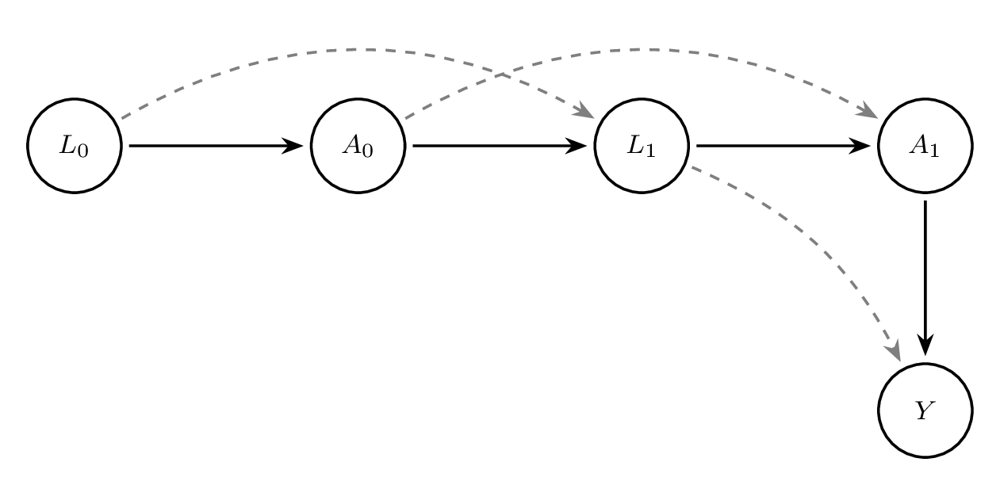

# Causal Inference for Longitudinal Data {#sec-longitudinal}

The previous chapters have described methods that are used when the intervention occurs at only one time point. Often, there are settings where the intervention occurs at multiple time points. Such settings could be a chemotherapy given to patients with cancer at regular intervals, a series of public health policies designed to reduce environmental impact on the population's health over time, or how health outcomes change over time within certain geographical clusters.

This chapter is split into two parts. Part I explores methods for multiple time-point interventions, including inverse probability weighting for longitudinal treatments (IPTW), marginal structural models (MSMs), double robust methods (AIPTW and LTMLE), and longitudinal TMLE [@Lendle2017Ltmle:Data]. Part II explores methods for time-to-event outcomes, including the parametric g-formula for survival and TMLE for survival data.

## Part I: Multiple Time-Point Interventions

### Time-Varying Confounding and Its Challenges

One of the most significant challenges in causal inference for longitudinal data is the presence of time-varying confounding. In a longitudinal setting, confounders are measured repeatedly over time and may both influence and be influenced by prior treatment. This feedback loop creates a fundamental difficulty for standard statistical methods.

To understand the problem, consider covariates $L_t$ that affect treatment decisions $A_t$ at each time $t$, but are themselves affected by earlier treatment $A_{t-1}$. In this case, $L_t$ serves as both a confounder (affecting treatment and outcome) and a mediator (affected by prior treatment). Adjusting for $L_t$ using standard regression methods may induce bias by conditioning on a variable on the causal pathway or introducing collider bias.

This situation violates one of the key assumptions required for unbiased estimation in standard regression: that adjustment covariates are not affected by the exposure. In longitudinal settings, naive adjustment for time-varying confounders using outcome regression can therefore produce biased effect estimates.

For example, in the context of HIV treatment, CD4 count is a time-varying confounder: it predicts future treatment decisions (whether to initiate or modify ART) and also predicts the outcome (e.g., mortality). But CD4 count is also affected by prior ART exposure. If we adjust for CD4 count in a regression model, we may block part of the effect of ART or introduce bias through conditioning on a collider.

This motivates the use of methods specifically designed to handle time-varying confounding, such as:
- **Inverse Probability of Treatment Weighting (IPTW):** Reweights individuals to create a pseudo-population in which treatment is independent of time-varying confounders.
- **G-computation:** Uses the g-formula to model the joint distribution of covariates and outcomes under a specific treatment regime.
- **Doubly Robust Estimators:** Combine outcome modeling and treatment modeling to protect against misspecification of either.

These methods rely on sequential models that reflect the time-varying structure of the data and appropriately account for dynamic confounding.

### Motivating Examples from Longitudinal Studies

Longitudinal data arise frequently in medicine, public health, economics, and the social sciences, where individuals are followed over time and data are collected at multiple time points. These repeated measurements offer rich opportunities to understand how treatments, exposures, or policies influence outcomes over time. However, the time-varying nature of treatments and confounders introduces methodological challenges for causal inference.

A classic motivating example comes from the HIV treatment literature. Consider a study evaluating the effect of initiating antiretroviral therapy (ART) on survival among HIV-positive individuals. Treatment initiation may depend on evolving clinical indicators such as CD4 cell count or viral load. These indicators also influence prognosis and are themselves affected by earlier treatment decisions. Thus, CD4 count acts as a time-varying confounder that is affected by prior treatment. Standard regression methods that adjust for CD4 count at each time point may introduce bias by blocking part of the treatment effect or conditioning on a collider.

Another example is the management of blood pressure over time. Patients with hypertension may begin or adjust medications based on current blood pressure readings, which in turn are influenced by prior treatment. Smoking cessation interventions, weight loss programs, and mental health treatments are further domains where longitudinal data play a central role.

These settings share common features: time-varying exposures, time-varying confounders, and outcomes measured after repeated decisions. In such contexts, specialized methods are required to estimate causal effects, including marginal structural models, the g-formula, and doubly robust estimators.

### Notation for Longitudinal Data

To formalize the discussion of causal inference with longitudinal data, we introduce notation to represent the sequence of treatments, covariates, and outcomes over time.

Let $t = 0, 1, \dots, T$ denote discrete time points. For an individual $i$, define:
- $A_t$: treatment or exposure at time $t$
- $L_t$: time-varying covariates measured at time $t$
- $\bar{A}_t = (A_0, A_1, \dots, A_t)$: treatment history up to and including time $t$
- $\bar{L}_t = (L_0, L_1, \dots, L_t)$: covariate history up to and including time $t$
- $Y$: outcome of interest, measured at time $T+1$ or at the end of follow-up
- $C_t$: indicator of censoring at time $t$, where $C_t = 1$ if censored at time $t$

We use capital letters to denote random variables and lowercase letters for their realizations. For example, $a_t$ is a specific value of $A_t$. The notation $Y^{\bar{a}}$ refers to the potential outcome that would be observed under the treatment regime $\bar{a} = (a_0, a_1, \dots, a_T)$.

In addition, we define the data structure for each individual as:
$$
O = (L_0, A_0, L_1, A_1, \dots, L_T, A_T, Y).
$$
This longitudinal data structure allows for dynamic treatment strategies that may assign treatment at time $t$ based on past covariate and treatment history. The goal of causal inference in this setting is to estimate the average causal effect of a treatment regime $\bar{a}$ on the outcome $Y$, denoted:
$$
E[Y^{\bar{a}}].
$$
This framework forms the foundation for the causal models and estimators introduced in subsequent sections.

**Box 6.1:** Simulating longitudinal data with time-varying treatment and confounders

::: {.panel-tabset}
### R
```r
n <- 1000
set.seed(123)

L0 <- rnorm(n)
A0 <- rbinom(n, 1, plogis(0.5 * L0))
L1 <- 0.5 * L0 + 0.8 * A0 + rnorm(n)
A1 <- rbinom(n, 1, plogis(0.5 * L1))
Y  <- 0.7 * L1 + 1.2 * A1 + rnorm(n)

data <- data.frame(L0, A0, L1, A1, Y)
head(data)
```

### Stata
```stata
clear all
set seed 123
set obs 1000

* Generate baseline covariates and treatment
generate L0 = rnormal()
generate A0 = rbinomial(1, invlogit(0.5 * L0))

* Generate follow-up covariates and treatment
generate L1 = 0.5 * L0 + 0.8 * A0 + rnormal()
generate A1 = rbinomial(1, invlogit(0.5 * L1))

* Generate outcome
generate Y = 0.7 * L1 + 1.2 * A1 + rnormal()

list L0 A0 L1 A1 Y in 1/6
```
:::

A DAG helps illustrate the challenge of time-varying confounding. Consider the following structure over two time points:

{#fig-longitudinal-dag}


In this DAG, $L_1$ is influenced by $A_0$, and $A_1$ is influenced by $L_1$, which in turn affects the outcome $Y$. Adjusting for $L_1$ blocks part of the effect of $A_0$, resulting in bias.

**Box 6.2:** Bias from naive regression adjustment for a time-varying confounder

::: {.panel-tabset}
### R
```r
# Using the data generated in Box 6.1
# Standard regression adjusting for L1
model_naive <- lm(Y ~ A0 + A1 + L1, data = data)
summary(model_naive)
```

### Stata
```stata
* Using the data generated in Box 6.1
* Standard regression adjusting for L1
regress Y A0 A1 L1
```
:::

This regression model adjusts for $L_1$, which is affected by $A_0$, leading to biased estimates for the effect of $A_0$. Methods such as IPTW avoid this bias by reweighting rather than conditioning.

Understanding time-varying confounding is critical for correctly estimating causal effects in longitudinal studies. The remainder of this chapter will focus on formalizing these ideas and presenting estimators that properly handle this complexity.

### G-computation and the G-formula for Longitudinal Data

The g-formula, introduced by Robins (1986), provides a way to estimate causal effects from longitudinal data in the presence of time-varying confounding. In longitudinal studies, standard regression methods often fail to provide valid causal estimates when time-varying confounders are also affected by prior treatment. This situation arises commonly in practice, especially in observational studies where treatment decisions are made based on intermediate health status, which itself may be influenced by earlier treatments. The g-formula resolves this problem by using a model-based standardisation approach to compute counterfactual outcomes under hypothetical treatment interventions.

#### Motivating Setting

Suppose data are collected over $K$ time points. At each time $t$ $(t = 0, \dots, K)$, we observe time-varying covariates $L_t$, treatment variables $A_t$, and eventually an outcome $Y$. The goal is to estimate the causal effect of a treatment strategy $\bar{a} = (a_0, a_1, \ldots, a_K)$ on the outcome $Y$.

Let $\bar{A}_t = (A_0, A_1, \dots, A_t)$ and $\bar{L}_t = (L_0, L_1, \dots, L_t)$ denote the treatment and covariate history, respectively. The counterfactual outcome under a specific treatment strategy $\bar{a}$ is denoted $Y^{\bar{a}}$. We aim to estimate $E[Y^{\bar{a}}]$, the expected outcome if all individuals had received treatment strategy $\bar{a}$.

#### The Longitudinal G-formula

The g-formula expresses this quantity as:
$$
E[Y^{\bar{a}}] = \int_{\bar{l}} E[Y \mid \bar{A}_K = \bar{a}, \bar{L}_K = \bar{l}] \prod_{t=0}^{K} f(L_t \mid \bar{L}_{t-1} = \bar{l}_{t-1}, \bar{A}_t = \bar{a}_t) d\bar{l}
$$
In practice, this formula is approximated using parametric regression models and Monte Carlo simulation. It decomposes the joint distribution of the data into a sequence of conditional models. Each covariate and the outcome are modeled conditionally on the observed treatment and covariate history.

#### Step-by-Step Estimation Procedure

1. **Model the data-generating process.** Specify models for each time-varying covariate $L_t$ and the final outcome $Y$, conditioning on previous covariates and treatments.

2. **Simulate counterfactuals.** For each individual, simulate covariates and outcomes under a specific intervention strategy $\bar{a}$. This requires sequentially predicting covariates $L_t$ using the fitted models, and using these to predict the outcome $Y$.

3. **Average the counterfactual outcomes.** Estimate $E[Y^{\bar{a}}]$ by averaging the predicted counterfactual outcomes across the simulated pseudo-population.

#### Illustrative Example

We now provide a full example using simulated data with two time points.

**Box 6.3:** Simulating data for the longitudinal g-computation example

::: {.panel-tabset}
### R
```r
# Simulate longitudinal data
set.seed(42)
n <- 1000
L0 <- rnorm(n)
A0 <- rbinom(n, 1, plogis(0.3 * L0))
L1 <- rnorm(n, mean = 0.5 * A0 + 0.6 * L0)
A1 <- rbinom(n, 1, plogis(0.4 * A0 + 0.7 * L1))
Y <- rbinom(n, 1, plogis(-1 + 0.8 * A1 + 0.6 * L1 + 0.3 * A0))

long_data <- data.frame(L0, A0, L1, A1, Y)
```

### Stata
```stata
clear all
set seed 42
set obs 1000

* Simulate longitudinal data
generate L0 = rnormal()
generate A0 = rbinomial(1, invlogit(0.3 * L0))
generate L1 = rnormal(0.5 * A0 + 0.6 * L0, 1)
generate A1 = rbinomial(1, invlogit(0.4 * A0 + 0.7 * L1))
generate Y = rbinomial(1, invlogit(-1 + 0.8 * A1 + 0.6 * L1 + 0.3 * A0))
```
:::

We now implement parametric g-computation to estimate the outcome under the intervention $A_0 = 1, A_1 = 1$.

**Box 6.4:** Manual parametric g-computation for a binary outcome

::: {.panel-tabset}
### R
```r
# Step 1: Fit models for L1 and Y
model_L1 <- lm(L1 ~ A0 + L0, data = long_data)
model_Y  <- glm(Y ~ A0 + A1 + L1, data = long_data, family = binomial())

# Step 2: Simulate under intervention A0 = A1 = 1
new_data <- long_data
new_data$A0 <- 1
new_data$A1 <- 1
new_data$L1 <- predict(model_L1, newdata = new_data)
new_data$Y_hat <- predict(model_Y, newdata = new_data, type = "response")

# Step 3: Estimate E[Y^{a}]
g_formula_estimate <- mean(new_data$Y_hat)
print(g_formula_estimate)

# Bootstrap for 95% CI
boot_est <- replicate(500, {
  idx <- sample(nrow(long_data), replace = TRUE)
  boot_data <- long_data[idx, ]
  m_L1 <- lm(L1 ~ A0 + L0, data = boot_data)
  m_Y  <- glm(Y ~ A0 + A1 + L1, data = boot_data, family = binomial())
  nd <- boot_data
  nd$A0 <- 1; nd$A1 <- 1
  nd$L1 <- predict(m_L1, newdata = nd)
  nd$Y_hat <- predict(m_Y, newdata = nd, type = "response")
  mean(nd$Y_hat)
})
quantile(boot_est, c(0.025, 0.975))
```

### Stata
```stata
* Step 1: Fit models for L1 and Y
glm L1 A0 L0, family(gaussian) link(identity)
logit Y A0 A1 L1

* Step 2-3: Predict under intervention A0 = 1, A1 = 1
preserve
  replace A0 = 1
  replace A1 = 1
  predict double L1_hat, xb
  replace L1 = L1_hat
  predict double Y_hat, pr
  summarize Y_hat
restore

* Bootstrap for 95% CI
capture program drop gcomp_boot
program define gcomp_boot, rclass
  preserve
    bsample
    glm L1 A0 L0, family(gaussian) link(identity)
    logit Y A0 A1 L1
    replace A0 = 1
    replace A1 = 1
    predict double L1_hat, xb
    replace L1 = L1_hat
    predict double Y_hat, pr
    summarize Y_hat
    return scalar psi = r(mean)
  restore
end
bootstrap r(psi), reps(500) seed(42): gcomp_boot
estat bootstrap, all
```
:::

To assess uncertainty, nonparametric bootstrap can be used to obtain confidence intervals.

#### Assumptions

The validity of the g-formula relies on three assumptions:
- **Consistency:** The observed outcome equals the counterfactual outcome for the observed treatment history.
- **Positivity:** There is a positive probability of receiving each treatment level for all covariate patterns.
- **Sequential Exchangeability (No Unmeasured Confounding):**
$$
Y^{\bar{a}} \perp A_t \mid \bar{A}_{t-1}, \bar{L}_t \quad \text{for all } t
$$
#### Interpretation and Extensions

The g-formula provides a consistent estimate of the counterfactual mean outcome under a static or dynamic treatment strategy. It generalizes standardization by incorporating time-varying covariates and treatments. The method can also be extended to simulate more complex interventions, such as treatment rules that depend on patient history.

While powerful, the g-formula is sensitive to model misspecification. Every component of the data-generating process must be modeled correctly. In practice, this often requires rich data and careful model diagnostics. Flexible modeling approaches, such as Super Learner, can improve robustness to misspecification.

#### Summary

The longitudinal g-formula is a foundational method for estimating causal effects in the presence of time-varying confounding. It is well-suited for estimating population-level effects of hypothetical interventions in longitudinal data, especially when conventional regression methods are biased due to treatment-confounder feedback. Although computationally intensive and model-dependent, it serves as a conceptual and methodological precursor to more robust estimators like TMLE.

### Marginal Structural Models

Marginal Structural Models (MSMs) are a class of causal models designed to estimate the marginal effect of a time-varying treatment or exposure on an outcome in the presence of time-varying confounding. Unlike traditional regression models, which condition on time-varying confounders that may be affected by prior treatment, MSMs allow for valid causal inference by modeling the treatment-outcome relationship marginally -- that is, without conditioning on such intermediate variables.

In longitudinal settings, the central challenge arises when confounders are affected by prior treatment. Adjusting for these confounders in a standard regression model can introduce bias, because it blocks part of the causal pathway from treatment to outcome. MSMs overcome this problem by modeling the counterfactual mean outcomes under different treatment regimes, while using inverse probability weighting (IPW) to account for confounding.

Let $\bar{A}_t = (A_0, A_1, \ldots, A_t)$ be the history of treatments up to time $t$, and let $Y$ be the outcome measured at a final time point $T$. The goal of an MSM is to estimate:
$$
\mathbb{E}[Y^{\bar{a}}]
$$
for different treatment regimens $\bar{a}$. These counterfactual means are modeled directly, without conditioning on intermediate covariates.

A typical form of an MSM is:
$$
\mathbb{E}[Y^{\bar{a}}] = \beta_0 + \beta_1 a_0 + \beta_2 a_1 + \cdots + \beta_T a_T
$$
This model expresses the expected counterfactual outcome as a function of the treatment history. It can be generalized to allow for interactions, nonlinear effects, or cumulative dose effects. For binary outcomes, the model might be fit on the log-odds scale using a logistic link.

Because the true counterfactuals are not observed, MSMs are estimated using the observed outcomes weighted by the inverse probability of treatment. Inverse Probability Weighting (IPW) is a method used to address time-varying confounding in longitudinal observational studies. It reweights the sample to create a pseudo-population in which treatment assignment at each time point is independent of past confounders. This approach enables unbiased estimation of marginal causal effects when traditional regression adjustment would fail due to feedback between treatment and covariates.

In longitudinal studies, confounders measured at time $t$, denoted $L_t$, often affect subsequent treatment $A_t$ and are themselves influenced by prior treatment $A_{t-1}$. This dual role of $L_t$ as both a confounder and an intermediate variable invalidates standard regression techniques, which cannot properly adjust for such variables without introducing bias.

To estimate the effect of a treatment regime $\bar{a} = (a_0, \dots, a_T)$, we use IPW to account for the time-varying nature of both treatment and confounding. This involves modeling the treatment mechanism over time and assigning weights to each individual based on the inverse of their probability of receiving their observed treatment history, conditional on their covariate history.

Let $\hat{e}_t(W_t) = P(A_t = a_t \mid \bar{A}_{t-1}, \bar{L}_t)$ denote the estimated probability of treatment at time $t$, given past treatment and covariate history. The unstabilized IP weight is:
$$
W_i = \prod_{t=0}^T \frac{1}{P(A_t = a_t \mid \bar{A}_{t-1}, \bar{L}_t)}.
$$
Stabilized weights are often preferred to reduce variance and improve finite sample performance. They are constructed by placing a numerator that only depends on baseline or prior covariates:
$$
W_i^{stab} = \prod_{t=0}^T \frac{P(A_t = a_t \mid \bar{A}_{t-1})}{P(A_t = a_t \mid \bar{A}_{t-1}, \bar{L}_t)}.
$$
More generally,
$$
W_i = \prod_{t=0}^T \frac{f(A_t = a_t^i \mid \bar{A}_{t-1}^i)}{f(A_t = a_t^i \mid \bar{L}_t^i, \bar{A}_{t-1}^i)}
$$
These stabilized weights create a pseudo-population in which treatment is independent of confounders, allowing consistent estimation of the MSM parameters via weighted regression.

1. Estimate the treatment model at each time point using logistic regression or machine learning to obtain probabilities $P(A_t \mid \bar{L}_t, \bar{A}_{t-1})$.
2. Compute stabilized IP weights for each individual across all time points.
3. Fit the MSM using a weighted regression model, regressing the outcome on treatment history, using the IP weights.

The parameters in an MSM can be interpreted as the causal effect of treatment on the outcome, averaged over the population. For example, $\beta_1$ in the above model reflects the marginal causal effect of treatment at time $t=0$, assuming correct model specification and no unmeasured confounding.

MSMs can be extended to:

- Estimate causal risk differences, odds ratios, or hazard ratios
- Allow for dynamic treatment rules or effect modification
- Handle survival outcomes using marginal structural Cox models
- Use flexible models (e.g., SuperLearner) for treatment mechanism

MSMs rely on key assumptions:

- **No unmeasured confounding**: All confounders of the treatment-outcome relationship must be measured.
- **Positivity**: There must be a non-zero probability of receiving each treatment at every level of confounders.
- **Correct model specification**: For consistent estimation, both the treatment model and the MSM must be correctly specified.

If these assumptions are violated, the MSM estimates may be biased or unstable. Weight truncation or flexible machine learning methods are often used to mitigate some of these issues.

### Weighted Regression to Estimate the Causal Effect

**Box 6.5:** Computing stabilized inverse probability of treatment weights

::: {.panel-tabset}
### R
```r
# Simulated longitudinal data
set.seed(123)
n <- 1000
L0 <- rnorm(n)
A0 <- rbinom(n, 1, plogis(0.4 * L0))
L1 <- 0.7 * L0 + 0.9 * A0 + rnorm(n)
A1 <- rbinom(n, 1, plogis(0.4 * L1))
Y  <- 1.5 * A0 + 1.2 * A1 + 0.5 * L1 + rnorm(n)

data <- data.frame(L0, A0, L1, A1, Y)

# Numerator models (simpler)
num_A0 <- glm(A0 ~ L0, family = binomial, data = data)
num_A1 <- glm(A1 ~ A0 + L0, family = binomial, data = data)

# Denominator models (full)
den_A0 <- glm(A0 ~ L0, family = binomial, data = data)
den_A1 <- glm(A1 ~ A0 + L0 + L1, family = binomial, data = data)

# Get predicted probabilities
pnum_A0 <- predict(num_A0, type = "response")
pnum_A1 <- predict(num_A1, type = "response")
pden_A0 <- predict(den_A0, type = "response")
pden_A1 <- predict(den_A1, type = "response")

# Compute stabilized weights
w_A0 <- ifelse(data$A0 == 1, pnum_A0 / pden_A0, (1 - pnum_A0) / (1 - pden_A0))
w_A1 <- ifelse(data$A1 == 1, pnum_A1 / pden_A1, (1 - pnum_A1) / (1 - pden_A1))
data$sw <- w_A0 * w_A1
summary(data$sw)
```

### Stata
```stata
* Simulate data for MSM estimation
clear all
set seed 123
set obs 1000
generate L0 = rnormal()
generate A0 = rbinomial(1, invlogit(0.4 * L0))
generate L1 = 0.7 * L0 + 0.9 * A0 + rnormal()
generate A1 = rbinomial(1, invlogit(0.4 * L1))
generate Y  = 1.5 * A0 + 1.2 * A1 + 0.5 * L1 + rnormal()

* Numerator models (baseline only)
logit A0 L0, vce(robust) nolog
predict double num_A0, pr
logit A1 A0 L0, vce(robust) nolog
predict double num_A1, pr

* Denominator models (full, including time-varying confounders)
logit A0 L0, vce(robust) nolog
predict double den_A0, pr
logit A1 A0 L0 L1, vce(robust) nolog
predict double den_A1, pr

* Compute stabilized weights
generate sw_A0 = num_A0 / den_A0 if A0 == 1
replace  sw_A0 = (1 - num_A0) / (1 - den_A0) if A0 == 0
generate sw_A1 = num_A1 / den_A1 if A1 == 1
replace  sw_A1 = (1 - num_A1) / (1 - den_A1) if A1 == 0
generate sw = sw_A0 * sw_A1
summarize sw
```
:::

*Note: The complete longitudinal analysis workflow (G-formula, IPTW, MSM, AIPTW, TMLE) is available at [github.com/migariane/TutorialComputationalCausalInferenceEstimators](https://github.com/migariane/TutorialComputationalCausalInferenceEstimators).*

Once the stabilized weights are estimated, they are used to fit a weighted regression model to estimate the marginal causal effect:

**Box 6.6:** Fitting a weighted marginal structural model

::: {.panel-tabset}
### R
```r
# Fit weighted MSM
model_weighted <- glm(Y ~ A0 + A1, weights = sw, data = data)
summary(model_weighted)

# Bootstrap 95% CI
boot_ate <- replicate(500, {
  idx <- sample(nrow(data), replace = TRUE)
  d <- data[idx, ]
  num_A0 <- glm(A0 ~ L0, family = binomial, data = d)
  num_A1 <- glm(A1 ~ A0 + L0, family = binomial, data = d)
  den_A0 <- glm(A0 ~ L0, family = binomial, data = d)
  den_A1 <- glm(A1 ~ A0 + L0 + L1, family = binomial, data = d)
  pn0 <- predict(num_A0, type = "response")
  pn1 <- predict(num_A1, type = "response")
  pd0 <- predict(den_A0, type = "response")
  pd1 <- predict(den_A1, type = "response")
  w0 <- ifelse(d$A0 == 1, pn0/pd0, (1-pn0)/(1-pd0))
  w1 <- ifelse(d$A1 == 1, pn1/pd1, (1-pn1)/(1-pd1))
  d$sw <- w0 * w1
  coef(glm(Y ~ A0 + A1, weights = sw, data = d))["A1"]
})
quantile(boot_ate, c(0.025, 0.975))
```

### Stata
```stata
* Fit marginal structural model with stabilized weights
regress Y A0 A1 [pw = sw], vce(robust)

* Bootstrap the 95% confidence intervals
capture program drop ATE
program define ATE, rclass
  capture drop num_A0 num_A1 den_A0 den_A1 sw_A0 sw_A1 sw
  * Numerator models
  logit A0 L0, vce(robust) nolog
  predict double num_A0, pr
  logit A1 A0 L0, vce(robust) nolog
  predict double num_A1, pr
  * Denominator models
  logit A0 L0, vce(robust) nolog
  predict double den_A0, pr
  logit A1 A0 L0 L1, vce(robust) nolog
  predict double den_A1, pr
  * Stabilized weights
  generate sw_A0 = num_A0 / den_A0 if A0 == 1
  replace  sw_A0 = (1 - num_A0) / (1 - den_A0) if A0 == 0
  generate sw_A1 = num_A1 / den_A1 if A1 == 1
  replace  sw_A1 = (1 - num_A1) / (1 - den_A1) if A1 == 0
  generate sw = sw_A0 * sw_A1
  * MSM
  regress Y A0 A1 [pw = sw], vce(robust)
  return scalar ate = _b[A1]
end
bootstrap r(ate), reps(500) seed(1): ATE
estat bootstrap, all
```
:::

*Note: Full longitudinal workflow available at [github.com/migariane/TutorialComputationalCausalInferenceEstimators](https://github.com/migariane/TutorialComputationalCausalInferenceEstimators).*

This regression provides an estimate of the average treatment effect under the assumption of no unmeasured confounding and correct model specification for the treatment assignment.

Inverse probability weighting is foundational for marginal structural models and plays a central role in modern causal inference for longitudinal data. While powerful, IPW requires careful diagnostics for positivity violations and extreme weights, which are discussed in later sections.

### Double Robust Methods for Longitudinal Data

The methods presented so far --- IPTW and the g-formula --- each rely on a single model being correctly specified. IPTW requires a correct treatment model; the g-formula requires correct outcome and covariate models. In practice, we rarely know which model is correct. **Doubly robust (DR) estimators** solve this problem by combining both modeling approaches: they remain consistent if *either* the outcome model *or* the treatment model is correctly specified --- not necessarily both.

For longitudinal data, this property is especially valuable because the sequential nature of treatment and confounding multiplies the opportunities for model misspecification. Two main classes of doubly robust estimators are used in longitudinal settings: **AIPTW** (Augmented Inverse Probability of Treatment Weighting), which augments IPTW with outcome regression predictions, and **LTMLE** (Longitudinal Targeted Maximum Likelihood Estimation), which adds a targeting step to optimize the bias-variance trade-off for the parameter of interest. Both methods inherit the double-robustness property while differing in their implementation complexity and finite-sample behaviour.

**Box 6.7:** AIPTW for longitudinal data: IPTW with outcome regression

::: {.panel-tabset}
### R
```r
# Using the data structure from Box 6.5 (L0, A0, L1, A1, Y)
set.seed(123)
n <- 1000
L0 <- rnorm(n)
A0 <- rbinom(n, 1, plogis(0.4 * L0))
L1 <- 0.7 * L0 + 0.9 * A0 + rnorm(n)
A1 <- rbinom(n, 1, plogis(0.4 * L1))
Y  <- 1.5 * A0 + 1.2 * A1 + 0.5 * L1 + rnorm(n)
data <- data.frame(L0, A0, L1, A1, Y)

# Step 1: Fit outcome models Q(A0, A1, L0, L1)
Q_model <- lm(Y ~ A0 * A1 + L0 + L1, data = data)

# Step 2: Fit treatment models g(A0 | L0) and g(A1 | A0, L0, L1)
g0 <- glm(A0 ~ L0, family = binomial, data = data)
g1 <- glm(A1 ~ A0 + L0 + L1, family = binomial, data = data)

# Step 3: Predict outcomes and propensity scores
data$g0_hat <- predict(g0, type = "response")
data$g1_hat <- predict(g1, type = "response")

# Counterfactual predictions under A0=1, A1=1
data_cf <- data
data_cf$A0 <- 1; data_cf$A1 <- 1
Q_cf <- predict(Q_model, newdata = data_cf)
Q_obs <- predict(Q_model, newdata = data)

# Step 4: Compute doubly robust estimator
# IPTW component
iptw_wt <- (data$A0 / data$g0_hat) * (data$A1 / data$g1_hat)
# Augmentation: add regression predictions to residuals
dr_component <- iptw_wt * (data$Y - Q_obs) + Q_cf

# ATE under always-treated vs observed
psi_dr <- mean(Q_cf)  # E[Y^{a=(1,1)}]
print(psi_dr)

# Bootstrap for inference
boot_dr <- replicate(500, {
  idx <- sample(n, replace = TRUE)
  d <- data[idx, ]
  Q_m <- lm(Y ~ A0 * A1 + L0 + L1, data = d)
  g0_m <- glm(A0 ~ L0, family = binomial, data = d)
  g1_m <- glm(A1 ~ A0 + L0 + L1, family = binomial, data = d)
  d_cf <- d; d_cf$A0 <- 1; d_cf$A1 <- 1
  mean(predict(Q_m, newdata = d_cf))
})
quantile(boot_dr, c(0.025, 0.975))
```

### Stata
```stata
* Simulate data for AIPTW example
clear all
set seed 123
set obs 1000
generate L0 = rnormal()
generate A0 = rbinomial(1, invlogit(0.4 * L0))
generate L1 = 0.7 * L0 + 0.9 * A0 + rnormal()
generate A1 = rbinomial(1, invlogit(0.4 * L1))
generate Y  = 1.5 * A0 + 1.2 * A1 + 0.5 * L1 + rnormal()

* Step 1: Fit outcome model Q(A0, A1, L0, L1)
regress Y c.A0##c.A1 L0 L1
predict double Q_obs, xb

* Step 2: Fit treatment models
logit A0 L0, vce(robust) nolog
predict double g0_hat, pr
logit A1 A0 L0 L1, vce(robust) nolog
predict double g1_hat, pr

* Step 3: Counterfactual predictions under A0=1, A1=1
preserve
  replace A0 = 1
  replace A1 = 1
  predict double Q_cf, xb
  summarize Q_cf
  return list
restore

* Bootstrap for DR estimator
capture program drop aiptw_boot
program define aiptw_boot, rclass
  preserve
    bsample
    regress Y c.A0##c.A1 L0 L1
    predict double Q_obs, xb
    logit A0 L0, vce(robust) nolog
    predict double g0_hat, pr
    logit A1 A0 L0 L1, vce(robust) nolog
    predict double g1_hat, pr
    replace A0 = 1
    replace A1 = 1
    predict double Q_cf, xb
    summarize Q_cf
    return scalar psi = r(mean)
  restore
end
bootstrap r(psi), reps(500) seed(42): aiptw_boot
estat bootstrap, all
```
:::

**Box 6.8:** LTMLE: Manual step-by-step implementation (two time points)

::: {.panel-tabset}
### R
```r
# Simulate data
set.seed(123)
n <- 500
L0 <- rbinom(n, 1, 0.5)
A0 <- rbinom(n, 1, plogis(-0.5 + 0.8 * L0))
L1 <- rbinom(n, 1, plogis(0.3 * A0 + 0.4 * L0))
A1 <- rbinom(n, 1, plogis(-0.4 + 0.5 * L1 + 0.3 * A0))
Y <- rbinom(n, 1, plogis(-1 + 0.6 * A1 + 0.5 * L1 + 0.2 * A0))
data <- data.frame(L0, A0, L1, A1, Y)

# Step 1: Estimate Q2 (E[Y | A0, A1, L0, L1]) -- initial outcome model at t=1
Q2_model <- glm(Y ~ A0 + A1 + L0 + L1, data = data, family = binomial)
Q2_pred <- predict(Q2_model, type = "response")

# Step 2: Estimate Q1 (E[Q2 | A0, L0, L1]) -- conditional expectation at t=0
data$Q2 <- Q2_pred
Q1_model <- glm(Q2 ~ A0 + L0 + L1, data = data, family = binomial)
Q1_pred <- predict(Q1_model, type = "response")

# Step 3: Estimate g models (treatment mechanisms)
g1 <- glm(A1 ~ A0 + L0 + L1, data = data, family = binomial)
g1_pred <- predict(g1, type = "response")
g0 <- glm(A0 ~ L0, data = data, family = binomial)
g0_pred <- predict(g0, type = "response")

# Step 4: Calculate clever covariates
# For t=1 (A1 = 1 under static intervention):
data$H1 <- ifelse(A1 == 1, 1 / g1_pred, 0)
# For t=0 (A0 = 1):
data$H0 <- ifelse(A0 == 1, 1 / g0_pred, 0)

# Step 5: Targeting -- update Q2 using clever covariate H1
fluct_model <- glm(Y ~ -1 + offset(qlogis(Q2_pred)) + H1,
                   data = data, family = binomial)
epsilon <- coef(fluct_model)["H1"]
Q2_star <- plogis(qlogis(Q2_pred) + epsilon * data$H1)

# Step 6: Counterfactual prediction under A0=1, A1=1
new_data <- data
new_data$A0 <- 1; new_data$A1 <- 1
Q2_cf <- predict(Q2_model, newdata = new_data, type = "response")
ATE <- mean(Q2_cf) - mean(Q2_pred)
ATE
```

### Stata
```stata
* Simulate longitudinal data for LTMLE
clear all
set seed 123
set obs 500
generate L0 = rbinomial(1, 0.5)
generate A0 = rbinomial(1, invlogit(-0.5 + 0.8 * L0))
generate L1 = rbinomial(1, invlogit(0.3 * A0 + 0.4 * L0))
generate A1 = rbinomial(1, invlogit(-0.4 + 0.5 * L1 + 0.3 * A0))
generate Y  = rbinomial(1, invlogit(-1 + 0.6 * A1 + 0.5 * L1 + 0.2 * A0))

* Step 1: Estimate initial outcome model Q2
logit Y A0 A1 L0 L1
predict double Q2_pred, pr

* Step 2: Estimate Q1 (E[Q2 | A0, L0, L1])
logit Q2_pred A0 L0 L1
predict double Q1_pred, pr

* Step 3: Estimate treatment mechanisms
logit A1 A0 L0 L1
predict double g1_pred, pr
logit A0 L0
predict double g0_pred, pr

* Step 4: Clever covariate for targeting at t=1 (A1=1 intervention)
generate H1 = 1 / g1_pred if A1 == 1
replace  H1 = 0 if A1 == 0

* Step 5: Targeting step -- update Q2
generate logit_Q2 = logit(Q2_pred)
logit Y, offset(logit_Q2)
* The coefficient on H1 in a model with offset gives epsilon
constraint 1 H1 = 1  // dummy to get coefficient
logit Y H1, offset(logit_Q2) nolog
* Manual update (epsilon extracted from coefficient)
matrix eps = e(b)
local epsilon = eps[1,1]
generate double Q2_star = invlogit(logit_Q2 + `epsilon' * H1)

* Step 6: Counterfactual under always-treated
preserve
  replace A0 = 1
  replace A1 = 1
  predict double Q2_cf, pr
  summarize Q2_cf
restore
```
:::

This provides a manual implementation of TMLE for a simple longitudinal setup. The key insight is that the targeting step uses a clever covariate to update the initial outcome model, removing bias for the parameter of interest.

**Box 6.9:** LTMLE using the ltmle R package

::: {.panel-tabset}
### R
```r
library(ltmle)

# Simulate data compatible with ltmle format
set.seed(123)
n <- 500
W <- rnorm(n)
L0 <- rbinom(n, 1, plogis(0.5 * W))
A0 <- rbinom(n, 1, plogis(-0.5 + 0.8 * L0))
L1 <- rbinom(n, 1, plogis(0.3 * A0 + 0.4 * L0))
A1 <- rbinom(n, 1, plogis(-0.4 + 0.5 * L1 + 0.3 * A0))
Y <- rbinom(n, 1, plogis(-1 + 0.6 * A1 + 0.5 * L1 + 0.2 * A0 + 0.1 * W))

ltmle_data <- data.frame(W, L0, A0, L1, A1, Y)

# Define nodes
Anodes <- c("A0", "A1")
Lnodes <- c("L0", "L1")
Ynodes <- "Y"

# Fit LTMLE under a static intervention (always treat)
result <- ltmle(data = ltmle_data,
                Anodes = Anodes,
                Lnodes = Lnodes,
                Ynodes = Ynodes,
                abar = c(1, 1),
                SL.library = c("SL.glm", "SL.gam", "SL.mean"))

summary(result)
```

### Stata
```stata
* Longitudinal TMLE is available in R via the ltmle package.
* Stata users can implement the manual targeting algorithm shown in Box 6.8
* using logit, predict, and the clever covariate construction.
* For production use, the R ltmle package or the eltmle Stata module
* (for single-time-point TMLE) are recommended.
```
:::

This code estimates the expected outcome had everyone received treatment at both time points using SuperLearner to fit nuisance models. The output includes point estimates, standard errors, and confidence intervals.

In summary, doubly robust methods provide a powerful framework for estimating causal effects in longitudinal studies. AIPTW offers a simple, closed-form estimator that combines IPTW with outcome regression. LTMLE extends this with a targeting step that optimizes the bias-variance tradeoff, providing semiparametric efficiency when both models are correctly specified. Together, they offer practical and theoretically grounded tools for handling time-varying confounding.

## Part II: Time-to-event outcome

### Brief Introduction to Censoring and Competing Risks

In longitudinal studies, participants are followed over time to assess the effect of treatments or exposures on outcomes of interest. However, complete follow-up for all individuals is rarely achieved. When an individual's data become unavailable before the outcome is observed, the data are said to be *censored*. Censoring can arise from loss to follow-up, study dropout, or administrative end of study.

Censoring is problematic because it introduces missing data in the outcome and may bias effect estimates if the reason for censoring is related to treatment or covariates. The standard assumption for valid inference in the presence of censoring is *independent censoring*--that is, the probability of being censored at any time depends only on observed covariates and treatment history, not on unmeasured factors or the potential outcomes themselves.

Let $C_t$ be the indicator that a subject is censored at time $t$, and define the observed data structure as:
$$
O = (L_0, A_0, C_0, L_1, A_1, C_1, \dots, L_T, A_T, C_T, Y).
$$
A subject contributes information up until the time of censoring. If censoring depends on time-varying covariates affected by prior treatment (e.g., CD4 count in HIV studies), then standard complete-case analyses can be biased. To address this, researchers often apply *inverse probability of censoring weighting* (IPCW), where each subject's contribution is reweighted by the inverse of their probability of remaining uncensored.

### Competing Risks

In some longitudinal studies, individuals may experience one of several mutually exclusive outcomes. When the occurrence of one event precludes the occurrence of the primary event of interest, it is called a *competing risk*. For example, in a study of cardiovascular mortality, death from cancer acts as a competing risk.

Standard survival analysis methods, such as the Kaplan-Meier estimator or Cox proportional hazards model, treat competing events as censoring, which can overestimate the cumulative incidence of the primary event. Instead, the correct estimand is often the *cumulative incidence function* (CIF), which estimates the marginal probability of experiencing each event over time.

**Box 6.10:** Competing risks analysis with cumulative incidence functions

::: {.panel-tabset}
### R
```r
library(cmprsk)
# Simulated data: time = event time, status = event type (0=censoring, 1=event, 2=competing risk)
set.seed(123)
n <- 500
time <- rexp(n, rate = 0.1)
status <- sample(0:2, n, replace = TRUE, prob = c(0.3, 0.5, 0.2))
group <- rbinom(n, 1, 0.5)

# Estimate cumulative incidence function by group
cif <- cuminc(time, status, group)
plot(cif, lty = 1:2, col = c("blue", "red"))
```

### Stata
```stata
* Simulate competing risks data
clear all
set seed 123
set obs 500
generate time = rexponential(0.1)
generate status = runiform()
generate group = rbinomial(1, 0.5)
* Recode: 0 = censored, 1 = event of interest, 2 = competing event
recode status (0/0.3 = 0) (0.3/0.8 = 1) (0.8/1 = 2)

* Declare survival data with competing risks
stset time, failure(status == 1)

* Cumulative incidence function by group
stcompet cif = ci, compet1(2) by(group)
* Plot cumulative incidence
twoway (line cif time if group == 0, sort) ///
       (line cif time if group == 1, sort), ///
       ytitle("Cumulative Incidence") xtitle("Time")
```
:::

### Inverse Probability of Censoring Weights (IPCW)

**Box 6.11:** Inverse probability of censoring weights

::: {.panel-tabset}
### R
```r
# Simulate dropout indicator
library(survival)
set.seed(456)
n <- 500
L0 <- rnorm(n)
A0 <- rbinom(n, 1, plogis(0.3 * L0))
C <- rbinom(n, 1, plogis(0.4 * A0 - 0.2 * L0)) # Censoring indicator (1 = censored)

# Estimate probability of remaining uncensored
ipcw_model <- glm(C ~ A0 + L0, family = binomial)
p_uncensored <- 1 - predict(ipcw_model, type = "response")
ipcw_weights <- 1 / p_uncensored
summary(ipcw_weights)
```

### Stata
```stata
* Simulate data for IPCW
clear all
set seed 456
set obs 500
generate L0 = rnormal()
generate A0 = rbinomial(1, invlogit(0.3 * L0))
generate C  = rbinomial(1, invlogit(0.4 * A0 - 0.2 * L0))

* Estimate probability of remaining uncensored
logit C A0 L0
predict double p_cens, pr
generate p_uncens = 1 - p_cens
generate ipcw = 1 / p_uncens
summarize ipcw
```
:::

These weights can be used in regression or IPTW analyses to adjust for informative censoring.

Censoring and competing risks are both forms of missing data or information loss that, if ignored, can severely bias causal effect estimates. Proper methods such as IPCW or competing risk models are essential for valid inference in longitudinal studies.

### Motivation and Examples from Survival Analysis

### Notation and Assumptions for Survival Data

### The Parametric and Nonparametric g-Formula for Survival

In time-to-event settings, the g-formula can be used to estimate counterfactual survival curves under static or dynamic treatment interventions. The goal is to evaluate the probability of survival over time under a hypothetical treatment strategy, adjusting for time-varying confounding and censoring.

Let $T$ denote the event time and $C$ the censoring time. Define the observed time as $U = \min(T, C)$ and the event indicator $\Delta = I(T \leq C)$. Let $Y_t = I(U > t)$ be the survival status at time $t$, and let $A_t$ and $L_t$ denote time-varying treatment and confounders. The counterfactual outcome $Y_t^{\bar{a}}$ indicates survival at time $t$ under treatment regime $\bar{a} = (a_0, a_1, \dots, a_t)$.

#### The Nonparametric g-formula for Survival

The nonparametric g-formula (also called the "extended Kaplan-Meier estimator") can be implemented using stratification and empirical averaging. Under this approach, survival probabilities are estimated directly from the observed data using inverse probability weighting or Monte Carlo simulation without parametric assumptions.

Let $\bar{d}$ denote a dynamic treatment rule. The nonparametric g-formula estimates:
$$
\hat{S}(t \mid \bar{d}) = \frac{1}{n} \sum_{i=1}^n \prod_{s=0}^{t} \hat{P}(Y_{is} = 1 \mid \text{history}_i, A_{is} = d_s)
$$
This is typically implemented via simulation: for each individual, generate a pseudo-population following rule $\bar{d}$, then compute the product of conditional survival probabilities across time.

#### The Parametric g-formula for Survival

The parametric g-formula expresses the counterfactual survival probability at time $t$ under treatment regime $\bar{a}$ as:
$$
P(Y_t^{\bar{a}} = 1) = \int_{\bar{l}_t} \prod_{s=0}^{t} P(Y_s = 1 \mid Y_{s-1} = 1, A_{s} = a_{s}, L_s = l_s) f(L_s \mid \bar{L}_{s-1}, \bar{A}_{s}) d\bar{l}_t
$$
This formula recursively computes the survival probability at each time point, conditioning on not having failed previously. The term $P(Y_s = 1 \mid Y_{s-1} = 1, A_s, L_s)$ is the conditional survival probability given being at risk at time $s$, and $f(L_s \mid \cdot)$ represents the evolution of time-varying covariates.

In practice, this approach involves specifying parametric regression models for:
- $P(Y_s = 1 \mid Y_{s-1} = 1, A_s, L_s)$: the outcome model (e.g., pooled logistic regression)
- $f(L_s \mid A_{s-1}, L_{s-1})$: the covariate models

#### Worked Example

We simulate a simple time-to-event dataset with time-varying covariates and treatment:

**Box 6.12:** Simulating time-to-event data with time-varying covariates

::: {.panel-tabset}
### R
```r
set.seed(123)
n <- 1000
K <- 5 # time points
L <- matrix(NA, n, K)
A <- matrix(NA, n, K)
Y <- matrix(1, n, K)

L[, 1] <- rnorm(n)
A[, 1] <- rbinom(n, 1, plogis(0.5 * L[, 1]))

for (t in 2:K) {
  L[, t] <- rnorm(n, mean = 0.4 * L[, t - 1] + 0.5 * A[, t - 1])
  A[, t] <- rbinom(n, 1, plogis(0.5 * L[, t]))
}

# Simulate event time (discrete hazard)
hazard <- matrix(NA, n, K)
for (t in 1:K) {
  hazard[, t] <- plogis(-2 + 0.6 * A[, t] + 0.5 * L[, t])
  fail <- rbinom(n, 1, hazard[, t])
  Y[, t] <- ifelse(rowSums(Y[, 1:t, drop=FALSE]) == t, 1 - fail, 0)
}

# Reshape into long format for pooled logistic regression
library(tidyr)
long_data <- data.frame(id = rep(1:n, each = K),
                        time = rep(1:K, times = n),
                        Y = as.vector(Y),
                        A = as.vector(A),
                        L = as.vector(L))

# Estimate conditional survival model
model <- glm(Y ~ time + A + L, family = binomial(), data = long_data)
```

### Stata
```stata
* Simulate time-to-event data with time-varying covariates
clear all
set seed 123
set obs 1000
* Generate baseline
generate L1 = rnormal()
generate A1 = rbinomial(1, invlogit(0.5 * L1))
* Generate follow-up times (simplified long format generation)
* For brevity, expand to person-time using stset/stsplit after
* declaring survival data. See Box 6.14 for the pooled logit approach.
```
:::

To estimate the survival curve under a hypothetical intervention $A_t = 1$ for all $t$:

**Box 6.13:** Estimating counterfactual survival curves under a treatment intervention

::: {.panel-tabset}
### R
```r
pred_data <- long_data
pred_data$A <- 1
pred_data$Y_hat <- predict(model, newdata = pred_data, type = "response")

# Compute survival curve under intervention
surv_probs <- with(pred_data, tapply(1 - Y_hat, time, mean))
surv_curve <- cumprod(surv_probs)
plot(1:K, surv_curve, type = "s", ylim = c(0,1),
     ylab = "Survival Probability", xlab = "Time")
```

### Stata
```stata
* Pooled logistic regression for discrete-time survival
logit Y time A L, vce(robust)

* Predict under intervention A = 1 for all time points
preserve
  replace A = 1
  predict double Y_hat, pr
  * Compute survival curve from predicted hazards
  bysort time: egen surv = mean(1 - Y_hat)
  generate surv_curve = surv if time == 1
  replace surv_curve = surv_curve[_n-1] * surv if time > 1
  * Plot survival curve
  twoway (line surv_curve time, sort), ///
    ytitle("Survival Probability") xtitle("Time") ///
    ylabel(0(0.2)1)
restore
```
:::

#### Interpretation and Uses

This approach allows estimation of the entire survival curve under hypothetical treatment strategies. It is especially useful when treatments are administered sequentially, and time-varying confounders must be appropriately adjusted.

The parametric g-formula is sensitive to model misspecification. Flexible machine learning methods and data-adaptive approaches (e.g., Super Learner) can be used to reduce bias in estimating the conditional survival and covariate models.

#### Summary

The g-formula can be used to estimate survival curves under complex dynamic interventions in the presence of time-varying confounding. Both parametric and nonparametric implementations are possible. The parametric approach uses pooled logistic regression to estimate conditional hazards, while the nonparametric approach relies on Monte Carlo averaging. These methods provide a foundation for evaluating intervention strategies in real-world longitudinal and survival data.

### TMLE for Time-to-Event Data

In time-to-event analyses, right censoring complicates the estimation of causal effects. Traditional approaches, such as Cox proportional hazards models, rely on strong assumptions (e.g., proportional hazards, correct model form) and typically do not target a marginal treatment effect. Targeted Maximum Likelihood Estimation (TMLE) offers a semi-parametric, double-robust framework for estimating causal effects under time-to-event data, accounting for both time-varying treatment and censoring processes. TMLE is flexible, accommodates data-adaptive estimation (e.g., via Super Learner), and targets causal parameters directly--such as survival probabilities under static or dynamic interventions. TMLE can be adapted for survival analysis where the outcome is the time until an event occurs. In this setting, we are often interested in estimating causal effects such as differences in survival probabilities or restricted mean survival time (RMST) under hypothetical interventions.

TMLE provides a semi-parametric and doubly robust method for causal effect estimation that combines flexible machine learning with targeted bias reduction. In the context of survival data, it handles censoring and treatment assignment through a careful combination of outcome modeling, propensity score estimation, and the use of clever covariates.

**Introduction and Motivation**

In time-to-event analyses, right censoring complicates the estimation of causal effects. Traditional approaches, such as Cox proportional hazards models, rely on strong assumptions (e.g., proportional hazards, correct model form) and typically do not target a marginal treatment effect. Targeted Maximum Likelihood Estimation (TMLE) offers a semi-parametric, double-robust framework for estimating causal effects under time-to-event data, accounting for both time-varying treatment and censoring processes. TMLE is flexible, accommodates data-adaptive estimation (e.g., via Super Learner), and targets causal parameters directly--such as survival probabilities under static or dynamic interventions.

**Observed Data Structure**

Let the observed data for $n$ individuals be:
$$
O = (W, A, \bar{L}(t), \bar{A}(t), \bar{C}(t), T, \Delta), \quad i = 1, \dots, n,
$$
where:

- $W$: baseline covariates;
- $A$: baseline treatment (for static intervention) or treatment history $\bar{A}(t)$ (for longitudinal interventions);
- $\bar{L}(t)$: time-varying covariates up to time $t$;
- $\bar{C}(t)$: censoring process up to time $t$;
- $T$: observed time to event or censoring;
- $\Delta = I(T \leq \tilde{T})$: event indicator (1 if observed event, 0 if censored).

We observe the minimum of the event time and censoring time.

**Parameter of Interest**

The parameter of interest is often a marginal survival probability under a static treatment strategy:
$$
\Psi(P_0) = \mathbb{E}_{P_0}[S^a(t)] = P(T^a > t),
$$
where $T^a$ is the potential failure time under intervention $A = a$, and $S^a(t)$ is the corresponding survival curve. TMLE targets this quantity while accounting for censoring and confounding.

**Efficient Influence Curve**

The efficient influence curve (EIC) for the survival probability under a static treatment $a$ is:
$$
D^*(O) = H(t, A, W) \left[ \Delta I(T \leq t) - \hat{S}(t \mid A, W) \right] + \hat{S}(t \mid A, W) - \hat{S}^a(t),
$$
where $H(t, A, W)$ is a clever covariate constructed using inverse probability weights for treatment and censoring.

**Step-by-Step Algorithm (Pooled TMLE)**

We now describe the procedure following Petersen et al. (2014) for static interventions:

1. **Estimate the initial outcome model.** Fit a pooled logistic regression model for the event indicator at each time point $t$, conditional on $A$, $W$, and $t$.
2. **Estimate the treatment and censoring mechanisms.** Estimate $g(A \mid W)$ and $P(C \geq t \mid A, W)$.
3. **Construct clever covariates.** Define:
   $$
   H_i(t) = \frac{I(A_i = a) I(T_i \geq t)}{\hat{g}(A_i \mid W_i) \hat{P}(C_i \geq t \mid A_i, W_i)}
   $$
4. **Target the outcome model.** Update the initial model by performing logistic regression with offset equal to the logit of the initial prediction and covariate $H_i(t)$ to estimate a fluctuation parameter $\epsilon$.
5. **Update survival estimates.** Use the updated predicted hazards to compute the targeted survival probability:
   $$
   \hat{S}^a(t) = \prod_{s=1}^t \left(1 - \hat{P}(T = s \mid A = a, W) \right)
   $$
6. **Compute standard errors.** Use the empirical variance of the EIC across individuals to compute standard errors and confidence intervals.

**Example: Manual Implementation of Pooled TMLE**

We simulate a simplified dataset for illustration. Suppose we have baseline treatment $A$, covariate $W$, and time-to-event outcome $T$ (censored at time 5).

**Box 6.14:** Pooled TMLE for survival: fitting the initial outcome model

::: {.panel-tabset}
### R
```r
library(survival)
library(dplyr)

set.seed(123)
n <- 500
W <- rnorm(n)
A <- rbinom(n, 1, plogis(W))
hazard <- function(t, A, W) plogis(-2 + 0.5*A + 0.3*W + 0.1*t)
T_true <- sapply(1:n, function(i) {
  for (t in 1:5) {
    if (runif(1) < hazard(t, A[i], W[i])) return(t)
  }
  return(6)
})
C <- sample(2:6, n, replace = TRUE)
T_obs <- pmin(T_true, C)
Delta <- as.integer(T_true <= C)

# Step 1: Create person-time dataset
data_long <- data.frame(
  id = rep(1:n, each = 5),
  t = rep(1:5, n),
  W = rep(W, each = 5),
  A = rep(A, each = 5),
  T = rep(T_obs, each = 5),
  Delta = rep(Delta, each = 5)
) %>%
  mutate(Y = as.integer(T == t & Delta == 1),
         at_risk = as.integer(T >= t))

# Step 2: Fit initial pooled logistic regression (TMLE step 1)
initial_fit <- glm(Y ~ A + W + t, family = binomial(),
                   data = data_long, subset = at_risk == 1)
summary(initial_fit)
```

### Stata
```stata
* Simulate survival data for pooled TMLE
clear all
set seed 123
set obs 500
generate W = rnormal()
generate A = rbinomial(1, invlogit(W))
* Simulate event times (discrete, t=1..5)
* (Simplified: generate directly rather than from hazards for brevity)
generate T_true = ceil(6 * runiform())
generate C_time = ceil(4 * runiform()) + 2
generate T_obs = min(T_true, C_time)
generate Delta = (T_true <= C_time)

* Step 1: Expand to person-time format
stset T_obs, failure(Delta == 1) id(id)
stsplit t, at(failures)
generate at_risk = (_t <= T_obs)
generate Y = (_t == T_obs & Delta == 1)

* Step 2: Fit initial pooled logistic regression
logit Y A W t if at_risk == 1, vce(robust)
```
:::

The subsequent steps include estimating censoring weights, constructing the clever covariate, performing the targeting update, and computing the survival curve. For brevity, we refer readers to code-based tutorials (e.g., TMLEbook) or the `ltmle` package for full pipelines.

**Example: TMLE with the `ltmle` Package**

We now implement TMLE for a longitudinal survival setting using the `ltmle` package. This automates estimation of survival curves under static interventions.

**Box 6.15:** TMLE for survival using the ltmle package

::: {.panel-tabset}
### R
```r
library(ltmle)

# Simulate survival data compatible with ltmle
set.seed(123)
n <- 300
W1 <- rnorm(n)
W2 <- rbinom(n, 1, 0.5)
A <- rbinom(n, 1, plogis(0.5 * W1 + 0.3 * W2))
Y1 <- rbinom(n, 1, plogis(-2 + 0.8 * A + 0.4 * W1))
C1 <- rbinom(n, 1, 0.1)  # 10% censoring at t=1
Y2 <- rbinom(n, 1, plogis(-2 + 0.8 * A + 0.4 * W1 + 0.1))
C2 <- rbinom(n, 1, 0.1)

ltmle_data <- data.frame(W1, W2, A,
                         C1 = C1, L1 = Y1,
                         C2 = C2, Y2 = Y2)

# Static intervention A = 1
ltmle_fit <- ltmle(data = ltmle_data,
                   Anodes = "A",
                   Cnodes = c("C1", "C2"),
                   Lnodes = "L1",
                   Ynodes = "Y2",
                   survivalOutcome = FALSE,
                   abar = 1)

summary(ltmle_fit)
```

### Stata
```stata
* TMLE for survival data is available in R via the ltmle package.
* Stata users can adapt the pooled TMLE algorithm shown in Box 6.14
* using logit, predict, and manual clever covariate construction.
* The targeting step uses the same fluctuation approach (offset + clever covariate)
* described in the LTMLE section (Box 6.8).
```
:::

This returns survival probability estimates under the static intervention, along with standard errors and confidence intervals based on the efficient influence function.

## Conclusion

Causal inference with longitudinal data presents unique challenges: time-varying confounders affected by prior treatment cannot be handled by standard regression methods without introducing bias. This chapter has introduced three complementary approaches for this setting.

Marginal structural models (MSMs) use inverse probability of treatment weighting to estimate the marginal causal effect of a treatment sequence, breaking the feedback between confounders and treatment. The parametric g-formula for survival data estimates counterfactual survival curves by modeling the conditional hazard at each time point. Longitudinal TMLE (LTMLE) combines the double robustness and efficiency of TMLE with the flexibility to handle time-varying treatments and confounders, providing the strongest theoretical guarantees.

Key takeaways from this chapter:
- Time-varying confounding affected by prior treatment (treatment-confounder feedback) invalidates standard regression adjustment.
- MSMs with IPW create a pseudo-population where treatment is independent of confounders at each time point.
- Stabilized weights reduce the variance of IPW estimators in longitudinal settings.
- Doubly robust methods (AIPTW, LTMLE) protect against model misspecification by combining outcome and treatment models.
- The parametric g-formula for survival estimates counterfactual survival curves under static or dynamic interventions.
- LTMLE provides doubly-robust, semiparametric efficient estimates for longitudinal causal effects.
- Inverse probability of censoring weighting (IPCW) is essential when follow-up is incomplete.

All three methods require careful attention to the positivity assumption, correct model specification, and the handling of censoring. When applied rigorously, they enable credible causal conclusions from complex longitudinal observational data.

## Glossary

**Censoring**
:   The loss of follow-up information before the outcome is observed; right censoring is the most common form in survival analysis.

**Competing risk**
:   An event whose occurrence precludes the occurrence of the primary event of interest.

**G-computation**
:   Another name for the g-formula; see glossary in Chapter 3.

**IPCW**
:   Inverse Probability of Censoring Weighting — a method that reweights observations to account for informative censoring.

**LTMLE**
:   Longitudinal Targeted Maximum Likelihood Estimation — an extension of TMLE for settings with time-varying treatments and confounders.

**MSM**
:   Marginal Structural Model — a model for the marginal distribution of counterfactual outcomes under a treatment sequence, typically estimated using IPW.

**AIPTW**
:   Augmented Inverse Probability of Treatment Weighting — a doubly robust estimator that combines IPTW with outcome regression predictions.

**Stabilized weights**
:   IPW weights that include a numerator model (often without time-varying covariates) to reduce variance.

**Time-varying confounding**
:   Confounding by a variable that changes over time and is affected by prior treatment.
