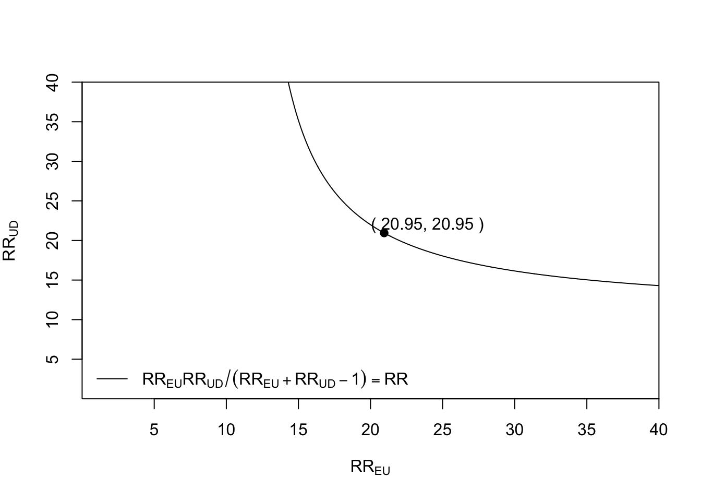
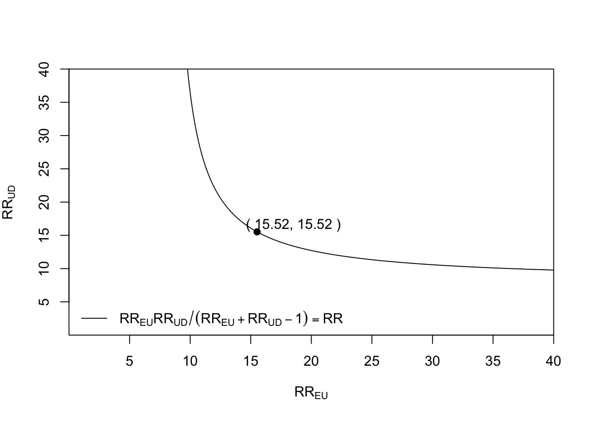
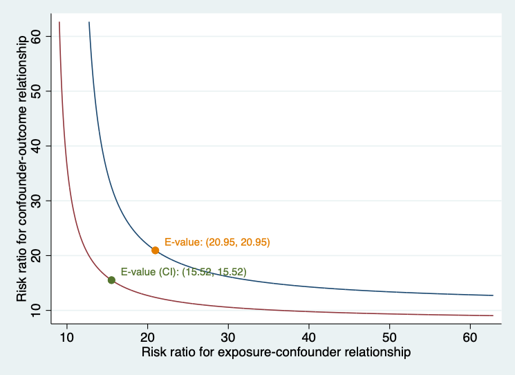
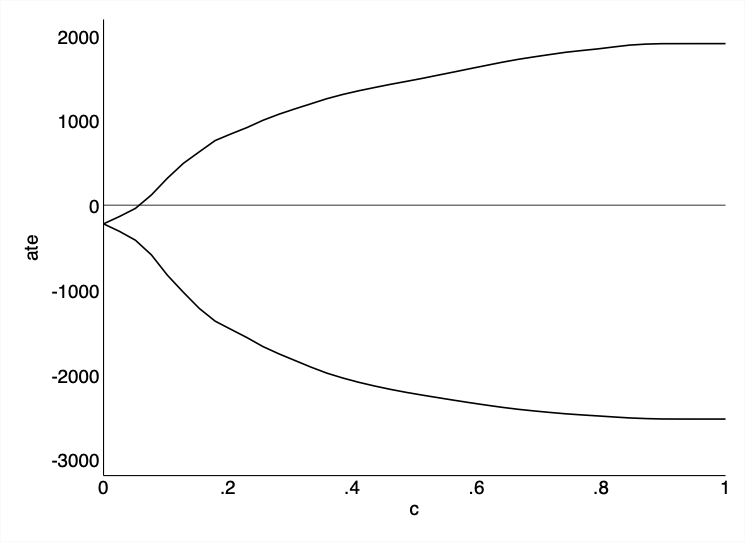

# Sensitivity analysis {#sec-sensitivity}

In the process of causal inference, we frequently try to estimate the population effect of a binary treatment on an outcome variable by comparing the means of potential outcomes $Y(1)$and$Y(0)$, where $Y(t)$is the (bounded) outcome of a random individual under treatment$A$, [@neyman23app; @rubin74potential]." This contrast, known as the *Average Treatment Effect (ATE)*, must be identified from observational data (i.e., non-experimental investigations) based on untestable hypotheses, i.e., consistency, conditional ignorability, exchangeability or independence, and positivity.
Under these assumptions, the ATE is identified from the observed data distribution via the *g formula*:
$$
\begin{aligned}
\textit{ATE} &= \int_w \Big\{E[Y \mid A=1, \textbf{W=w}] - E[Y \mid A=0, \textbf{W=w}] \Big\} dF(w),
\end{aligned}
$$
 {#eq-ace}

where $F(\cdot)$denotes the cumulative distribution function of$w$.

Using $n$independent and identically distributed copies of$O=(W, A, Y)$, many methods have been developed to draw inference about the ATE functional, e.g., propensity score matching [@rosenbaum83propensity], g-computation [@robins86new], (stabilized) inverse probability weighting [@hernan2006estimating], augmented inverse probability weighting [@robins94estimation], and targeted maximum likelihood [@van2006targeted] as seen in the previous chapters.

The conditional *conditional independence assumption* states that there exists a set of measured pre-treatment covariates (**W**) such that treatment is conditionally independent of the potential outcomes given **W**, i.e.,
$$
Y(a) \perp A \mid \textbf{W} \quad \text{ for } a=0,1;
$$ {#eq-ci}

implies that there are no unmeasured confounders (**U**) between treatment and outcome.

In sensitivity analysis from observational studies targeting the study of causal relationships, the robustness of inference to potential unmeasured confounding is always needed and considered crucial. In this chapter, we aim to briefly review the literature on sensitivity analysis in causal inference and provide a computational overview of the current methods for evaluating the sensitivity of the analysis to the unmeasured confounding assumption about the ATE (@eq-ci).

## Overview of methods for sensitivity analysis in causal inference

To investigate the effect of residual unmeasured confounding on the causal effect estimate, sensitivity analysis to the "no unmeasured confounders" assumption is commonly used. [@ding2016sensitivity] Assessing how robust an estimated causal effect is to potential unmeasured confounding is the principal aim of the following methods.

The E-value was first introduced [@ding2016sensitivity]. The authors proposed a sensitivity analysis technique without any assumptions about the unmeasured confounders. They derived a bound on the relative risk (RR) scale based on two parameters. However, the method does not accommodate complex measured confounders.

@Masten24 introduced a nonparametric methodology to evaluate the sensitivity of results related to causal inference under the assumption of conditional independence. He introduced the concept of *conditional partial independence*, which is a less stringent condition than full conditional independence. Specifically, he examined a group of assumptions labeled *conditional c-dependence*, which quantify the relaxation of conditional independence through a single parameter, c. For every positive c, conditional independence is only partially fulfilled, preventing the exact determination of treatment effect parameters, such as the ATE; instead, only bounds can be derived. Masten describes these bounds in relation to c: smaller c values result in tighter bounds, whereas larger c values produce broader bounds. The extent of these bounds, and thus the sensitivity of the results, is contingent upon the data.

Rosenbaum's [@rosenbaum1987sensitivity] method identified the smallest $\Gamma$ ensuring the ATE cannot be deemed "statistically significant" within matched studies [@tan2006distributional], and Zhao et al. [@zhao2019sensitivity] established ATE bounds by comparing the odds of receiving treatment with both measured and unmeasured confounders versus only measured confounders. Recent advancements by Dorn et al. [@dorn2022sharp; @dorn2021doubly] have further refined these bounds. The final bounds are expressed in a closed form, incorporating the observed propensity score, a specific transformed-outcome regression, and conditional quantiles of the outcome given treatment and covariates.

Moreover, [@dorn2021doubly] demonstrated that estimators for these bounds can be developed that remain valid---though somewhat conservative---even when the conditional quantiles are improperly specified, provided that at least one of the other two nuisance functions is estimated consistently. Other methods, such as those described by [@diaz2013sensitivity] and [@diaz2018sensitivity], involve deriving bounds on the Average Treatment Effect (ATE) by limiting the difference in mean potential outcomes between patients who received treatment and those who received control, considering covariates. [@bonvini2022sensitivity] utilized a contamination model to provide bounds on the ATE by limiting the fraction of units influenced by unmeasured confounding.
The following two sections focus on the E-value (developed in both Stata and R statistical software) and the Conditional C-dependence (only available in Stata) from a computationally applied perspective.

## The E-value

The E-value is the minimum strength of a causal effect, on the RR scale, that an unmeasured confounder would need to have with both the treatment (E) and the outcome (D) to fully explain away a specific treatment-outcome association, conditional on the measured covariate (note that before we defined the treatment or exposure as (A) and the outcome as (Y). We decide to introduce here E and D to match the software convenctions further presented in this section). The E-value makes no assumptions on whether the unmeasured confounders (U) are binary, continuous, or categorical, on how they are distributed, or on the number of confounders, and it can be applied to several common outcome types and estimands in observational research. A large E-value implies that considerable unmeasured confounding would be needed to explain away an effect estimate. A small E-value implies little unmeasured confounding would be needed to explain away an effect estimate. Further developments [@vanderweele2011bias] introduced a general "bias" formula for the difference between the possibly incorrect expression for the ATE under no unmeasured confounding and the correct expression for the ATE when accounting for both measured and unmeasured confounding in terms of many sensitivity parameters.

To facilitate these sensitivity analyses, an R package ("EValue")[@Mathur2018] was developed and also an online E-value calculator is online available at [https://mmathur.shinyapps.io/evalue/](https://mmathur.shinyapps.io/evalue/) that computes E-values for a variety of outcome measures.

The E-value seminal publication considered the historical study conducted by Hammond and Horn[@Hammond1958] as an example to describe it. The study focused on the tobacco effect on lung cancer with a point estimate of the observed RR of cigarette smoking on lung cancer of 10.73 (95% CI 8.02, 14.36). Based on it we will illustrate the use of the R package to evaluate the effect of a common genetic confounder (U) on the observed RR of the treatment or exposure (E) on the outcome (D) using a set of boxes including the code and a detailed commented explanation.

**Box 7.1. Use of the E-value: R-package**

```r
# You can install the EValue from CRAN using:
install.packages("EValue")
# Then, load the package:
library(EValue)
# The E-value for the association between cigarette smoking and lung cancer as observed by Hammond and Horn in 1958 can be computed as follows:
evalues.RR(est = 10.73, lo = 8.02, hi = 14.36)
#>             point    lower upper
#> RR       10.73000  8.02000 14.36
#> E-values 20.94777 15.52336    NA
```

The E-value of 20.95 tells us that a confounder, or set of confounders (U), would have to be associated with a 20-fold increase in the risk of lung cancer and must be 20 times more prevalent in smokers than non-smokers to explain the observed RR. If the strength of one of these relationships were weaker, the other would have to be stronger for the causal effect of smoking on lung cancer to be truly null.

The package provides a plot functionality that allows the user to see how the magnitude of the exposure-confounder and the confounder-outcome relationships would have to vary to fully explain the observed association.

**Box 7.2. Plotting the E-value: R-package**

```r
bias_plot(10.73, xmax = 40)
```

{#fig-e-value-upper-bound fig-align="center"}

This tells us, for example, that if the exposure-confounder parameter $RR_{EU}$were 15, meaning that the confounder(s) is 15 times more likely among smokers, the$RR_{UD}$ for the confounder outcome relationship parameter would have to be about 40 for it to even be possible that confounding explains the entire observed association.

It is also possible to plot the lower bound of the confidence interval

**Box 7.3. Plotting the E-value: R-package**

```r
bias_plot(8.02, xmax = 40)
```

which we calculated an E-value of 15.52 for the above.

{#fig-e-value-lower-bound fig-align="center"}

Scholars may evaluate the potential for confounding influences to alter the observed relationship to any other value, such as diminishing the observed relationship to a true causal effect that lacks scientific significance or amplifying a near-null observed relationship to one of scientific importance. For instance, to adjust an observed relative risk of 3.5 down to a true causal relative risk of 2.5, the E-value is 2.15. This represents the smallest amount of unmeasured confounding necessary to shift both the estimate and confidence interval toward your defined true value instead of the null value (Box 7.4).

**Box 7.4. E-value shifts: R-package**

```r
# summary() used to print the E-value only
summary(evalues.RR(est = 3.5, true = 2.5))
#[1] 2.148331
```

The E-value for the association between cigarette smoking and lung cancer as observed by Hammond and Horn in 1958 can be computed in Stata as follows [@Linden2020]:

**Box 7.5. E-value: Stata**

```stata
evalue rr 10.73, lcl(8.02) ucl(14.36) figure
```

{#fig-e-value-lower-upper-bounds-stata fig-align="center"}

## Conditional c-dependence

In causal inference, a fundamental question is determining and estimating how a treatment variable **A** influences an outcome variable **Y**. A frequently adopted assumption for identifying these effects is unconfoundedness, also referred to as selection on observables, conditional independence, ignorability, or exogenous selection. This assumption is non-falsifiable, as the data itself cannot confirm its validity. However, researchers often question: How crucial is this assumption for their analyses? In other words, how robust are the results derived under the conditional independence assumption?

In their work, [@Masten18] present theoretical findings aimed at addressing this question. They introduce the concept of conditional partial independence, which is a relaxation of full conditional independence. The focus is on a specific type of assumption known as **conditional c-dependence**, quantifying deviations from conditional independence using a parameter c. When c is positive, conditional independence is only partial, preventing precise determination of treatment effect parameters such as ATE or ATT, resulting in bounded estimates instead. [@Masten18] describe these bounds as dependent on **C**, with smaller c leading to tighter bounds and larger c producing wider ones. The extent of these bounds, and thus the sensitivity of results, is influenced by the data. The paper by [@Masten24] explains the estimation strategy used from an applied computational perspective by using a Stata package named **tesensitivity**.

To define conditional c-dependence, we first define the following random variables:

- $Y^{a}$: the potential outcome for a given treatment$a \in\{0,1\}$
- $A$ : the treatment
- $W$ : a vector of covariates
- $Y$ : the observed outcome

The observed outcome satisfies by consistency
$$
Y = (1-A) Y^{0} + A Y^{1}.
$$
Rather than observing the full data generating process, $(Y^{0}, Y^{1}, A, Y)$, we only observe: O=(Y, A, W).

We say that $A$is conditionally c-dependent with$Y^{a}$given$W$ if:
$$
\textbf{supp} \underset{y_{a} \in \operatorname{supp}(Y^{a}\mid W=w)}{\left|\mathbb{P}\left(A=1 \mid Y^{a}=a, W=w\right)-\mathbb{P}(A=1 \mid W=w)\right|} \leq c,
$$
for all $w$in$\operatorname{supp}(\mathbf{W})$.

Under this assumption, the identified set for a treatment effect statistic will be a closed interval, which depends on c and the distribution of O=(Y, A, W).

The main purpose of the **tesensitivity** package is to calculate these bounds and show how the identified set for treatment effect statistics i.e., ATE varies with the sensitivity parameter c. In addition to estimating these bounds for a range of values of c, **tesensitivity** also calculates a breakdown point relative to a conclusion about a treatment effect statistic i.e., the ATE. As discussed in [@Masten24], the breakdown point is the maximum value of c under which the conclusion still holds.

Employing a Stata excerpt dataset from [@Cattaneo2010] and [@almond2005costs], alongside annotated boxes containing commented code, we demonstrate the computation and interpretation of the sensitivity parameter $c$ using the Stata package **tesensitivity**.

Treatment-effects modeling serves as a vital method for deriving causal effects akin to those from experiments, even when working with observational data. While conducting an experiment would be ideal, such endeavors are often impractical due to ethical or financial constraints. For instance, consider assessing the impact of cigarette smoking (the intervention) on infant birthweight (the resultant outcome). Ideally, an experiment would involve selecting a representative group of pregnant women, dividing them into a control group instructed not to smoke and a treatment group required to smoke a designated number of cigarettes each day.

Consider addressing this question by employing the Stata command **teffects**. To ensure our estimates are reliable, it is crucial to confirm that when we account for observable characteristics, it appears as though pregnant mothers were randomly distributed between control and treatment groups. We model the birthweight (bweight) as a function of the number of prenatal visits (nprenatal), whether the mother is married (mmarried), whether this baby is her first pregnancy (fbaby), and maternal education (medu). The treatment, smoking during pregnancy (mbsmoke), is modeled as a function of the same variables and concerning whether the mother consumed alcohol during her pregnancy.  For reference, we start by estimating the ATE of these experimental and non-experimental samples based on maternal smoking using the **eltmle** Stata package. [@Luque-Fernandez2019] (Box 7.5)

**Box 7.6. ATE using effects and eltmle in Stata**

```stata
# To allow intalling Stata programs from GitHub:

    net install github, from("https://haghish.github.io/github/")

# To install eltmle Stata program to compute the ATE:

    github install migariane/eltmle
    which eltmle
    help eltmle

# These will be the data and variables used in the analysis:

    webuse cattaneo2, clear
    describe
    local Y "bweight"
    local A "mbsmoke"
    local W "nprenatal mmarried fbaby medu"
    eltmle `Y' `A' `W', tmle

# Output:

    Variable |        Obs        Mean    Std. dev.       Min        Max
-------------+---------------------------------------------------------
        POM1 |      4,642    2843.307     114.191    2369.31   3539.972
        POM0 |      4,642    3061.247    150.1519   2453.428   3931.552
          ps |      4,642    .1861267    .1110024   .0368017   .6847253
--------------------------------
TMLE: Average Treatment Effect
--------------------------------
ATE:      | -217.9
SE:       |   22.8
P-value:  | 0.0000
95%CI:    | -262.6, -173.3
--------------------------------
-----------------------------
TMLE: Causal Risk Ratio (CRR)
-----------------------------
CRR: 0.93; 95%CI:(0.91, 0.94)
-----------------------------
-------------------------------
TMLE: Marginal Odds Ratio (MOR)
-------------------------------
MOR: 0.84; 95%CI:(0.81, 0.87)
-------------------------------

# Using the Stata software command for causal inference and the augmented
# inverse probability weights (AIPW) algorithm:

    teffects aipw (`Y' `W') (`A' `W')

# Output:
Iteration 0:   EE criterion =  3.069e-23
Iteration 1:   EE criterion =  2.182e-25

Treatment-effects estimation        Number of obs     =      4,642
Estimator      : augmented IPW
Outcome model  : linear by ML
Treatment model: logit
------------------------------------------------------------------------------
             |               Robust
     bweight | Coefficient  std. err.      z    P>|z|    [95% conf. interval]
-------------+----------------------------------------------------------------
ATE  mbsmoke |
   (1 vs 0)  |  -223.4343    24.3635    -9.17   0.000   -271.1858   -175.6827
-------------+----------------------------------------------------------------
```

The ATE is interpreted as the mean risk difference of 217.9 fewer grams in the birth weight from infants born to mothers who smoke vs. infants born from non-smoker mothers in an additive scale using eltmle and 223 fewer grams using the **aipw** Stata option from the **teffects** command.

Under the standard unconfoundedness assumption, the treatment effect is negative and statistically significant. Now we will use the **tesensitivity** package to analyze how sensitive these results are to this assumption. The main subcommand of the **tesensitivity** package is **cpi**, i.e., conditional partial independence. This command estimates bounds on the ATE given a set of c-dependence values and calculates the breakdown point for the conclusion that the treatment effect statistic is above a given threshold. First, we calculate bounds on the ATE. By default, the command calculates bounds for a uniform grid of 40 values of c, and the breakdown point for the conclusion that the ATE estimation does not contain the null.

**Box 7.7. tesensitivity: Stata**

```stata
# Running the command:

    tesensitivity cpi (`Y' `W') (`A' `W'), ate

# Output:

Treatment effects sensitivity
Analysis         : cond. partial independence  Number of obs=         4642
Outcome model    : linear quantile           Breakdown      =         0.058
Treatment model  : logistic                  Conclusion     =         ate > 0
Outcome variable : bweight
-------------------------------------
                 c |              ate
-------------------+-----------------
             0.000 | [  -220,   -220]
             0.026 | [  -309,   -134]
             0.051 | [  -414,    -38]
             0.077 | [  -587,    120]
             0.103 | [  -826,    317]
             0.128 | [-1,027,    493]
             0.154 | [-1,218,    629]
                    ...
             0.769 | [-2,475,  1,825]
             0.795 | [-2,487,  1,844]
             0.821 | [-2,500,  1,867]
             0.846 | [-2,511,  1,889]
             0.872 | [-2,518,  1,901]
             0.897 | [-2,523,  1,906]
             0.923 | [-2,524,  1,906]
             0.949 | [-2,524,  1,906]
             0.974 | [-2,524,  1,906]
             1.000 | [-2,524,  1,906]
-------------------------------------
```

The grid of values show that the breakdown point computation for c is 0.077. Remember that the breakdown point is the maximum value of c under which the conclusion still holds. For example, if we consider the conclusion that the ATE is negative as in our example, then the breakdown point is the minimum value of c such that 0 is included in the identified 95% CI for the ATE in the set. The package also includes tools to visualize the analysis, interpret the scale of c-dependence, and compare results of multiple sensitivity analyses. Note that the value of c is small indicating weak unconfoundeness assumption based on the observed data.

**Box 7.8. tesensitivity visual tools in Stata**

```stata
tesensitivity cpiplot
```

{#fig-conditional-c-dependence-breakdown-point fig-align="center"}

## Conclusion

Sensitivity analysis is an essential component of any causal inference from observational data. While methods such as the g-formula, IPW, and TMLE address confounding by measured covariates, the assumption of no unmeasured confounding is fundamentally untestable. Sensitivity analysis quantifies how robust study conclusions are to violations of this assumption.

This chapter has introduced three complementary approaches:
- The **E-value** provides an intuitive, scale-free metric: the minimum strength of association an unmeasured confounder would need to have with both treatment and outcome to explain away the observed effect. Its simplicity makes it accessible to non-specialist audiences.
- The **conditional c-dependence** approach, implemented in the `tesensitivity` package, offers a more flexible framework that conditions on measured covariates, providing refined bounds.
- Both methods complement — rather than replace — careful study design, thorough confounder measurement, and rigorous primary analysis.

Key takeaways from this chapter:
- No observational study can prove that all confounders have been measured.
- Sensitivity analysis should be a routine part of any causal analysis, not an afterthought.
- The E-value is easy to compute and report, making it suitable for transparent communication of uncertainty.
- The conditional c-dependence approach provides tighter bounds by leveraging information on measured confounders.
- Sensitivity analyses should be interpreted in the context of substantive knowledge about likely unmeasured confounders.

## Glossary

**Breakdown point**
:   The maximum value of a sensitivity parameter under which the study conclusion (e.g., a significant causal effect) still holds.

**c-dependence**
:   A measure of the strength of residual confounding, representing the deviation from the assumption of no unmeasured confounding.

**E-value**
:   The minimum strength of association, on the risk ratio scale, that an unmeasured confounder would need to have with both the treatment and the outcome to fully explain away an observed treatment-outcome association.

**Sensitivity analysis**
:   A set of methods for assessing how sensitive causal conclusions are to violations of untestable assumptions, particularly the assumption of no unmeasured confounding.

**Unmeasured confounding**
:   Confounding by variables that were not measured and therefore cannot be adjusted for in the analysis.
